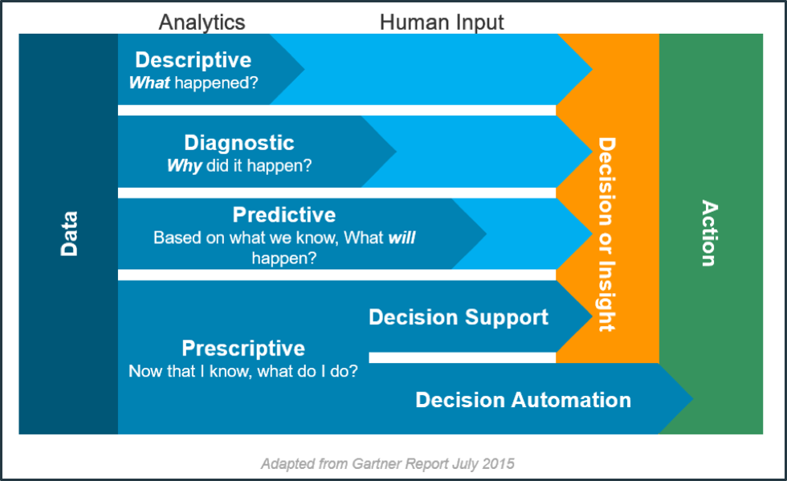

[Зміст](README.md) [---> 2](2.md) 

# 1. Вступ до Індустрії 4.0 та цифрової трансформації

План.

- Вступ до Індустрії 4.0.
- Стимулюючі технології І4.0 
- Цифрова трансформація

- Ключі до успішної цифрової трансформації

Сучасні промислові (і не тільки) підприємства повинні бути гнучкими щоб задовольняти персоналізований попит за змінних умов ринку та надавати продукт чи послугу у мінімально короткий термін. При цьому якість продукту повинна бути високою а ціна, хоч вона і не є головним критерієм, має бути якомога нижчою. Забезпечити виконання таких високих вимог стало можливим за рахунок порівняно недавньої появи кількох ключових "стимулюючих" технологій, здебільшого зі світу ІТ, які у свою чергу призвели до необхідності не тільки технічного переоснащення підприємства, а і переформатування самого способу ведення бізнесу а також культури виробництва та навіть зміни побуту. А це значить, що традиційні бізнес-процеси, а також самі принципи взаємодії між учасниками необхідно повністю змінювати. Ці зміни є революційними, що привело до появи терміну "Четверта промислова революція" або Індустрія 4.0" (Industry 4.0), а сам перехід підприємства до нового способу ведення бізнесу - "цифровою трансформацією", або "цифровим переходом". 

Порівняно недавно принципи Індустрії 4.0 були переосмислені, що привело до появи терміну "Індустрія 5.0", однак з точки зору використання технологій та базових принципів цифрової трасформації, принципово нічого не змінилося. Детально Індустрія 5.0 розглядатиметься в іншій лекції, тут зупинимося на Індустрії 4.0.      

## Вступ до Індустрії 4.0  

### Індустрія 4.0 - промислова революція

Четверта промислова революція (4IR або Industry 4.0) — це безперервна автоматизація традиційного виробництва та виробничої практики за допомогою сучасних розумних технологій (M2M, IoT та інших), що у свою чергу змінює побудову глобальної мережі виробництва та постачання у ланцюжках доданої вартості. 

Отже Індустрія 4.0 кардинально змінює правила, тепер це ключовий фактор, що дозволяє компаніям залишатися попереду в плані інновацій. Щоб досягти цього, Industry 4.0 базується на інтеграції ланцюжка створення вартості компанії а також постачальників, партнерів і клієнтів, бізнес-процесів і виробничих процесів, а також на застосуванні технологій ІТ (як апаратного, так і програмного забезпечення) до поточних систем промислового виробництва. Зерніть увагу що в традиційному контексті [ланцюжки](https://uk.wikipedia.org/wiki/Ланцюг_вартості) створення вартості (value chain) - це послідовність дій, які виконує **організація**, щоб постачати цінний продукт та/або послуги до кінцевого споживача (клієнта). У 4-й промисловій революції ці ланцюжки можуть виходити за рамки одного підприємства. 

Концепція Industry 4.0 є похідною від триваючої трансформації в промисловому секторі, якій передували три інші революції. 

- Перша революція (близько 1784 р.) відноситься до механізації праці: включення водяного/парового двигуна в механічні виробничі установки. Це полягало у використанні потужності пари для виконання завдань, які раніше виконувалися вручну. Це започаткувало перехід з домашнього на промислове виробництво. 

- Друга промислова революція (близько 1870 р.) послідувала за впровадженням масового виробництва з електричним приводом та на основі поділу праці. Впровадження електрики в різні виробничі процеси зробило можливим використання масового виробництва та використання складальних ліній. 

- Третя промислова революція (близько 1970 року) була заснована на впровадженні автоматизованих систем керування з використанням програмованих логічних контролерів (PLC), електроніки та різних технологій ІТ, що привело до можливості автоматизації виробництва та різноманітних бізнес процесів. У цю епоху для виконання завдань часто використовуються роботи і різноманітна програмована техніка.

Рис.1.1. Від Індустрії 1.0 до 4.0.

Сьогодні Індустрія 4.0 — це зміна парадигми: у якій велика кількість кіберфізичних технологій об’єднані для цифрової трансформації промислової діяльності. Кіберфізичні системи (CPS) складаються із систем зберігання, можливостей обробки даних, розумних машин і виробничих потужностей, здатних автономно обмінюватися інформацією, керувати діями та незалежно керувати один одним. Це не просто інвестиції в автоматизацію виробничої лінії, це трансформація її виробничих ліній через IIoT (промисловий Інтернет речей), використовуючи хмарні технології та застосовуючи передове програмне забезпечення та аналітику даних. Через IIoT велика кількість синхронізованих датчиків надає дані в реальному часі комп’ютерним серверам компанії (локальним або хмарним). Усі ці дані надають дуже цінну інформацію для процесів прийняття рішень і є ключовою основою для створення прогностичних моделей, які допомагають компаніям передбачати порушення у своїх системах, операціях і процесах, отже, належним чином можна вжити заходів до появи помилок або серйозних збоїв. Цей аналіз даних у величезних обсягах (відомий як "Великі дані") є ключем до підтримки та вдосконалення ланцюжка постачань, промислових процесів і керуванням життєвим циклом продукту. 

Таким чином, результатом Industry 4.0 є створення надзвичайно гнучкої, інтелектуальної, розподіленої виробничої та сервісної мережі. Кінцева мета: прокласти шлях до досягнення концепції розумної фабрики, яка характеризується адаптивністю, гнучкістю та ефективністю, одночасно підвищуючи цінність, що надається клієнтам.

### Порівняння традиційної промисловості та Індустрії 4.0

Індустрія 4.0 - це якісний стрибок в управлінні організацією, контролі всього ланцюжка створення вартості та моніторингу всього життєвого циклу продукту. Фактично, це зміна парадигми для галузей, що вимагає нових можливостей і відкриває нові вікна можливостей, деякі з яких описано в таблиці нижче.

Таб.1.1. Зміна парадигми в Індустрії 4.0

| Традиційна промисловість                                     | Індустрія 4.0                                                |
| ------------------------------------------------------------ | ------------------------------------------------------------ |
| Масове виробництво                                           | Гіперперсоналізація продуктів/сервісів на основі вимог клієнтів |
| Великі заводи для виробництва великих обсягів конкретного продукту | Розумні фабрики з гнучкими виробничими лініями для виробництва за конкурентоспроможними цінами |
| Жорстке планування виробництва на основі прогнозів запасів   | Динамічне виробництво продукції на основі ринкового попиту   |
| Доходи, отримані від реалізації продукції                    | Максимізація ROCE (рентабельності зайнятого капіталу): прибутковість/використаний капітал |
| Жорсткий розподіл праці                                      | Гнучкість в організації роботи                               |

Перехід в Industry 4.0 базується на таких принципах:

- Забезпечення сумісності: комунікаційна здатність усіх елементів виробничого підприємства. Необхідно створити загальні стандарти, які полегшать потік даних між кіберфізичними системами, роботами, корпоративними інформаційними системами, інтелектуальними продуктами та людьми, а також сторонніми системами.
- Децентралізація: акцентування на більшій автономії та розміщення інтелекту на найнижчому практичному рівні. Наприклад, впровадження кіберфізичних елементів зі здатністю приймати рішення автономно, щоб скоротити час виробництва та витрати. Повинна бути забезпечена координація, але жорстка організація згори донизу вважається небажаною.
- Аналітика в режимі реального часу: масивний збір і аналіз даних (Big Data) у режимі реального часу, що дозволяє здійснювати моніторинг, керування і оптимізацію процесів, сприяючи негайному прийняттю будь-яких рішень, що випливають із процесу.
- Віртуалізація: можливість створити віртуальну копію виробництва за допомогою зібраних даних; іншими словами, оцифрувати фізичні елементи. Віртуальні моделі заводу та моделювання промислових процесів дозволяють імітаційним моделям проводити експерименти та краще ідентифікувати та порівнювати альтернативи, які покращують поточні виробничі системи.
- Орієнтація на сервіси: можливість передати більшу цінність безпосередньо клієнту. Це значення означає кращий продукт, нові послуги або навіть покращені бізнес-моделі.
- Модульність і гнучкість: гнучкість і еластичність для постійної адаптації до потреб галузі.

### Рухи в екноміці 

Перше офіційне використання терміну "Індустрії 4.0" було запроваджено в Німеччині приблизно в 2011 році як назва стратегічної ініціативи, що була запроваджена урядом Німеччини з наступними цілями: 

- виявлення різноманітних тенденцій, що відбуваються
- заохочення проектів цифрової трансформації та впровадження високих технології у виробництві

Десь після 2014 року в цей процес включилися компанії та уряди в інших країнах. У цьому процесі важливу роль також відіграло рішення Європейської комісії щодо збільшення промислового сектору європейської економіки до 2020 року до рівня 20% всього виробництва. Це привело до збільшення уваги інвестуванню ЄС в діяльності, що мають підвищити продуктивність, конкурентоспроможність та загальну додану вартість для підприємств. Для досягнення цієї мети було створено спеціальну фінансову політику та інструменти. Основним запровадженим інструментом стала програма досліджень та інновацій [Horizon 2020](https://eu-ua.org/horizon-2020/) (H2020), в якій однією з ключових цілей було просування та впровадження Індустрії 4.0. Паралельно кілька провідних країн ЄС та світу прийняли конкретні стратегії просування у себе Індустрії 4.0, які мали дещо відмінні цілі та різні назви.  Внаслідок вищезазначених стратегій промислового розвитку Європейський Союз позиціонує себе як провідний інноваційний регіон.

В Україні подібної національної програми наразі немає. Натомість є національний рух "Індустрія 4.0 в Україні" (<https://industry4-0-ukraine.com.ua> ), який об'єднує велику кількість національних компаній для інтенсифікації розвитку та впровадження високих технологій на виробництві.  

## Стимулюючі технології I4.0                                         

Як вже зазначалося Індустрія 4.0 базується на кількох технологіях, які дозволяють забезпечити функціонування системи кіберфізичних систем. У 2012 році Gartner представив так зване «поєднання сил» SMAC (Social, Mobile, Analytics and Cloud) як нову технологію, що сприяє цифровій трансформації бізнесу. Поточним головним драйвером є інформація: спосіб отримання, керування та використання. Конвергенція мобільних, соціальних, хмарних технологій та інформації/аналітики є головною рушійною силою гнучкості бізнесу. Після визначення сил SMAC у 2012 році стали широко доступними технології, які доповнюють означення SMAC, зокрема: Інтернет речей (IoT), штучний інтелект (AI), віртуальна та доповнена реальність (V/AR), 3D-друк та інші. Ці технології постійно приєднуються до сил трансформації і називаються «прискорювачами інновацій».

Рис.1.2. Безперервна трансформація промисловості 

Тим не менше, єдиного угодженого списку стимулюючих технологій, пов’язаних з Індустрією 4.0, немає. Останніми роками багато консультантів та інших організацій опублікували схеми, що представляють основні технології, кожна схема випливає з дещо різних точок зору. Нижче наведений список, запропонований Boston Consulting Group у [2015 році](https://www.bcg.com/publications/2015/engineered_products_project_business_industry_4_future_productivity_growth_manufacturing_industries) (див. рис. 1.3), який забезпечує гарне уявлення про доступні технології, до їх складу входить:

1. Автономні роботи (Autonomous robots)
2. Імітаційне моделювання (Simulation)
3. Системна інтеграція (System integration)
4. Інтернет речей (Internet of Things)
5. Кібербезпека (Cybersecurity)
6. Хмарні обчислення (Cloud computing)
7. Адитивне виробництво (Additive manufacturing)
8. Доповнена реальність (Augmented reality)
9. Великі дані (Big data)

Рис.1.3. Стимулюючі технології Індустрії 4.0

Нижче коротко розглянемо ці технології з точки зору їх можливостей, а самі технології розкриваються в інших дисциплінах. Варто зауважити, що ці технології не слід розглядати як набір незалежних технологій, які слід використовувати ізольовано, а скоріше це розумне поєднання між ними, яке може принести великі зміни та переваги. Крім того, деякі дослідники до цього переліку також добавляють:

- Digital Twin - цифрові двійники
- Edge Computing - обчислення на краю
- Blockchain
- Machine vision - машинний зір
- AI - штучний інтелект 
- інші

### Інтернет речей (Internet of Things) та технології ідентифікації                       

**Інтернет речей (IoT)** — це розширення можливостей фізичних пристроїв та речей підключатися до Інтернету. Завдяки вбудованій в пристроях електроніці для підключення до Інтернету та іншим формам апаратного забезпечення, наприклад, датчикам, що вбудовані в речі вони здатні спілкуватися та взаємодіяти з іншими фізичними пристроями через Інтернет, а також можуть віддалено відстежуватися та керуватися.

IoT має багато різноманітних застосувань у різних секторах, таких як розумні будинки, медицина та охорона здоров’я, транспорт тощо. У виробничому секторі часто використовується термін "**Промисловий Інтернет речей**" (Industrial Internet of Things, **IIoT**), що вказує на промислову підмножину IoT, що має певні особливості. 

Використовуючи IIoT можна підключити будь-який елемент промислового підприємства, передаючи та/або отримуючи інформацію про нього або керуючи ним. Таким чином можна забезпечити моніторинг і керування у реальному часі, а також подальший аналіз отриманих даних. До елементів, які можна підключити відносяться як "речі" всередині заводу, такі як машини, персонал, інструменти та сировина, так і зовнішні по відношенню до заводу "речі", такі як транспортні засоби, вироблена продукція та навіть клієнти.

У промисловому Інтернеті речей як правило використовують типові "будівельні блоки", які беруть участь у розробці застосувань. Серед них можна виділити (див. рис. 1.4):

1. **"Речі"** або підключені пристрої (things): фізичні пристрої, якими ми хочемо керувати. Їх потрібно підключити до маршрутизатора/концентратора фізично через засоби введення/виведення чи мережу, або використовуючи додаткові датчики/приводи. Може бути прямий спосіб підключення пристрою/датчику до Інтернету без використання шлюзу, але в сегменті промислового Інтернету речей цей спосіб рідше використовується.
2. **Шлюз** або маршрутизатор (gateway/router): це елемент, який підключає пристрій/річ до Інтернету. У промисловому Інтернеті речей шлюз часто використовується для проміжної обробки даних та може брати на себе функції швидкої аналітики та формування рішень. Замість проведення усіх обчислень в Інтернеті, частину з них делегують шлюзу, що зменшує затримку в реакції та зменшує залежність від стабільності доступу до Інтернет. Такий підхід прийнято називати обчисленнями на краю (Edge computing) а самі пристрої "Edge Gateway" або "IoT Gateway". У звичайному непромислвомоу IoT, пристрої та датчики здебільшого підключаються напряму до Інтернету, без використання шлюзу. 
3. **Інтернет**: інфраструктура, яка дозволяє об’єктам та іншим елементам, таким як комп’ютери, сервери та центри обробки даних, спілкуватися один з одним. По факту це поєднальна ланка всіх інших компонентів.
4. **Хмара** (Clud): набір серверів і центрів обробки даних, які містять спеціалізоване ПЗ як платформу, де зберігається та обробляється інформація (див. також хмарні обчислення). 
5. **Застосунок** або програмне забезпечення (App/software). Застосування IoT зазвичай мають застосунки, які дозволяють користувачам взаємодіяти з платформою та візуалізувати результати, керувати пристроями тощо. Користувачі можуть бути локальними користувачами (з прямим доступом до маршрутизатору/пристрою) та/або віддалених користувачів (з віддаленим доступом до пристрою).

Рис.1.4. Будівельні блоки промислового Інтернету речей.

З IoT тісно зв'язані різноманітні технології ідентифікації, такі як **RFID** (радіочастотна ідентифікація) та QR-кодування. Вони дають можливість унікально ідентифікувати будь яку річ,що спрощує її поєднання з цифровим представленням цієї речі. До ідентифікації та збору даних також можна віднести **машинний зір** (**machine vision**) - технологія, яка дозволяє ідентифікувати речі або їх властивості за відеоспостереженнями. Варто нагадати що ці технології у свою чергу працюють у взаємодії з іншими. 

Промисловий Інтернет речей надає можливість організувати автоматичний збір даних з будь яких речей, які мають відношення до виробництва. Сам принцип побудови зменшує залежність від інфраструктури існуючих систем керування та інформаційних систем, а також забезпечує можливість об'єднання будь яких даних для їх сумісного аналізу. Треба також відмітити, що нерідко в якості пристроїв використовуються вже існуючі засоби промислової автоматизації.    

### Великі дані та аналітика                                      

**Аналітика даних** – це наука про аналіз необроблених (сирих) даних з метою формування висновків щодо схованої в них інформації, що дозволяє підприємствам оптимізувати свою діяльність. Аналітика даних поділяється на чотири різні типи (див. рис. 1.5).

1. Описова аналітика (Descriptive analytics) описує те, що сталося протягом певного періоду часу.
2. Діагностична аналітика (Diagnostic analytics) більше зосереджується на визначення причин того, що сталося в минулому.
3. Прогностична або предиктивна аналітика (Predictive analytics) зосереджена на тому, щоб вказати ймовірність того, що саме станеться в короткостроковій перспективі.
4. Наказова або прескриптивна аналітика (Prescriptive analytics) пропонує дії, які можуть запобігти тому, щоб щось сталося, або запропонувати оптимальні рішення.

Рис.1.5. Типи аналітики даних.

Перший тип, описова аналітика (Descriptive analytics), вказує на наявність проблеми, але не дає відповіді на причини їх виникнення. Це вимагає втручання людини, враховуючи, що особа, про яку йде мова, маючи доступ до інформації повинна зрозуміти цю проблему, прийняти рішення і, нарешті, діяти. На протилежному полюсі знаходиться наказова аналітика (Prescriptive analytics), в якій втручання людини є мінімальним, оскільки система здатна запропонувати курс дій або навіть прийняти рішення сама.

Останнім часом кількість та тип масивів даних які можна аналізувати значно збільшилася. Так з'явилися можливості оперувати з дуже великою кількістю даних, які часто неможливо зберігати та обробляти на одному комп'ютері. Такі дані прийнято відносити до **Великих даних (Big Data)**. У промисловому виробництві джерела інформації дуже численні та різноманітні: датчики, обладнання та установки, інтерфейси HMI, програми та інформаційні системи, оператори, Інтернет, соціальні мережі, електронні листи, відеокамери тощо. Тому Великі Дані — це величезна кількість різноманітної інформації, якою звичайні системи керування базами даних не можуть керувати та аналізувати за необхідний період часу, прийнятний для формування рішень. 

Аналіз Великих Даних зв'язаний з набором технологій, алгоритмів і систем, призначених для зіставлення великої кількості різних даних, з яких витягується цінна інформація за допомогою передових високошвидкісних аналітичних систем у режимі реального часу. 

Великі дані характеризуються так званою п'ятіркою V (див. рис. 1.6): 

- **volume** (обсяг) - кількість створених і збережених даних. Розмір даних визначає цінність і потенційне розуміння, а також те, чи можна їх вважати великими даними чи ні. Розмір великих даних зазвичай перевищує терабайти та петабайти.
- **velocity**(швидкість) - швидкість, з якою дані генеруються та обробляються, щоб відповідати вимогам і викликам, які стоять на шляху зростання та розвитку. Великі дані часто доступні в режимі реального часу. Порівняно з малими даними, великі дані створюються постійно. З великими даними пов’язані кілька типів швидкості - це частота генерації даних (frequency of generation) а також частота оброблення, запису та публікації (frequency of handling, recording, and publishing).
- **variety**(різноманітність) – тип і характер даних. Традиційні технології обробки системами керування реляційними базами даних ефективно обробляють структуровані дані. Однак зміна типу та характеру від структурованого (формат даних попередньо означеня) до напівструктурованого або неструктурованого (набір якихось текстів, чисел, фактів) кинула виклик існуючим інструментам і технологіям. Технології великих даних розвивалися з першочерговим наміром отримувати, зберігати та обробляти напівструктуровані та неструктуровані (різноманітні) дані, створені з високою швидкістю і величезними за розміром. Пізніше ці інструменти та технології були досліджені та використані також для оброблення та кращого зберігання структурованих даних. Зрештою, оброблення структурованих даних все ще залишалася необов’язковою, що може використовувати методи та інструменти великих даних, або традиційних систем керування базами даних. Це допомагає в аналізі даних для ефективного використання прихованої інформації, отриманої з даних, зібраних через соціальні мережі, файли журналів, датчиків тощо. Великі дані беруться з тексту, зображень, аудіо, відео; плюс він доповнює відсутні фрагменти шляхом об’єднання даних.
- **veracity** (правдивість) - правдивість та надійність даних, яка стосується якості та цінності даних. Великі дані мають бути не лише великими за розміром, але й надійними, щоб досягти цінності в їх аналізі. Якість отриманих даних може сильно відрізнятися, що впливає на точність аналізу.
- **value**(цінність) - здатність перетворюватися даним в цінність для бізнесу. Якщо з даних не можна отримати цінність, то їх аналіз зрештою не потрібен.

Рис.1.6. П'ять V великих даних.

Для аналізу Великих Даних часто застосовують алгоритми штучного інтелекту (ШІ, **AI** - Artificial Intelligence). Зокрема, використовуються техніки машинного навчання (**ML, machine learning**) — наукове дослідження алгоритмів і статистичних моделей, які комп’ютерні системи використовують для ефективного виконання конкретного завдання без використання явних інструкцій, покладаючись натомість на шаблони та висновки. У машинному навчанні правила генерування рішень формуються в моделі, яка навчається за наявними даними та очікуваним результатом.   

Великі дані та машинне навчання є ключовими інструментами та мають велике значення для різноманітного використання в промисловості та пропонують багато переваг, включаючи підтримку та автоматизацію прийняття рішень, інтелектуальне планування роботи на заводі, автоматичне налаштування машин відповідно до робочих нарядів, оптимізація контролю якості або прогнозне та приписне обслуговування.          

### Хмарні обчислення                                        

***Хмарні обчислення*** (Cloud Computing) — модель забезпечення повсюдного та зручного доступу через мережу на вимогу до загальнодоступного набору обчислювальних ресурсів, що підлягають налаштуванню (наприклад, до комунікаційних мереж, серверів, засобів збереження даних, прикладних програм та сервісів), і які можуть бути оперативно надані та звільнені з мінімальними затратами на керування та зверненнями до провайдера.

Поняття «хмара» відноситься до інфраструктури обчислювальних служб, які зазвичай необхідні відповідно до запиту. Набір ресурсів (обчислень, мереж, сховищ і пов'язаних з ними програмних сервісів) може динамічно масштабуватися в бік збільшення або зменшення в залежності від середнього навантаження і якості обслуговування. Хмари, як правило, - це великі центри обробки даних, які надають клієнтам послуги, орієнтовані на зовнішнього споживача, і модель оплати за використання. Ці центри створюють ілюзію єдиного хмарного ресурсу, в той час як насправді може бути використано багато географічно розподілених ресурсів (наприклад серверів). 

Хмарні обчислення передбачають зміну парадигми по відношенню до традиційної моделі, яка завжди базувалася на поступовому придбанні та встановленні нового апаратного забезпечення, і яка, як наслідок, є надзвичайно обмеженою через свою вартість (наприклад, придбання обладнання, ліцензії на програмне забезпечення, обслуговування тощо). На противагу цьому хмарні обчислення дозволяють використовувати обчислювальні послуги через мережу, як правило, Інтернет, таким чином, що компанія платить лише за ресурси, які вона використовує, що робить технічно та економічно життєздатним отримання доступу до великих обчислювальних ресурсів .

Модель пропонує важливі переваги для компанії, оскільки вона дозволяє їй отримувати доступ лише до тих ресурсів, які необхідні гнучким і економічно ефективним способом, але з додатковою перевагою можливості коригувати масштаб та/або збільшувати ресурси за необхідності у будь-який момент. Хмарна модель є ключовим елементом для отримання інших технологій, таких як великі дані, методи машинного навчання або моделювання, і тому незамінна для будь-якої галузі, яка бажає прийняти I4.0.

Хмара також надзвичайно корисна для полегшення обміну даними між виробничими майданчиками та між компаніями. Продуктивність хмарних технологій з кожним роком покращується, досягнувши часу реакції в мілісекунди. У результаті машинні дані та функціональні можливості все частіше розгортатимуться в хмарі, забезпечуючи більше послуг, керованих даними, для виробничих систем.

Як вже визначалося раніше, з розвитком обчислювальних можливостей невеликих комп'ютерів, хмарні технології можна використовувати на Edge Gateway, що робить системи гібридними, де частина сервісів запускається в обчислювальних центрах а інші - на Edge пристроях. Таку технологію прийнято називати "Туманними обчисленнями" ([Fog Computing](https://en.wikipedia.org/wiki/Fog_computing)).   

### Кібербезпека

З розширеним зв’язком, що є результатом «Індустрії 4.0», необхідно захистити критично важливі промислові системи та виробничі лінії від кіберзагроз. Тому кібербезпека є незамінним елементом, без якого впровадження I4.0 не може бути успішним. 

Трьома основними стовпами інформаційної безпеки є Конфіденційність**, **Цілісність і Доступність, також відомі як тріада CIA.

1. **Конфіденційність (Confidentiality):** Лише особам, які мають законні повноваження на доступ до необхідної інформації, має бути дозволено це робити. Метою конфіденційності є запобігання доступу до конфіденційних даних не тим людям.
2. **Цілісність (Integrity):** Цей принцип спрямований на забезпечення точності, достовірності та дійсності інформації протягом усього її життєвого циклу.
3. **Доступність (Availability):** Доступність стосується інформації, яка є доступною для уповноваженого персоналу завжди, коли вона потрібна.

У цьому сенсі компаніям необхідно прийняти моделі безпеки, які відповідають набору відповідних існуючих стандартів, зокрема IEC-62443. Прикладом є система Defense in Depth, яка базується на моделі безпеки на основі шарів, де кожен шар забезпечує додатковий рівень безпеки всієї системи. Іншим прикладом є концепція проектної безпеки (security by design), згідно з якою безпека враховується на ранній стадії проектування та концептуалізації нових продуктів, процесів, систем і послуг. Таким чином, запровадивши заходи та критерії безпеки з самого початку, можна мінімізувати та, значною мірою, уникнути ризиків і впливу від можливих майбутніх атак або нещасних випадків у міру зростання та розвитку всієї системи.

Сама по собі кібербезпека не приносить збільшення доданої вартості. Однак недостатнє серйозне відношення до кібербезпеки ставить на нівець впровадження інших технологічних рішень. 

### Горизонтальна та вертикальна інтеграція 

**Вертикальна інтеграція** передбачає інтегрування виробничих систем з системами інших областей та відділів компанії (наприклад, менеджмент, продажі, фінанси, людські ресурси, основне виробництво тощо). Це значить що необхідно налагоджувати зв'язки між існуючими інформаційними системами на підприємстві. 

**Горизонтальна інтеграція** полягає в інтегруванні всього ланцюжка створення вартості життєвого циклу продукту, включаючи взаємодію між кількома організаціями, зокрема постачальниками, партнерами та клієнтами. 

Хоч технології інтегрування не є новими і вже давно використовуються в системах Індустрії 3.0, це є важливим драйвером переходу на І4.0. Для інтегрування також можуть використовуватися нові технології, зокрема IIoT, хмарні та інші. Крім інформаційного обміну необхідно забезпечити семантичну сумісність, наразі для цього популярними є стандарти ISA-95/IEC-62264 та інші з групи стандартів та технологій інтегрування.  

### Автономні роботи

Згідно з даними Міжнародної федерації робототехніки (IFR), зростання використання робототехніки за останні роки зумовлене багатьма факторами, серед яких виділяються наступні: потреба у більшій продуктивності, необхідність роботи з більш суворими стандартами як в промислових процесах так і отриманих продуктах, тенденція до масової персоналізації (кастомізації), вимоги мініатюризації (малих партій продукту) та еволюція до скорочення життєвого циклу продукту.

Очікується, що з появою колаборативних роботів це зростання прискориться, оскільки в поєднанні з технологіями штучного інтелекту, машинним навчанням і комп’ютерним зором існує нове покоління роботів, здатних виконувати нові завдання та адаптуватися до безлічі середовищ, які надалі сприятиме впровадженню робототехніки в промисловості в цілому.

**Колаборативні роботи** (часто їх називають «**коботами**») — це промислові роботи, розроблені спеціально для роботи разом з людьми в спільному робочому просторі та для виконання завдань у співпраці з ними. Ці роботи розроблені з різноманітними технічними функціями, які гарантують, що вони не завдають шкоди під час прямого контакту з працівником. Ці функції включають легкі матеріали, заокруглені контури та датчики на основі та з’єднаннях робота, які вимірюють і керують силою та швидкістю, а також гарантують, що вони не перевищують означених порогів у разі контакту.

Впровадження робототехніки для спільної роботи на робочому місці призводить до колаборативної автоматизації, яка характеризується підвищенням продуктивності та безпеки оператора разом із більшою гнучкістю роботи над різними процесами, якщо це необхідно в будь-який конкретний момент. Колаборативна робототехніка дозволяє виробникам підвищувати продуктивність, використовуючи роботів для доповнення людських навичок, звільняючи працівників від багатьох неергономічних і нудних завдань, і може використовуватися для автоматизації частин виробничої лінії з дуже невеликими змінами в решті процесу.

За даними IFR, ринок колаборативних роботів все ще знаходиться в зародковому стані. Очікується, що цей відсоток зросте найближчим часом, коли промисловість виявить його потенційні переваги.

### Доповнена та віртуальна реальність                                        

Спосіб, у який ми взаємодіємо з комп’ютерами та машинами, може змінитися в найближчі десятиліття. Термін **Людино-машинний інтерфейс** («HMI») описує методи взаємодії людей з комп’ютерами. **Доповнена реальність (AR, Augmented Reality)** є одним із HMI з найбільшим потенціалом для розвитку та забезпечує високий вплив на ефективність виробництва. AR розглядає людину як рушія операції, таким чином збільшуючи потенціал людини. За словами Gartner, доповнена реальність — це використання інформації в реальному часі у вигляді тексту, графіки, аудіо та інших віртуальних покращень, інтегрованих з об’єктами реального світу. Створення змішаних реальностей у режимі реального часу, які поєднують реальний світ із віртуальними елементами, пропонує надзвичайні застосування в промисловому середовищі. Це полегшує роботу та продуктивність працівників, надаючи їм можливість взаємодіяти та отримувати доступ до цікавої інформації на місці та систематично, пов’язаної з будь-яким реальним об’єктом.

Застосувань для AR багато. Вони включають: покрокові інструкції зі збирання продукту, експертну допомогу для польового персоналу у віддалених місцях, навчання, контроль якості, контроль ефективності та продуктивності, інвентаризацію тощо. Технологія AR навіть дозволяє новачкам виявляти проблеми та виконувати ремонт, дотримуючись покрокових інструкцій.

Іншим типом HMI є **Віртуальна реальність (VR)**. Доповнена реальність змінює постійне сприйняття середовища реального світу, тоді як віртуальна реальність повністю замінює реальне середовище користувача змодельованим. Віртуальна реальність в основному використовується для навчання (наприклад, для управління ризиковими ситуаціями) і для промислового прототипування.

https://youtu.be/ZWsBHISOqjA?si=7my-9D_eUO_CsI4v

### Імітаційне моделювання та цифрові двійники                                           

Імітаційне моделювання (Simualtion) не є якоюсь новою технологією і часто використовується при проектуванні. У основі стоїть комп'ютерна модель, яку використовують для перевірки її поведінки в часі за дії різних умов. Це дає можливість перевірити властивості та функції речі без її фізичного використання.    

Так, наприклад, імітаційне моделювання продуктів за допомогою віртуальних прототипів дозволяє оптимізувати етап проектування нових продуктів із мінімізацією витрат на розробку та скорочення тривалості маркетингового періоду. Технології 3D-моделювання продукції також дозволяють здійснювати високоточне керування якістю виробленої продукції.

Віртуальне відтворення заводу (яке може включати машини, продукти та людей), за допомогою якого моделюється продуктивність відповідного заводу, дозволяє оцінити придатність різних альтернатив конфігурації на заводі та проаналізувати його поточну здатність реагувати, коли стикаються з різними прогнозованими сценаріями попиту. Без імітаційного моделювання це б було просто неможливим через потрібний час і витрати.

Розвитком такої технології стали так званні **цифрові двійники** (**Digital Twin**) - це імітаційна модель складної системи, яка на відміну від традиційного моделювання, підключається в режимі реального часу до фізичного еквівалента та збирає згенеровані дані. Це дозволяє цифровому двійнику підвищити свою точність на основі реальної системи, а також аналізувати систему або виконувати тести, які були б надто дорогими або трудомісткими для виконання на реальній системі. Через відсутність стандартизації концепція цифрового двійника все ще різноманітна у різних експертних колах. Одна з класифікацій базується на рівні способу обміну даними (ручний або автоматичний) між фізичним і цифровим аналогом (рис.1.7):

- **Цифрова модель (Digital Model)** використовує лише ручну передачу даних між реальним/фізичним активом і віртуальною моделлю. Більшість не вважали б це справжнім цифровим двійником, оскільки ручний обмін даними не дозволяє цифровому об’єкту мати доступ до даних у реальному часі.
- **Цифрова тінь (Digital Shadow)** включає односторонній автоматичний потік даних від фізичного активу до цифрового представлення.
- **Цифровий двійник (Digital Twin)** забезпечує автоматичний обмін даними в обох напрямках між фізичним активом і віртуальною моделлю. У цьому випадку цифровий двійник здатний контролювати фізичний об’єкт на основі рішень цифрового двійника.

рис.1.7. Різні типи зв'язку моделей з реальним об'єктом 

Усі ці приклади демонструють величезний потенціал, який можуть запропонувати технології віртуалізації та імітаційного моделювання, щоб стати більш ефективним і конкурентоспроможним.

<iframe width="560" height="315" src="https://www.youtube.com/embed/cjxOX3JQWcs" frameborder="0" allow="accelerometer; autoplay; encrypted-media; gyroscope; picture-in-picture" allowfullscreen=""></iframe>

### Адитивне виробництво (3D друк)                                        

Адитивне виробництво базується на створенні об’єкта шляхом пошарового нанесення різних матеріалів (наприклад, пластику, смоли, металу тощо), за допомогою яких можна відтворити будь-яку 3D-модель як реальний об’єкт.

Це передбачає зміну парадигми виготовлення продукції, оскільки дозволяє:

- Переозначення виробничих процесів, оскільки це дозволяє виробництво без форм чи інструментів.
- Зведення до мінімуму або повного виключення складальних частин, таким чином зменшуючи кількість матеріалів, що використовуються для отримання набагато легших об’єктів і компонентів.
- Гіперперсоналізація (катомізація) продукції та життєздатність виробництва дуже малих партій.
- Гнучкість і швидка адаптація до постійних змін попиту.

Крім того, здатність до децентралізації систем адитивного виробництва також дозволяє здійснювати виробництво поблизу цільових клієнтів, таким чином знижуючи витрати на пов’язану логістику.

## Цифрова трансформація

### Поняття цифровізації та цифрової трансформації                                          

Отже на Індустрію 4.0 можна дивитися як на систематичну цифровізацію процесів організації (обслуговування, виробництва або керування) з метою збору, зберігання та аналізу її даних. Вивчаючи нові підходи до виробництва, Industry 4.0 надає компаніям іншу економічну модель, керовану новими технологіями. Четверта промислова революція (Індустрія 4.0) і відповідно цифрова трансформація виходять за межі внутрішньо-організаційних викликів, так як оптимізація процесів відбувається на усьому ланцюжку доданої вартості, які у більшості випадків виходять за рамки одного підприємства. 

Наведені вище технології так чи інакше приводять до необхідності роботи з даними у цифровому форматі. Перетворення даних в цифровий формат та їх використання часто по різному називають та трактують. Три терміни, які, як правило, помилково використовуються як синоніми це оцифрування (Digitization), цифровізація (digitalization) та цифрова трансформація (digital transformation). Однак, вони мають відмінне означення, які наведені нижче:

- **Оцифрування (Digitization)** – це перетворення інформації з аналогової форми на цифрову. Аналогова інформація кодується і перетворюється в біти (тобто оцифрування даних). Перетворення рукописного, машинописного або «паперового» тексту в цифрову форму є найпростішим прикладом оцифрування. Наприклад, для фахівця з обслуговування, який здійснює візит до клієнта, оцифрування значитиме, що технік зможе легко отримати доступ до всіх файлів клієнта, звітів про ремонт і посібників з продукту в цифровому форматі, де б вони не були, до, під час та/або після візиту. Автономне оцифрування не обов’язково приносить грошову вигоду (економію чи заробіток). Тим не менш, оцифрування необхідне для просування на шляху цифрової трансформації.
- **Цифровізація (digitalization)** означає використання цифрових технологій у конкретних операціях і їхній вплив, як правило, з точки зору економіки (наприклад, цифровізація процесу зменшує кількість часу та зусиль людини з низькою доданою вартістю). Іншими словами, у той час як оцифрування було лише перенесенням інформації в цифрову сферу, цифровізація — це процес, завдяки якому оцифрована інформація працює на вас. Повертаючись до прикладу сервісного техніка, централізована інформація про історію продукту та клієнтів (попередні проблеми, історія заміни, онлайн-інструкції, контакти з клієнтами тощо) може допомогти технікам досягти налагодження з першого разу, сприяючи більш гладкому та ефективнішому обслуговуванню. У даному випадку технічний спеціаліст уникає попередньої консультації з величезною кількістю застарілих документів, щоб отримати глибоке розуміння потенційних рішень і труднощів клієнта ще до візиту на місце.
- **Цифрова трансформація (Digital transformation)** — це менталітет націленості на цифрові технології, який охоплює всі аспекти бізнесу, незалежно від його природи (стосується це цифрового бізнесу чи ні). Цифрова трансформація призводить до створення абсолютно нових ринків, клієнтів і компаній (можливостей, процесів, доходів і операційних моделей). Цифрова трансформація – не стільки в організації окремих проектів, а скоріше передбачає наскрізний вплив на всю організацію: розробку нових бізнес-моделей, оптимізацію операцій, вихід на нові ринки та руйнівну зміну операцій. У результаті цифрова трансформація може створити нові джерела прибутку, а також значно заощадити найцінніші корпоративні ресурси: гроші та час. Нижче наведено деякі ініціативи, які в поєднанні можуть стати прикладом шляху до цифрової трансформації у сфері обслуговування технічних засобів:
  - *Прогнозне технічне обслуговування*: вимірювання ключових показників (наприклад, зносу, тиску, температури), щоб уникнути непотрібних візитів, попередньо знаючи стан інфраструктури, планувати заміну деталей, прогнозувати несправності тощо.
  - *Використання штучного інтелекту для планування обслуговування*: оптимізоване програмне забезпечення для розподілу обслуговування технічних засобів, яке за допомогою штучного інтелекту призначає найкваліфікованішого техніка на основі його досвіду, навичок і розташування клієнта.
  - *Використання доповненої реальності при обслуговуванні*: використання відеоуроків і посібників в доповненій реальності, щоб керувати рухами техніків і допомагати їм швидше вирішувати складні проблеми, з якими вони можуть зіткнутися.
  - *Краудсорсинг*: застосування економіки спільного використання в секторі технічних послуг. Група сертифікованих фрілансерів, які працюють віддалено, командою керують онлайн (програмне забезпечення для керування винагородами, розподілу персоналу, контролю якості послуг, керування онлайн-навчаннями та протоколами тощо).

Підсумовуючи, ми оцифровуємо інформацію, ми цифровізуємо процеси та ролі, які складають діяльність бізнесу, і ми проводимо цифрову трансформацію організації та її стратегії. 

Рис.1.8. Digital transformation, digitalization and digitization.

Процеси цифрової трансформації також називається **цифровим переходом** підприємства, об'єднання або цілих галузей.  

### Очікувані переваги цифрової трансформації

У поточному періоді І4.0 порівняно з іншими промисловими революціями є певні особливості, які можна використати для покращення бізнесу, зокрема: 

1. Такі технології, як роботизовані програми, штучний інтелект, віртуальна реальність, Інтернет речей, розвиваються з запаморочливою швидкістю. Крім того, ці технології не розвиваються ізольовано. Навпаки, вони взаємодіють одна з одною, що призводить до експоненціального зростання їхніх можливостей.
2. Об’єднання цих технологій також призводить до нових бізнес-моделей, оскільки вони дозволяють різними способами взаємодії з клієнтами, користувачами чи зацікавленими сторонами. Технології дозволяють отримати кращий досвід у формуванні ціннісних пропозицій, виробництві та зберіганні, кращий досвід у маркетингу та електронній комерції, нові канали розподілу та зв’язку з клієнтами, а також з ключовими партнерами та постачальниками, широке налаштування та високу сегментацію (уможливлення гіперперсоналізованих пропозицій) і т.д.
3. Через глибокі соціально-демографічні та культурні зміни також змінюються очікування та поведінка людей щодо пошуку, купівлі та споживання товарів. Наприклад, міленіали виходять на ринок праці, особиста ідентичність визначається та підтримується через соціальні мережі тощо. Це також варто використовувати у своїх бізнес процесах. 

У поєднанні ці три чинники створюють нестримний і самопідсилювальний потік, який посилює та прискорює один одного: масове використання технологій прискорює розробку та впровадження нових технологій.

Коли ви плануєте підготуватися до цифрового переходу, головною вимогою є подумати про цифровізацію. Іншими словами, цифровізація є першим кроком до досягнення так званої Індустрії 4.0. У разі успішного досягнення індустрії 4.0 цифровізація вплине на продуктивність безлічі функцій підприємства. Кілька досліджень, таких як McKinsey «Індустрія 4.0: Як орієнтуватися у цифровізації виробничого сектора», кількісно оцінили це підвищення продуктивності. Оцінка McKinsey наведена на рис.1.9:

Рис.1.9. Очікувані переваги від цифровізації в Industry 4.0  

Цифрову революцію неможливо зупинити. Для компаній це створює нові можливості, а також виклики. Здійснюючи цифрову трансформацію, компанії отримують кращі позиції, щоб відповідати дедалі вимогливішим очікуванням клієнтів, зацікавлених сторін і співробітників.

Хорошим прикладом компаній, які успішно використовують нові можливості  є так звані «Єдинороги» — псевдонім, який застосовують до приватних стартапів, вартість яких перевищує 1 мільярд доларів — уже не є таким міфічним за своєю природою. Технологічні та оцифровані підприємства лідирують у [клубі єдинорогів](https://en.wikipedia.org/wiki/List_of_unicorn_startup_companies) завдяки їхній здатності працювати в невизначених середовищах і схильності приймати та робити ставку на надзвичайно руйнівні технології.

### Виклики цифрового переходу

Як вже зазначено вище в епоху Індустрії 4.0 і відповідно цифрової трансформації підприємств і галузей правила гри змінюються. При цифровій трансформації необхідно врахувати наступні чинники:  

- **Взаємозв’язаність:** тепер як ніколи обладнання, персонал і промислові процеси взаємопов’язані. Дані збираються та аналізуються в глобальному масштабі, постійно оптимізуючи та полегшуючи процеси прийняття рішень. Фізичний світ сам стає інформаційною системою. Такі компанії, як FedEx, уже заявили, що «*інформація є ціннішою за будь-який транспортований товар*».

- **Швидкість змін:** речі рухаються надзвичайно швидко в гонці, за якою важко встигати. Раніше компанії мали час відстежувати тенденції та чекати доказів успіху нових програм у різних умовах, перш ніж запроваджувати їх у власній компанії. Однак тепер нові можливості впроваджуються з кожним роком швидше, революційні технологічні інновації постійно з’являються, а користувачі освоюють нові технології з невпинною швидкістю.

- **Використання постійно змінних технологій:** здатність до адаптації є ключем до виживання в цю епоху, коли ринкові чинники та вимоги постійно змінюються. Довгостроковими переможцями будуть не ті, хто просто раз намагатиметься перейти на наступний рівень, а ті, хто постійно адаптується. Протягом наступних кількох років технології, які ще не повністю зрозумілі людям (наприклад, квантові обчислення), можуть надзвичайно вплинути на промислові системи. Компанії повинні підготувати свої команди, інфраструктуру та можливості для успішного використання потенціалу цих ще не зрілих технологій. Це також включає в себе навчання приймати керовані даними та швидкі рішення та прогресувати у дуже невизначених середовищах.

Трансформація в інноваційну компанію в контексті цифровізації не завжди може бути легким процесом. Серед багатьох факторів це вимагає часу, знань і відповідної екосистеми. Компанія яка планує зробити цифрову трансформацію повинна викоанати багато завдань, зокрема:

- По відношенню до ланцюжка створення вартості 
  - Інтегрування інформаційних систем
  - Створення належних мереж співпраці з усіма членами ланцюжка (OEM-виробники, рівні)
  - Зниження витрат на логістику
- По відношенню до виробництва

  - Можливість гіперперсоналізації продуктів
  - Керування даними
  - Сумісність систем та інтеграція даних
  - Здатність монетизувати інформацію
  - Гарантія IT безпеки
  - Визначення нових бізнес-моделей
  - Забезпечення утримання талантів
- По відношенню до кінцевого користувача
  - Розуміння потреб клієнтів
  - Адаптація до нових цифрових каналів зв'язку
  - Подолання вищих труднощів для задоволення очікувань клієнтів

Ці завдання є викликами, через які більшість організацій повільно просуваються шляхом цифрової трансформації.  Щоб досягти успіху, управлінські команди повинні вийти за межі розпливчастих заяв про наміри та зосередитися на забезпеченні цифрового зв’язку в структурах, процесах і системах своєї організації, а також у її відносинах з іншими учасниками ланцюжка створення вартості, до якого вона входить як частина. Цифрова трансформація вимагає не лише технологій. Це вимагає, серед іншого, нових знань і нових професійних навичок, нової технологічної інфраструктури та активного керування виробничими даними як активом компанії. Цифрова трансформація гальмується не лише з точки зору обсягу необхідних інвестицій, але й труднощів у вимірюванні ефективності, обміну новими практиками в організації та впровадження змін у великому масштабі.  Відповідно до цих викликів, будь-яка компанія, яка прагне оцифрувати свої процеси та/або продукти та підвищити свої шанси на успіх трансформацій, повинна буде взяти до уваги та зіткнутися з наступними проблемами.

#### Керування активними даними

Для компаній у майбутньому дані стануть величезним надбанням, а навчання стане важливою здатністю. Керування активними даними стосується технічних інструментів, програмного забезпечення та процедур для організації (аналізу та застосування) активних даних. Йдеться про те, щоб зробити інформацію легкодоступною та доступною для користувачів з усіх частин організації, включаючи файли обробки текстів, електронні таблиці, дані баз даних, повідомлення електронної пошти, електронні календарі та менеджерів контактів.

Дані – це буквально «чуття» машин компанії та ШІ. Компанії повинні будуть інвестувати в збір даних (за допомогою датчиків, екосистем даних і партнерства, а також шляхом отримання дозволів клієнтів). Їм потрібно буде добре керувати своїми даними (інвестуючи в хмару та озера даних), щоб їх можна було використовувати, водночас належним чином захищаючи (з відповідними політиками конфіденційності та необхідною кібербезпекою). Дані є ключовим активом для цифрової трансформації компанії. Якщо фактичні (в реальному часі) дані процесу (а також продукти або послуги, що пропонуються клієнтам) доступні, можна ефективно здійснювати моніторинг, керування і приймати рішення на основі знань. Також стане можливим генерувати нові знання, які дозволять вдосконалювати та оптимізувати процеси одночасно, щоб надати їм більше «інтелекту» та автономії. 

Даними необхідно активно керувати на всіх етапах їхнього життєвого циклу: збирання, зберігання, аналіз, обмін та архівування за допомогою використання стандартів і визначення політики та належної практики.

Рис.1.10. Створення цінності завдяки активному управлінню даними 

Однак питання полягає не в тому, щоб мати дані заради них, а в тому, щоб вони були корисними відповідно до цінності, яку вони можуть створити. Компанії повинні будуть визначити власні *випадки використання* (конкретні ситуації, в яких потенційно можуть бути використані продукт або послуга), де дані можуть створити величезну цінність. Для цього їм потрібно буде оцінити дані за допомогою штучного інтелекту та розширеної аналітики, перетворити їх на бізнес-дії, відстежувати результати та створювати цикли навчання. Уже застосовані варіанти використання включають: прогнозне технічне обслуговування або керування машиною на виробництві; вдосконалене керування виробництвом або запасами або транспортуванням у ланцюзі поставок; підготовка кращих пропозицій або цін, або рекламних, або маркетингових повідомлень у комерційних функціях. Компанії, які успішно аналізують і використовують свої дані, прийматимуть кращі рішення, створюватимуть цінність і конкурентну перевагу.

#### Інтегрування даних і систем всередині компанії 

Згідно з попереднім пунктом і тим, як створити цінність за допомогою аналізу даних, іншим аспектом, який слід взяти до уваги та не менш важливим, є здатність інтегрувати різні інформаційні системи всередині організації (ERP, CRM, PLM, MES/MOM, SCADA, PLC тощо). Досягнення цієї інтеграції дозволить оптимізувати та зв’язати промислові процеси з рештою бізнес-процесів, таких як ті, що пов’язані з маркетингом і обслуговуванням клієнтів або послугами. 

Це великий виклик для компаній із різними наборами застарілих систем. Часто першим кроком є адаптація стеків даних і технологій для підтримки ключових випадків використання. Важлива частина виклику полягає в необхідності навести порядок і мати можливість інтегрувати різні стандарти та технології, що використовуються різними інформаційними системами, щоб можна було гарантувати зв’язок між ними та спільною платформою. На сьогодні існують ряд стандартів та технології, які передбачають семантичну сумісність, зокрема ISA-95/IEC-62264 та B2MML, однак їх підтримка є далекою від повсякмісної. Крім того, велика частина процесів нерідко проводяться вручну, що також треба враховувати.   

#### Керування безпекою

Цифровізація приносить великі переваги, але вона також несе великі ризики, пов’язані з безпекою даних і залучених технологій. Необхідно передбачити та знати, як керувати створенням і впровадженням процесів, інструментів і конкретних рішень, щоб гарантувати безпеку інформаційних систем і всіх компонентів, а також «підключеного» обладнання та установок, які складають промислова мережа компанії.

У зв’язку з цим слід враховувати феномен кібератак як ризик, що зростає. Кібератаки є найшвидше зростаючим злочином у США, і вони зростають у розмірі, складності та вартості. Витрати, пов’язані з кіберзлочинністю, включають пошкодження та знищення даних, викрадені гроші, втрату продуктивності, крадіжку інтелектуальної власності, крадіжку особистих і фінансових даних, розкрадання, шахрайство, порушення нормального ходу діяльності після атаки, судове розслідування, відновлення та видалення зламаних даних і систем, а також шкоди репутації. Вплив атак на безпеку може бути дуже важливим і вплинути на продуктивність компанії, її репутацію перед клієнтами та її конкурентоспроможність загалом, і може завдати значної економічної шкоди, а в деяких випадках навіть поставити під загрозу його життєздатність.

Проте ряд досліджень щодо останніх великих витоків даних показало, що лише третина з них були спричинені неадекватними технологіями безпеки. У переважній більшості випадків порушення було результатом організаційного збою, збою процесу або недбалості співробітників. Таким чином, кібербезпека є проблемою не лише для ІТ-відділу компанії, але й для всіх співробітників компанії.

#### Керування та залучення талантів з потрібною кваліфікацією

Організації в майбутньому виглядатимуть зовсім інакше й працюватимуть зовсім інакше, ніж сьогодні. Роль талантів у компаніях у майбутньому передбачатиме вищий рівень взаємодії з інтелектуальними технологіями, а організаційна структура відіграватиме ключову роль у переосмисленні традиційних ролей. 

У майбутньому з’явиться ціла область нових ролей, які значно набудуть ваги протягом наступних років, тоді як інша область профілів роботи ставатиме все більш зайвим. Багато робочих місць можуть бути витіснені через цифровізацію промисловості та застосування нових технологій, але при цьому з'являться додаткові робочі місця. 

Компанії будуть боротися за талановитих співробітників, здатних використовувати існуючі цифрові технології та адаптуватися до нових методів і підходів. Компаніям знадобляться люди зі знаннями в області  моделе-орієнтованого і технічними навичками, включно з експертами з UX/UI, науковцями з даних та інженерами з обробки даних і технологій. Більшу цінність будуть мати співробітники, які є гнучкими, здатними (і бажаючими) навчатися та адаптуватися. Щоб залучати, розвивати й утримувати потрібних їм людей, лідери повинні адаптувати свої організації в багатьох сферах.

Людський потенціал дедалі більше потрібно буде використовувати для проектування, аудиту та інноваційних процесів, а не для їх експлуатації. Сучасну організаційну модель, яка базується на ієрархії, означенні ролей і каскадних моделях планування, необхідно буде адаптувати або замінити. Багатопрофільні «групи гнучких вдосконалень» працюватимуть з машинами, щоб покращити клієнтський досвід і операційні процеси бізнесу. Ці команди можна постійно оптимізувати за допомогою машинного навчання. Вони рухатимуться до цього стану за допомогою підходу тестування та навчання, який швидко покращує продуктивність. Зміни включатимуть руйнівне скорочення робочої сили та більшу потребу в адаптивних талантах у різних місцях. Компанії повинні будуть значно більше інвестувати в навчання та перепідготовку.

Таким чином, компанія, яка керує кадрами, повинна стикатися, серед іншого, з проблемами, як включити цифрову культуру суспільства в промислове середовище, як дозволити цифрову трансформацію різних робочих місць із запровадженням нових технологій, і як залучити та утримати таланти та досвід у нових навичках, таких як великі дані, кібербезпека чи використання нових бізнес-моделей, ключів до цифрової трансформації.

#### Співпраця та координація із зацікавленими сторонами та промисловою екосистемою 

Цифрова трансформація виходить за рамки внутрішнього процесу підприємства. Іншими словами, відбувається не лише автоматизація внутрішніх процесів, а й вплив на зовнішні процеси, які дозволяють компанії спілкуватися та координуватись із зовнішнім світом. У цьому сенсі цифрові технології дозволяють обмінюватися інформацією, оптимізуючи та полегшуючи відносини з усією екосистемою, від постачальників і партнерів до кінцевих клієнтів. Це може зробити можливим перейти до ефективності та переваг усього ланцюжка створення вартості на глобальному рівні, тим самим значно покращуючи ефективність усіх процесів ланцюжка створення вартості, наприклад, з маркетингом нових продуктів, мінімізацією інцидентів якості та відходів, усунення несправностей або відстеження всього ланцюга, серед іншого.

Тут інноватори зіткнуться з проблемою, як керувати взаємовідносинами з екосистемою як на рівні послуг, так і на рівні угод про якість, стандарти сумісності, інтеграції технологій та інформаційних систем, керування інтелектуальною власністю, отриманою з інформації та спільних знань, або від керування експлуатацією спільних бізнес-моделей. Треба також не забувати, що даними потрібно керувати стратегічно, знаходячи правильний баланс між їх обміном і захистом.

Рис.1.11. Традиційний ланцюг постачання у порівнянні з інтегрованою екосистемою 

## Ключі до успішної цифрової трансформації

Те, що відрізняє цифрових лідерів від інших, – це чітка цифрова стратегія в поєднанні з культурою та лідерством, готовими до трансформації. Відповідно є три ключові сфери керування для успішного здійснення цифрової трансформації, опишемо їх детальніше.

Рис.1.12. Три ключові сфери керування для успішної цифрової трансформації 

### Лідерство

Справжня трансформація відбувається лише тоді, коли на підприємстві є **команда лідерів**, яка сприймає і втілює ідею цілісних змін у роботі бізнесу. Ця команда повинна враховувати всі фактори, які створюють цінність для організації, включно з прибутком, капітальними витратами та оборотним капіталом. При цьому звичайні підходи до трансформації зазвичай дають звичайні (і часто неоптимальні) результати. Щоб досягти надзвичайних результатів, необхідна комплексна, високодисциплінована методологія.

Коли справа доходить до цифрової трансформації, найдефіцитнішим ресурсом є не стільки технологічне ноу-хау, як **лідерство**. Хоча лідерам не обов’язково бути майстрами в технологіях, вони повинні розуміти, чого можна досягти на стику бізнесу та технологій. Вони також повинні бути готові лідирувати в концептуалізації того, як технології можуть змінити бізнес. Принципово змінюється роль лідерів. Їм потрібно навчитися нової поведінки та відмовитися від старих звичок. Знаходження правильного балансу між вирівняністю та автономією є основним випробуванням лідерства під час цифрової трансформації.

Щоб здійснити цифрову трансформацію, потрібна повна злагодженість — від правління до виконавчої команди та всієї організації. Без цієї підтримки з боку правління та акціонерів, які розуміють зміни, через які лідери проводять організацію, дуже важко зробити це успішно.

Під час цифрової трансформації зміни відбуваються на всіх рівнях, особливо коли йдеться про таланти та здібності. Наявність правильних лідерів, які знають цифрові технології, є одним із ключів до успіху трансформації. Так само, як і залучення ролей, пов’язаних із трансформацією, а саме лідерів окремих ініціатив і керівників відділу керування програмою або офісу трансформації, які повністю присвячують роботу змінам. Ще одним ключем до успіху є відданість лідерів. Коли люди на ключових посадах (як старше керівництво організації, так і ті, хто виконує функції, пов’язані з трансформацією) також залучені до цифрової трансформації, успіх трансформації більш імовірний.

### Розбудова цифрової культури 

Як і будь-яка велика трансформація, цифрова трансформація вимагає прищеплення культури, яка підтримує зміни, одночасно забезпечуючи основну стратегію компанії. Ігноруючи культуру, організація ризикує провалом трансформації. У ряді досліджень визначили, що цифрові трансформації у компаніях, які зосереджувалися на культурі, мали в п’ять разів більше шансів досягти прориву, ніж компанії, які нехтували культурою. 

Впровадження цифрової культури в організацію дає людям змогу швидше досягати результатів, а також залучає й утримує кращих талантів. Але це вимагає чіткої методології та дисциплінованих зусиль; тут лідерство має вирішальне значення. Цифрова культура зазвичай має п’ять визначальних елементів:

1. Вона сприяє зовнішній, а не внутрішній орієнтації. Цифрова культура заохочує співробітників дивитися назовні та взаємодіяти з клієнтами та партнерами для створення нових рішень. Співробітники формують розроблення продукту та покращують взаємодію з клієнтами, ставлячи себе на місце клієнта.
2. Вона надає перевагу делегуванню перед керуванням людьми. Цифрова культура поширює процес прийняття рішень углиб організації. Замість того, щоб отримувати чіткі інструкції щодо того, як виконувати свою роботу, працівники дотримуються керівних принципів, щоб можна було довіряти їхнім судженням.
3. Вона заохочує сміливість замість обережності. У цифровій культурі людей заохочують ризикувати, швидко зазнавати невдач і вчитися, і вони не мають зберігати статус-кво через звичку чи обережність.
4. Вона акцентує увагу на збільшення дій проти довгого планування. У цифровому світі, що швидко змінюється, планування та прийняття рішень повинні перейти від довгострокового фокусу до короткострокового. Цифрова культура підтримує потребу у швидкості та сприяє безперервній ітерації, а не вдосконаленню продукту чи ідеї перед їх запуском.
5. Вона цінує більше співпрацю, ніж індивідуальні зусилля. Успіх у цифровій культурі досягається завдяки колективній роботі та обміну інформацією між підрозділами та функціями. Ітеративний і швидкий темп цифрової роботи вимагає набагато більшого рівня прозорості та взаємодії, ніж ті, які є в традиційній організації.

Більш детально на особливостях культури та організації 4.0/5.0 ми зупинимося в інших лекціях. Тут варто зрозуміти принципові зміни у виробничій культурі та організації виробництва.

### Широке обговорення змін

Хороша комунікація завжди була ключовим фактором успіху в традиційних зусиллях щодо змін, і вона настільки ж важлива в цифровій трансформації. Якщо говорити точніше, то одним із ключів до успіху є передача історії змін до всіх співробітників, яка допомагає їм зрозуміти, куди рухається організація, чому вона змінюється та чому ці зміни важливі. Дослідження показали, що в організаціях, які дотримуються такої практики, ймовірність успішної трансформації збільшується втричі. Тому дуже важливо почати з переконливого бачення, яке починається з вершини. Керівники повинні розробити бачення цифрової трансформації, змінити вкорінену організаційну поведінку, щоб змінити організаційну культуру та встановити реальні цілі для цифрових ініціатив.

Другий ключ полягає в тому, що в цифровому контексті компанії повинні бути більш креативними в каналах, які вони використовують, щоб забезпечити нові, швидші способи роботи та швидші зміни мислення та поведінки, яких вимагає цифрова трансформація. Комунікація вгору, вниз або по горизонталі має вирішальне значення для довгострокового успіху організації. Одна зміна полягає в тому, щоб відійти від традиційних каналів, які підтримують лише односторонню комунікацію (наприклад, корпоративні електронні листи), і перейти до більш інтерактивних платформ (таких як внутрішні соціальні мережі), які забезпечують відкритий діалог у всій організації. Іншим ключем до кращої комунікації є розробка більш лаконічних і навіть персональних повідомлень для людей в організації, скорочування довгих комунікацій.

Елементи, які найбільше впливають на успіх, — це чіткі цілі для ключових показників ефективності організації та чітке повідомлення про графік трансформації.

Переваги від відкритої комунікації в організації:

- Спілкування сприяє лідерству. Коли керівництво здатне сформулювати чіткий шлях, мету, бажаний результат і вказівки, уся організація має можливість приєднатися до них і прийняти зміни.

- Спілкування може допомогти у вирішенні проблем. Часто зміни можуть вплинути на життєві цикли продукту, терміни доставки, процеси та процедури. Чіткі лінії комунікації можуть пом’якшити ці проблеми до того, як вони вплинуть на прибутковість організації.

- Менший опір змінам. Коли вся організація знає про нові процеси ще до того, як вони мають відбутися, про те, як ці процеси вплинуть на роботу співробітників тощо, люди схильні підходити до змін з меншим страхом чи побоюванням і з більшим ентузіазмом.

### Визначення цифрової стратегії та дорожньої карти

Цифрова трансформація є складним процесом, який вимагає серйозних інвестицій і пов’язаний з ризиками. Щоб рухатися до цифрового майбутнього, компаніям необхідно мати чітке бачення з детальною стратегією цифрової трансформації. Надійна стратегія, заснована на глибокому аналізі, може допомогти передбачити можливі ризики, розрахувати бюджет такого вдосконалення та забезпечити бажані результати. Виконана як цілісна стратегія, а не через спеціальні проекти, цифрова трансформація може допомогти компанії підвищити свою конкурентоспроможність у цифровому світі та протистояти викликам, пов’язаним із цією трансформацією.

Як зазначалося раніше, щоб отримати переваги цифрової трансформації, потрібні чітка стратегія та дорожня карта, які зосереджені як на застарілих, так і на цифрових технологіях і процесах, щоб отримати цінність, отримати інформацію та зосередитися на клієнті.

На першому ж кроці варто визначити своє бачення впровадження цифрової трансформації. Але **замість того, щоб розглядати проблеми, які намагається вирішити компанія за допомогою інновацій, необхідно зосередитися на кінцевій меті.** Необхідно поставити перед собою довгострокові цілі та зосередитися більше на досвіді, який компанія хоче створити як для своїх клієнтів, так і для співробітників.

Дуже важливо придумати глобальне бачення, спрямоване на майбутнє. З іншого боку, це бачення має відповідати реальності. Отже, необхідно побудувати своє стратегічне бачення на короткострокових цілях і ресурсах, доступних для бізнесу компанії сьогодні. Зосереджуючись на своїй конкурентній перевагі, можна визначити прогалини в поточній структурі та створити дорожні карти впровадження для її оптимізації.

Розробка та реалізація дорожньої карти зусиль з цифрової трансформації може значно підвищити ймовірність успіху реалізації бачення компанії на майбутнє. Дорожня карта допоможе розділити її на керовані частини, щоб ви могли ефективно планувати ресурси, щоб створити цінність, яку очікує ваша компанія.

рис.1.13. Вимоги цифрової стратегії

Розробка дорожніх карт так само як і оцінка стану компанії розглядається в інших лекціях курсу.

## Посилання

1. Lasi, H., Fettke, P., Kemper, H. G., Feld, T. and Hoffmann, M. (2014)  ‘Industry 4.0.’ Business and Information Systems Engineering, 6(4), pp.  239–242

2. VIDEO: WHAT IS THE FOURTH INDUSTRIAL REVOLUTION? – World Economic Forum. https://www.youtube.com/watch?time_continue=570&v=kpW9JcWxKq0
3. Курси https://mooc.restartsmes.eu