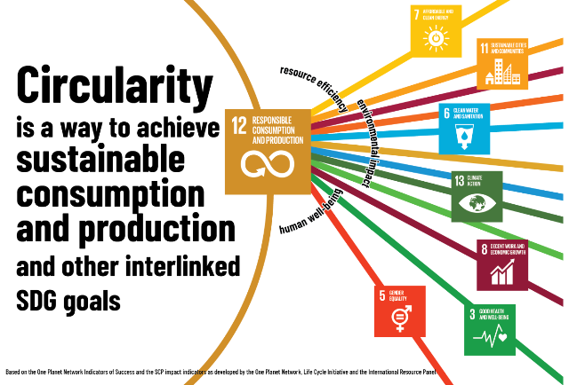
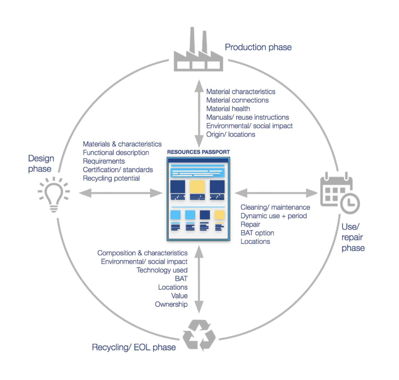

[1 <---](1_2024.md) [Зміст](README.md) [---> 3](3_2024.md) 

# 2. Стала індустрія та циркулярна економіка

На думку Європейської комісії законодавців по всьому світу цифрова трансформація нерозривна з зеленим переходом і тому при цифровій трансформації варто розібратися в аспектах сталого розвитку. У цій лекції ми зробимо вступ до сталого розвитку, а також розглянемо циркулярну економіку.

## 2.1. Кризові явища та необхідність зеленого переходу

Для початку варто розглянути які виклики зараз існують і які кризові явища спричинили розвиток нових моделей побудови економіки всієї промисловості, а не тільки на окреме підприємство. 

- По-перше, це економічна криза, яка викликана тим, що система капіталізму досягла межі свого розвитку, спричиняючи системну кризу. Цей стан справ стимулює пошук нових економічних та бізнес-моделей.  
- По-друге, це кліматичні зміни. Науковці зійшлися на тому, що у якості ключового фактору зміни клімату є промислове виробництво. Підприємства повинні уважніше враховувати свій вплив на навколишнє середовище та приймати заходи для зменшення негативних наслідків. 
- По-третє, це криза вичерпання енергетичних ресурсів. Росте потреба в енергії при обмежених можливостях її видобутку. Це у свою чергу вимагає розробки ефективних та стійких енергетичних моделей, з використанням відновлювальних джерел енергії. 

У зв'язку з цими викликами підприємства повинні адаптуватися до нових умов, розвиваючи підходи, які враховують принципи сталого розвитку та ESG, для збереження своєї конкурентоспроможності та стійкості в майбутньому.

рис.2.1. Ключові дати стосовно зеленого переходу.

Констатація цих трьох криз була зафіксована ще в кінці 60-х, а у 1972-му році вийшов звіт від Римського Клубу "The limits to Growth", про межі росту розвитку, в якому було промодельовано кілька сценаріїв того, як можна будувати в наступних роках розвиток економіки, промисловості та суспільства. Так з'явилася певна дорожня карта, щодо зеленого переходу, згідно якої вказано кілька ключових дат. Національні Зелені плани присвячені 2030 року, і вони означують шляхи  переходу країни до нових економічних моделей, де велика увага  приділяється розвитку промисловості. Глобальний дедлайн вказаний у 2050 році - це дата, коли необхідно досягти повного переходу до зеленої або так званої сталої економіки. Корінням цього переходу є події 2008 року - дата великої кризи капіталу, яка показала потребу у змінах у фінансовій системі. Капітал виступає фінансовою підтримкою розв'язання глобальних проблем, таких як голод, освіта та промисловий розвиток. Тому кризи на ринку капіталу впливають на всі підприємства та людей. Фундаментальна криза перешкоджає вирішенню проблем, таких як зміни клімату, засуха та підвищення рівня океану. З цього моменту почалася системна робота над тим, щоб перейти до інших принципів побудови індустрій. 

**Сталий розвиток (Sustainable Development)** - це такий розвиток, який задовольняє потреби нинішніх поколінь без шкоди для здатності майбутніх поколінь задовольняти власні потреби. Це означення дали ще у 1987-му році, але досить часто його плутають і по-різному трактують. Насправді - це про свідоме споживання ресурсів людством таким чином, щоб не ставити під загрозу ресурси для майбутніх поколінь.  А ключовою метою сталого розвитку є довгострокова стабільність, а не зріст. Станом на зараз розвиток не є сталим. Нова концепція в противагу попередній має назву економіка нульового зростання, тобто це побудова промисловості та економічних систем, які будуть стабільно працювати та задовольняти саме ті потреби, які є необхідними. Також можна вести критерії сталої індустрії як вуглецево-нейтральної економіки, як нульові викиди парникових газів.

Зокрема існують мегатренди в світі, на які варто звернути увагу:

- розрив між багатими і бідними людьми
- демографічна проблема, у світі зараз офіційно 8 млрд людей на планеті 
- технологічна промислова революція поставить під питання багато професій на ринку праці 
- зміни клімату
- екологічний слід світового виробництва та споживання, тобто наскільки підприємства ефективно споживають ресурси, матеріали та задають негативного впливу на навколишнє середовище 
- і шоки невизначеності які з'являються в світі такі як пандемія, як вторгнення росії в Україну, як війна Палестини і Ізраїлю і т.п. 

Ці всі речі впливають на нас всіх, тобто на Все це потрібно зважати з точки зору майбутніх десятиліть. 

Саме тому багато років велась робота над **цілями сталого розвитку** - консенсусного документу, який зрештою об'єднав 193 країни ООН. Він вийшов 25 вересня 2015 року та прийнятий ООН одноголосно під назвою "Перетворення нашого світу: Порядок денний у сфері сталого розвитку до 2030 року" [[1](https://www.undp.org/uk/ukraine/publications/%D0%BF%D0%B5%D1%80%D0%B5%D1%82%D0%B2%D0%BE%D1%80%D0%B5%D0%BD%D0%BD%D1%8F-%D0%BD%D0%B0%D1%88%D0%BE%D0%B3%D0%BE-%D1%81%D0%B2%D1%96%D1%82%D1%83-%D0%BF%D0%BE%D1%80%D1%8F%D0%B4%D0%BE%D0%BA-%D0%B4%D0%B5%D0%BD%D0%BD%D0%B8%D0%B9-%D1%83-%D1%81%D1%84%D0%B5%D1%80%D1%96-%D1%81%D1%82%D0%B0%D0%BB%D0%BE%D0%B3%D0%BE-%D1%80%D0%BE%D0%B7%D0%B2%D0%B8%D1%82%D0%BA%D1%83-%D0%B4%D0%BE-2030-%D1%80%D0%BE%D0%BA%D1%83)]. Було досягнуто в принципі взаєморозуміння щодо цілей:

- перелік
- універсальний характер 
- інтегрованість в законодавчі ініціативи
- вплив на трансформацію суспільств
- орієнтація на кожну окрему націю
- фокусовання на людях і на глобальному партнерстві

Ці цілі мають бути доступними для всіх людей на планеті, щоб вони могли розвиватися далі і захищати Землю, біорізноманіття і все життя на ній. 

Цей документ розділений на декілька блоків:

- візія - бачення, 
- які структурні моменти (цілі), 
- як стратегію реалізовувати 
- як її переглядати і контролювати 

У документі були зазначено 17 цілей сталого розвитку (**ЦСР**), які структуровані навколо п’яти категорій: люди (people), планета (planet), процвітання (prosperity), мир (peace) і партнерство (partnership). Ці категорії (**п'ять P**) підкреслюють, що ЦСР є взаємопов’язаною системою, а не групою окремих цілей. Прогрес на одному з них повинен балансувати та підтримувати прогрес на іншому. 

**Люди**. До цієї категорії відносяться ЦСР, які стосуються подолання бідності, голоду, забезпечення здоров’я та благополуччя, надання якісної освіти, доступу до чистої води та санітарії, прагнення до гендерної рівності. 

**Планета**. Зміна клімату є перешкодою на шляху до досягнення ЦСР і має непропорційний вплив на бідних. Без узгоджених дій це може призвести до бідності ще 100 мільйонів людей до 2030 року. Цілі розвитку ставлять перед собою мету захистити планету, щоб вона могла задовольняти потреби нинішнього та майбутніх поколінь. 

**Процвітання**. Нерівність є однією з визначальних проблем цього покоління і вимагає відповідної уваги, якої досі бракує. Забезпечення процвітання та повноцінного життя в гармонії з природою втілює процвітання, до якого світ повинен прагнути в найближчі десять років. 

**Мир**. Справедливість лежить в основі успіху ЦСР: від подолання бідності та нерівності до забезпечення того, щоб ніхто не залишився осторонь. Світ ще дуже далекий від того, щоб стати мирним, але лише свідомо працюючи над досягненням цієї мети, ми можемо досягти будь-якого прогресу в запобіганні насильству та покращенні безпеки громад від верху до низу. 

**Партнерські відносини**. Інтеграція, прискорення та політична підтримка (MAPS) для ЦСР конче потребують інформування всіх державних і приватних зацікавлених сторін щодо володіння, впровадження та прискорення ЦСР у їхніх відповідних можливостях. 

рис.2.2. Цілі сталого розвитку

Тобто це ті цілі, на які орієнтуються всі уряди всіх демократичних країн в світі. Ці всі цілі пов'язані від само високорівневих документів і опускаються все нижче до практичних речей які потім лягають в основу саме бізнесу і багатьох рішень. Ці глобальні цілі сталого розвитку також зафіксовані указами президента України в різних нормативних документах і вони є основою для розуміння фактично стратегій різного роду законів. 

## 2.2. Циркулярна економіка 

Надалі у цій лекції здебільшого ми зосередимося на 12-тій цілі сталого розвитку - Відповідальне споживання і виробництво (Responsible consumtion and production),  яка максимально фокусується на ресурсо- і енерго-ефективності. Це ті речі які є в центрі уваги циркулярної економіки, про що йтиме мова далі. 

рис.2.3. Зв'язок цілі 12 "Відповідальне споживання та виробництво" з іншими цілями.

### Означення та основні принципи

Зараз світ фактично живе в парадигмі так званої лінійної економіки, коли ресурси, матеріали, надра видобуваються з них виробляються якісь товари, вони споживаються, використовуються користувачами і потім вони потрапляють на смітник як відходи, що часто призводить до погіршення стану навколишнього середовища та виснаження ресурсів (рис.2.4). 

рис.2.4. Лінійна економіка

Цю економічну модель намагаються зараз змінити на ту, яка є більш циркулярною. Циркулярна економіка пропонує альтернативний підхід, спрямований на те, щоб відокремити економічне зростання від споживання ресурсів, одночасно сприяючи сталим практикам, які відновлюють і повторно використовують матеріали. 

Існує декілька означень **циркулярної економіки** (**circular economy**) або економіка **замкненого циклу** (**closed-loop economy**), тому що термін "циркулярна економіка" все ще має різні тлумачення. Найбільш широким і узагальненим терміном є наступне «Циркулярна економіка це загальний термін, що охоплює всі види діяльності , які зменшують, повторно використовують і переробляють матеріали в процесах виробництва , розподілу та споживання».  Blomsa & Brennan (2017). У ньому передбачається що ми маємо концептуально орієнтуватися щоб всі наші матеріали були максимально ефективно використані, щоб продукти наші були в економіці якомога довше і вони були максимально цінні. 

Основоположними ідеями циркулярної економіки є: відновлення ресурсів, вторинна переробка матеріалів та перехід до використання відновлюваних джерел енергії, таких як сонячна, вітрова та гідроенергія. 

### Принципи циркулярної економіки

Принципи, які лежать в основі циркулярної економіки, ґрунтуються на  радикальному переосмисленні управління ресурсами, виробничих процесів і  моделей споживання. Ці принципи разом роблять внесок у систему, яка  надає пріоритет стійкості, ефективності та довгостроковій  життєздатності. Впроваджуючи ці принципи в різні аспекти економічної  діяльності, суспільства можуть відійти від традиційної лінійної моделі  та перейти до регенеративного та реставраційного підходу. Є різні варіанти цих принципів в залежності від авторів. У загальному вони зосереджуютьс на:

- регенеруванні природних систем, тобто виробництво має бути побудовано таким чином, щоб природа змогла сама себе відновлювати
- проектуванні систем без відходів на забруднення, тобто товари потрібно проектувати таким чином щоб в них за дизайном була мінімальна кількість відходів на етапі постспоживання 
- необхідності використання мінімуму матеріалів наскільки це можливо і утриманні їх максимально довго в обігу 

У 2010-х роках було розроблено кілька моделей циркулярної економіки, які використовували набір кроків або рівнів циркулярності, як правило, з використанням англійських дієслів або іменників, що починаються з літери «R». Першою такою моделлю, відомою як «принцип трьох R», була «Reduce, Reuse, Recycle», яку можна простежити ще в 1970-х роках. Однією з найповіших моделей є **«принцип 10R»**, розроблений професором  сталого підприємництва та колишнім міністром навколишнього середовища  Нідерландів Жаклін Крамер.

рис.2.5. Ключові принципи циркулярної економіки

Це наступні 10 принципів: 

- Refuse (Відмова), 
- Reduce (Зменшення), 
- Renew/Redesign (Оновлення/зміна дизайну), 
- Reuse (Повторне використання), 
- Repair (Ремонт), 
- Refurbish (Ремонт, Відновлення), 
- Remanufacture (Відновлення/Переобробка), 
- Repurpose (Перепрофілювання/Переорієнтація), 
- Recycle (Переробка), 
- Recover (Відновлення). 

Ці приниципи стоять в основі стратегій циркулярного дизайну, які  розглянемо пізніше в цій лекції.  Існує декілька особливостей циркулярної економіки, про які варто зазначити.

- Системне мислення в основі - циркулярна економіка системна в своєму дизайні, вона комплексна. На противагу до складних речей (наприклад автомобіль, протилежність проста), комплексні (противага незалежні) - все зв'язано. Приклад екосистеми лісів Амазонки, коли вплив на якийсь вид може змінити всю екосистему. У циркулярній - треба змінювати всю систему. В Україні на практиці дуже часто відсутня взаємодія між центральними органами виконавчої влади і бізнесом. Вони можуть об'єднатися наприклад для вирішення викликів, пов'язаних з переробкою матеріалів і обслуговування певних кластерів, створення інфраструктури саме в економічному плані. Тобто ці речі потребують системного мислення тих людей, які їх проектують.   
- Не використання токсичних речовин
- Ідея петлі зворотного зв’язку - щоб матеріали були довго в петлі між виробником і споживачем 
- Стійкість через різноманітність - залучення різних аспектів та елементів для досягнення цінностей
- Збереження цінності - має бути максимальною
- Використання відновлюваної енергії - циркулярна економіка і сталий розвиток нерозривні від відновлювальних джерел енергії
- Перехід від споживача до користувача - ми маємо більше бути користувачами а не власниками
- Замкнуті цикли та «Відходи як їжа»

Далі ми зупинимося на цьому більш детальніше. 

### Економіка рециклінгу в порівнянні з циркулярною економікою

Зараз в Україні відбувається реформа керування відходами, яка передбачає переробку відходів для часткового повторного використання, і по суті це якраз перехід до економіки рециклінгу. Але насправді циркулярна економіка зосереджена не на те щоб переробляти відходи а на те, щоб матеріали взагалі не потрапляли у смітник (рис.2.6). Це зовсім інша концепція так як передбачає зміни в життєвому циклі продукту ще на ранніх стадіях а не тільки в поствикористанні.

рис.2.6. Порівняння лінійної економіки, економіки рециклінгу та циркулярної економіки.

Тому існує декілька нестиковок з підходами, які ми бачимо зараз що реалізуються у владі. 

## 2.3. Циркулярний дизайн

### Ідея циркулярного дизайну 

Загалом дослідження показують, що 80% негативного впливу на навколишнє середовище закладене на стадії проектування, тобто в дизайні. Це значить, що вже на стадії проектування можна вплинути на те, як продукція буде використана, і, фактично, яка її доля буде після споживання і після використання. І саме на цю стадію життєвого циклу (проектування, дизайн), особливо варто звернути увагу. 

Всі активності та процеси, які намагаються закрити потік матеріалів в ідеальну петлю, можуть розглядатись підходами циркулярного проектування (в контексті процесів), або циркулярного дизайну (в контексті результату).

Є різниця між сталим дизайном і циркулярним дизайном, хоча ці терміни не взаємовиключні. Сталий дизайн - це більш широкий термін, циркулярний дизайн - це як підкатегорія сталого дизайну. Але загалом можна сказати, що якщо ви говорите про виробництво, де ваша продукція споживає менше енергії, води і ресурсів, то мова більш йде про сталий дизайн. Якщо ви говорите, що по вашому дизайну продукція знов повернеться на виробництво, або матеріали знов повернуться, або вона буде якимось чином відновлена, то це вже про стратегії, що пов'язані з циркулярним дизайном. 

Вплив циркулярного дизайну можна схематично показати на рис.2.7 в комнтексті життєвого циклу продукту, починаючи з етапу купівлі. У цьому підході можна вважати, що є кілька життєвих циклів продукту, кожен з яких можна вважати часом володіння цим продуктом. Тільки після n-го циклу продукт йде на переробку. 

рис.2.7. Розуміння циркулярного дизайну продукту через схему багатьох життєвих циклів 

Розглянемо приклад пральної машини, яку купила сім'я. У цієї машини є певний термін придатності, і фактично весь перший цикл говорить про те, що протягом якогось періоду часу, наприклад 3-5 років ця машина буде служити. Після цього вже там можуть виникати технічні проблеми, коли сім'я вирішує  чи потрібно ремонтувати чи позбутися, або сім'я хоче купити нову техніку. Так завершується перший цикл для цього продукту, і продукт може передатися на ремонт або відновлення, після чого може перейти до іншого власника, наступає 2-й цикл. Таких циклів для техніки (технічні цикли) може бути кілька, і з точки зору циркулярного дизайну, чим більше - тим краще. Для біологічних продуктів циклів також може бути декілька, але в цьому випадку продукти можуть бути утилізовані одразу після першого використання. На деяких циклах продукт може використовуватися по іншому. У кінці кожного циклу користувач вирішує чи досі корисний та/або придатний продукт і що з ним робити. Після всіх можливих циклів використання пральна машина розглядається як сукупність матеріалів, і її можна розібрати на частини, переробити і повторно використати при виробництві подібної або іншої техніки.    

Тобто з точки зору циркулярної економіки для бізнесу важливо проектувати продукти таким чином, щоб цих циклів використання, відновлення та ремонту було максимально багато і матеріали які є в цій машині  підлягали відновленню і могли бути використані десь в майбутньому. Тобто щоб час життєвого циклу був максимально довгий. 

Як вже було зазначено, важливо мати системне бачення і розуміти весь цей життєвий шлях, його стадії і етапи. Це у свою чергу дасть можливість визначити як на нього можна вплинути, які елементи дизайну і які інноваційні підходи можна привнести для того, щоб цих циклів було багато, щоб була можливість ремонту, обслуговування та відновлення матеріалів. 

Таким чином в лінійній економіці на стадію пост-споживання, поствикористання фактично не звертається уваги, її там фактично не існує. Тобто в даній лінійній моделі більшості бізнесу байдуже яким чином його продукція буде використана, і що буде після цього. А в циркулярній економіці на це звертається особлива увага і цей процес є контрольованим і керованим. Коли це контрольований процес, це дає додаткові можливості для різних бізнес-моделей і для досягнення фактично всіх цілей, про які зазначалося в циркулярній економіці. 

### Особливості дизайну у біологічних та технологічних циклах

Зазвичай біологічні та технологічні цикли розділяють (рис.2.8).

рис.2.8. Технологічний та біологічні цикли.

**Біологічні цикли** розглядають в термінах використанням біологічних або біорозкладних первинних матеріалів, наприклад деревина. Вони можуть бути перероблені або використані в інших цілях. Необхідно обміркувати біологічний ресурс, його процес та тривалість росту, сегмент ринку, та тривалість життєвого циклу продукту. Життєві цикои повинні бути спроектовані таким чином, щоб біологічний матеріал встигав відновлюватися. Наприклад, щоб бути по справжньому сталим, виріб з деревини для масового ринку має мати термін служби таким же як час зростання 3-х таких дерев, з яких він зроблений.

**Технологічні цикли** розглядають з точки зору використання матеріалів, які не можуть бути повернуті в природу, бо вони синтезовані і не розпадаються (наприклад пластик). Тільки реінтеграція технічних матеріалів у матеріальний потік дозволить багаторазове використання матеріалів. При цьому використання небезпечних матеріалів, хімічних продуктів або рідкісних матеріалів має уникатись. Скорочення втрат матеріалів через покращення можливості розбирання є критичним для циркулярної економіки. Бізнес має робити кроки щоб спростити користувачам можливість самостійного ремонту та продовження циклу використання. Ремонт не має бути дуже дорогим але і техніка не може бути дуже дешевою. Саме у проектуванні технологічного циклу обов'язково треба враховувати: 

- контекст, як ця продукція використоується
- який існує ринок
- як відноситься до цього замовник
- який це виробничий процес, на скільки роботизований
- зручність обслуговування
- на скільки дорого розробити інфраструктуру для відновлення.

Є багато простору для цифрових рішень, які дають розуміння для продовження циклу корисності та повторного використання:

- які продукти, компоненти та матеріали
- як реінтегрувати в систему
- пропонувати скоріше послугу користування, аніж продукт
- продуктовий дизайн та використання інших бізнес моделей впливає на потік матеріалів

### Стратегії циркулярного дизайну в технологічному циклі

Існують три стратегії щодо циркулярного дизайну в технологічному циклі:

- **сповільнення матеріального потоку** - використання матеріалів довше в часі
- **звуження матеріально го потоку** - зменшення кількості матеріалу
- **зациклення матеріального потоку** - повторне використання матеріалу

З точки зору організації цього процесу в циркулярному дизайні можна виділити виробничі системи закритого та відкритого циклу. 

- Виробничі компанії **закритого циклу** виробляють свою продукцію і контролюють повністю те, як товар виходить на ринок, як відновлюється та повертається назад. У цих системах простіше контролювати усі процеси, бо вони виконуються тією ж компанією. Але такі виробничі системи притаманні лише для досить великих компаній, які вже давно працюють на ринку.  

- Більшість компаній працюють у виробничих системах **відкритого циклу**, коли продукт створюється однією компанією, а відновленням, ремонтом та переробкою займаються інші компанії. Трансфер цінності продукту тут лежить на користувачеві, а виробники не мають ефективного контролю над якістю сервісу третіх сторін. У таких системах  потребується кооперація і координація між учасниками ринку і це фактично впливає на бізнесову компоненту. 

У циркулярних бізнес-моделях як для закритих так і для відкритих систем використовують кілька паттернів (підходів), зокрема:

- Нові моделі власності
- Пропозиції цінності
- Доступ перед прибутком (для бізнесу)
- Особи можуть мати доступ до товарів поза їх фінансовими можливостями

Для кожного технологічного біологічного циклу і для кожної дизайн стратегії є кілька можливих дизайнів(рис.2.9) 

рис.2.9. Різні підходи до дизайну 

Нижче розглянемо їх детальніше. 

#### Дизайн для обслуговування

Цей дизайн направлений на спрощення обслуговування, повернення до стану придатного до використання та зменшення часу ремонту. Тут можна робити кілька акцентів:

- Дизайн для ремонтопридатності націлені на спрощення ремонту. Це може передбачати використання стандартних компонентів, спрощення та модульності продукції, використання доступних запчастин (наприклад типових, стандартизованих). Також при розробці увагу варто приділити маркуванню та доступності документації по обслуговуванню та ремонту. 
- Дизайн для апгрейду (оновлення) направлений на можливість вдосконалення в майбутньому. Наприклад автомобіль тесла оновлюється через ПЗ. Продукт також може бути оновлений через заміну компонентів.     
- Дизайн для надійності. Це можливо за рахунок використання прогнозування можливих причин поломок через предикативні моделі та запобігання їм відповідними засобами, або використання дуже стійких до часу та зношення компонентів.

#### Дизайн для повторного використання

Цей дизайн передбачає що власник продукту може змінитися на початку кожного наступного життєвого циклу продукту. Як і в попередньому дизайні це потребує врахування необхідності обов'язкового обслуговування між циклами, апгрейду і надійності. Крім цього важливими аспектами є простота, зручність та доступність. Тут можна робити кілька акцентів:    

- Дизайн для автентичності поза часом, що передбачає таку форму продукту, яка буде мати стильний вигляд незалежно від часу та трендів. Продукт із збалансованим та «нейтральним» дизайном буде слугувати довше. 

- Дизайн для граційного старіння базується на іншій ідеології, коли при проектуванні продукту враховують що час впливатиме на зміну вигляду продукту, але старіший продукт при цьому матиме гарну форму (рис.2.10). 
- Дизайн для повернення передбачає що продукт буде повертатися виробнику кожного разу пере наступним циклом за рахунок винагороди або викуповування. Звісно повинні враховуватися матеріали та застосування продукту. 

рис.2.10. Приклади дизайнів продуктів граційного старіння.

#### Дизайн для ремонту

Цей дизайн передбачає що продукт може тестуватися і ремонтуватися третіми особами, а отже націлений на те, щоб перевірити правильність ремонту та працездатності продукту післямремонту. Зокрема цей дизайн передбачає можливість розбірки та збірки виробів, а саме:

- спрощення продукту
- зменшена кількості запчастин

Такий підхід дає можливість знизити витрати на процеси та накладні витрати, так як продукт є простішим, при цьому має вищу ефективність та коротший час виходу на ринок.

#### Дизайн для заводського перероблення

Деякі речі можна відновити тільки на заводському обладнанні тому цей дизайн передбачає один з 2-х варіантів:

- Відновлення використаних продуктів для нових цілей
- Відновлення цінності від продуктів на етапі «кінець циклу»

Як вказано в [[3](https://wedocs.unep.org/handle/20.500.11822/31614)], це "Стандартизований промисловий процес, що відбувається в промислових або заводських умовах, у якому товар відновлюються до початкового стану, як новий, з тією ж продуктивністю або краще. Процес відновлення відповідає конкретним технічним специфікаціям, включаючи стандарти інженерії, якості та випробувань, і зазвичай дає продукти з повною гарантією. Виробниками відновлених товарів вважаються фірми, які надають послуги з відновлення вживаних товарів до початкового робочого стану". 

Можна виділити наступні кроки до заводського перероблення:

- Товари відправляються до виробника повністю
- Виробник розбирає та очищує товар
- Дефективні, пошкодження чи зламані компоненти замінюються
- Компоненти збираються та перевіряються на якість
- Товар знову продається на ринок з гарантією

#### Дизайн для апсайклінгу

Є кілька трактувань поняттю **апсайклінг (Upcycling)**. 

- «… матеріал або продукт, який спроектований таким чином, щоб повернутись назад в технологічний цикл, в індустріальний метаболізм з якого він вийшов» Cradle to Cradle, Braungart and McDonough

- «… «Сила повного циклу» … лежить у факті, що незабруднені матеріальні потоки, збільшують збір та розподільчу ефективність, при цьому зберігаючи якість, особливо у технологічному циклі, який, в свою чергу, збільшує довговічність продукту і таким чином збільшує ефективність матеріалу.» Ellen MacArthur Foundation

Тобто це повторне використання матеріалу поверненого з продукту і при цьому цей матеріал не втрачає якості. 

Дизайн для апсайклінгу може передбачати що матеріал з продукту використається повторно для наступного продукту для тих же цілей. Наприклад банки для напоїв можна використовувати для створення нових банок для напоїв. Іншим прикладом є використання високоміцних матеріалів при виробництві меблів, щоб щоб повернутись в індустріальний потік.

#### Дизайн для рециклінгу

У противагу до апсайклінгу  **Даунсайклінг (Downcycling, cascading)** відноситься до переробки (рециклінг) відходів, матеріал яких є нижчої якості тому не може бути використаний в тому ж вигляді для того ж використання (див. таб.2.1). 

Таблиця 2.1. Порівняння апсайклінгу та даунсайклінгу

| апсайклінг                                                  | даунсайклінг                                                 |
| ----------------------------------------------------------- | ------------------------------------------------------------ |
| Відноситься до технологічного циклу                         | Відноситься практично до всіх існуючих активностей переробки |
| Використовується другий раз з тією самою метою, що і перший | Багато матеріалів не можуть бути використані з тією самою метою вдруге |
| Зберігає фізичні, механічні та косметичні властивості       | Багато матеріалів не зберігають фізичні, механічні та косметичні властивості |
| Зазвичай присутній в системах закритого циклу               | Не завжди працює в системах закритого циклу                  |

Дизайн для рециклінгу - це найбільш відома та широковживана стратегія дизайну. Вона знижує потребу в нових матеріалах, скорочує кількість відходів пов’язаних з видобуванням первинних матеріалів. Необхідно врахувати те, що різні матеріали мають різну ступінь переробки. Також треба враховувати де і як продукт буде використаний та його вміст, тобто з якими матеріалами разом, та як ці матеріалу будуть перероблені.

Стратегія приводить до мінімізації використання матеріалів, запчастин, матеріалів в кожній запчастині, кількість типів матеріалів. Дизайн також направлений на полегшення сортування відходів. Наприклад для правильної переробки пластику, на ньому відображають [код](https://uk.wikipedia.org/wiki/%D0%9A%D0%BE%D0%B4_%D0%BF%D0%B5%D1%80%D0%B5%D1%80%D0%BE%D0%B1%D0%BA%D0%B8).

#### Звуження матеріального потоку

Звуження матеріального потоку напряму не пов’язано з концепцією циркулярності продукту, бо не промотує повернення продуктів у систему. Натомість ця стратегія зменшує кількість матеріалів задіяних при виготовленні продукту. Серед можливих дизайнів можна виділити наступні:

- Дизайн для оптимізації направлений на використання мінімальної кількості матеріалів, проте на міцний та компактний дизайн. Зменшення кількості матеріалів напряму впливає на навколишнє середовище, так як менше відходів та впливу під час транспортування як матеріалів так і продукції до пунктів зберігання. Якість продукції залежить від кількості матеріалів.

- Дизайн для матеріалів з малим впливом направлений на використовування меншої кількості небезпечних матеріалів, більш екологічних замість синтетичних процесів, використання матеріалів та технік виробництва, які споживають менше енергії та води.
- Дизайн для мініатюризації. Мініатюризація заохочує використовувати менше матеріалів, враховує розбірку продукту, доступність компонентів.

- Дизайн для дематеріалізації передбачає цифровізацію товару. Прикладом є введення електронного документообігу, цифрові книги, тощо. Однак варто зауважити що оцифрування не завжди призводить до скорочення матеріалів (наприклад CD/DVD).

- Дизайн для використання місцевих ресурсів застосовується, як до продукту так і до упаковки. Це зменшує потребу в ресурсах з різних частин світу. Повітряний транспорт найменш дружній до довкілля, тому використання місцевих ресурсів зменшує викиди в атмосферу. Також цей дизайн направлений на ефективне планування логістики та дистрибуції.

#### Дизайн для ефективності ресурсів (енергія)

Цей дизайн направлений на зменшення інтенсивності використання матеріалів, що передбачає вибір матеріалів, які можуть каскадно впливати на всю систему. При цьому аналізується життєвий цикл продукту. 

До цієї стратегії відноситься дизайн для енергоефективності процесів. Наприклад, холодильник використає за час терміну служби більше енергії, ніж витрачено на його виробництво. Тому кількісний аналіз потенційної спожитої енергії протягом терміну служби буде критерієм, який треба мінімізувати.

#### Дизайн для каскадного використання

Під каскадним використання матеріалів розуміють використання в послідовних циклах з різною метою того самого продукту. Загальні методи в біологічних циклах також можуть бути використані в технологічних циклах. При першому використанні продукт є найвищим в цінні, а при останньому - найнижчим. Важливо розуміти пріоритетність використання ресурсів.

рис.2.11. Приклад дизайну для каскадного використання. 

#### Дизайн для біодеградації

Цей дизайн для продуктів з біологічним циклом. Коли не має альтернативи використанню продукту і матеріалу після застосування. Це продукти з короткою або дуже короткою тривалістю служби, наприклад біорозкладні замість пластикових пакетів в магазинах. 

Цей дизайн потребує дослідження на рахунок того, як продукт може бути розібраний та біоперероблений. Це потребує додаткових затрат на саму біопереробку, тому потребує спонукання користувача до цих дій.

### Вплив на поведінку користувачів

У дизайн продукту необхідно закласти механізми стимулювання користувачів до задіяння їх впливу на  циркулярність. 

Тут можна виділити кілька підходів:

- Дизайн для екологічного зворотного зв’язку, коли користувач може зв'язатися з виробником для покращення продукту.
- Дизайн на заохочення управління - керування користувачем енергоефективністю продуку та контролю за ним.
- Дизайн для переконливих технологій (обмеження використання) - по замовченню багато речей обмежується 

## 2.4. Циркулярні бізнес-моделі

### Особливість циркулярних бізнес моделей 

Базуючись на загальноприйнятому визначенні, **бізнес модель (БМ)** пояснює як організація створює, доставляє та захоплює цінність (вартість, value).

**Циркулярні бізнес моделі (ЦБМ)** - це інноваційні бізнес моделі у яких створення, доставка та захоплення цінності зберігає економічну цінність продукту і його складових якомога довше, за рахунок:

- зменшення його залежності від первинних матеріалів, 
- використання відновлювальних енергетичних систем, 
- адаптування практики сталого виробництва, 
- і більш загально - «озелененням» усього ланцюжку цінності.

Традиційні лінійні бізнес-моделі відображають різні форми підходу «взяти-зробити-викинути». Вони направлені на створення цінності тільки з метою максимізації прибутку, враховують наслідки капіталізму для стейхолдерів. При цьому вони не розраховані на повагу до довкілля, планети, або інших зовнішніх ефектів і загалом приводять до виснаження природних ресурсів. 

Циркулярні бізнес моделі є по своїй суті регенеративними, вони забезпечують створення, доставку та захоплення цінності без шкоди для планети і у спосіб, який допомагає відновлювати планету. Це комплексний підхід, який враховує весь життєвий цикл.

Можна виділити два підходи до ЦБМ

- Існуючі БМ адаптуються до циркулярних, тобто змінюються якісь частини БМ
- БМ проектують з нуля 

Існує загалом досить багато можливих підходів як це реалізувати і звичайно всі їх не можна використати, а тільки деякі з них в залежності від продукту. Але загалом потрібно орієнтуватися на те, щоб:

- скорочувати матеріали 
- щоб матеріали повторно могли бути використані 
- щоб продукт можна було відремонтувати
- максимально використовувати вторинні матеріали
- використовувати екодизайн
- збільшувати ефективність продукту
- використовувати користування продуктом в противагу власності 
- контроль за продуктом на всьому життєвому циклі
- використовувати альтернативи викопним матеріалам 

Прикладом циркулярної бізнес-моделі є повторне використання повернених телефонів при виробництві iPhone. На виробництві є спеціальний робот, який повністю розбирає старі телефони iPhone, для того щоб використати компоненти і заново їх зібрати в нових телефонах. Тобто це інновація від компанії і вона потенційно може бути масштабована на інші виробництва. Це можливо у тому випадку, якщо виробники будуть ділитися інформацією про схему їхніх виробів і склад їхніх матеріалів, для того щоб розробники могли зробити роботів, які далі будуть розбирати на частини ці вироби з можливістю повторного використання елементів. 

Загалом циркулярні моделі можна застосовувати як до продукції, так і до послуг, як для дорогих речей так і для дешевих, як для матеріальних так і для нематеріальних активів, в комунікації бізнес для бізнесу (B2B) так і в бізнес для споживачів (B2C). Це надзвичайно широкий підхід, який можна застосувати разом з цифровими рішеннями в багатьох сферах, якщо розуміти концепцію збереження матеріалів, розуміти ті дизайн стратегії, яку архітектори продуктів заклали, і під неї будувати цифрові рішення, які її підтримують.

### Класифікація ЦБМ

Наразі мало консенсусу щодо топології та класифікації ЦБМ. Через відносну новизну ЦБМ часто з’являються нові. Більшість ЦБМ можна структурувати. Багато дослідників і практиків працюють над розробкою більш масових практичних рішень. Так наприклад фундація Ellen MacArthur декілька років тому запропонувала фреймворк (рис.2.12), в якому компаніям пропонуються орієнтири щодо того, як вони:

- можуть відновити матеріали, 
- ділитися ресурсами та своєю продукцією
- оптимізувати виробництво
- замкнути в петлю продукцію, щоб поверталися до них матеріали, 
- що вони можуть віртуалізувати 
- чим якими ресурсами вони можуть ділитися. 

Цей загальний підхід який дуже часто використовується для побудови ЦБМ.

рис.2.12. Фреймворк від Ellen MacArthur

Свіжі спроби класифікувати ЦБМ робляться через різні фокуси: 

- Вплив на сталість
- Принципи продуктового дизайну
- Ціннісна пропозиція та потоки
- Життєві цикли продукту

Тобто в залежності від продукту і стратегічного підходу компанії можна сфокусуватися на різних елементах. Вже на цьому етапі видно зв'язок як до стратегій звуження, скорочення і зациклення можуть бути адаптовані циркулярні бізнес-моделі. Виділимо такі ЦБМ:

- Збереження власності над продуктом. Власність зберігається за виробником і відділяється від «користування». 
- Продовження життя продукту. Інтегруються різні циркулярні елементи: повторне виробництво, індустріальний симбіоз, апскейлінг. 
- Дизайн для переробки. Інтегрується модульність, спрощення обслуговування, дизайн для розробки та «дизайн для…» елементів
- Сповільнення ресурсного циклу. Заохочення продовження життя продукту у різних формах
- Звуження ресурсного циклу. Циркулярний продуктовий дизайн та ефективність виробництва
- Закриття ресурсного циклу. Трансформація продуктів та їх «відходів» в корисні матеріали через різні форми інноваційних бізнес моделей

### Перепони для ЦБМ

Сьогодні існують великі перепони щодо впровадження ЦБМ. 

- По-перше, це звісно недостатньо фінансів. Конкурувати з традиційними лінійними бізнес-моделями в короткостроковій перспективі майже завжди нереально, тому що для традиційних компаній виготовлення продукції буде дешевше. Тому потрібна системна підтримка влади, яка б створила умови для підтримки таких речей. 

- По-друге, є структурні та операційні обмеження, які пов'язані з необхідністю тісної взаємодії між кількома компаніями, які є в ланцюжку доданої вартості. Потрібно створити операційні можливості, комунікуючи з компаніями, які в цьому є ланцюжку, які стають партнерами по заготівлі або переробки продукції після їхнього споживання, тобто працювати цілою командою створювати специфічні технології для того щоб відслідковувати матеріальний потік. 

- По-третє, це в свою чергу потребує впровадження нових технологій. Наприклад потребується впровадження цифрових паспортів продукції, і різних систем відслідковування матеріального потоку і продукції. І це тільки частина необхідних технологічних рішень, які і потребують цифрового переходу. І як вже зазначалося в попередній лекції, сам перехід є викликом, і без нього практично неможливо перейти на ЦБМ.

- По-четверте, це загальне ставлення до циркулярної економіки. Не достатньо людей приділяють уваги навіть для поверхового огляду концепції, вже не кажучи про деталі. Тому ставлення до циркулярної економіки часто упереджене як до теоретичної ідеології і люди не завжди розуміють що вона може принести. 

### Економічна модель спільного споживання (шерингова економіка)

Економіка спільного використання ([[4](https://business.diia.gov.ua/handbook/impact-investment/ekonomicna-model-spilnogo-spozivanna-seringova-ekonomika)]) — це економічна модель, що означується як діяльність на основі однорангового зв’язку (P2P), яка полягає в  придбанні, наданні або спільному доступі до товарів і послуг, що часто здійснюється за допомогою онлайн-платформи, заснованої на спільноті. Економіка спільного використання:

- передбачає короткострокові р2р (один до одного) транзакції для спільного використання незадіяних активів і послуг або для сприяння співпраці.
- часто включає певний тип онлайн-платформи, яка з’єднує покупців і продавців.
- швидко зростає та розвивається, але стикається зі значними проблемами у  вигляді невизначеності нормативно-правових актів та занепокоєння щодо  зловживань

Основі переваги моделі полягають у наступному:

1. Дешеві товари і послуги та економія часу й ресурсів: економічна модель побудована на ідеї, що обмін певними  товарами, послугами та навичками є більш ефективним. Це може зменшити  витрати на доступні товари, послуги та час (не потрібно купувати дрель, щоб 1 раз скористатися).
2. Фінансова вигода: додатковий дохід для провайдерів (надання житла в оренду зменшує витрати на його утримання,  отримання додаткових коштів за використання наприклад транспортного  засобу, який інакше простоював).
3. Збільшення ринку збуту, легкість та глобалізація через використання ІТ рішень.
4. Нові та кращі можливості та раціональне споживання (доступ до речей, які потребують значних коштів для володіння: машини, обладнання).
5. Сильніші спільноти. Багато платформ  спільного доступу мають вбудовані рейтинги та огляди, які допомагають  постачальникам і споживачам бути чесними. Коворкінги та маркетплейси  побудовані на ідеї міжособистісної співпраці та спільного використання  ресурсів. А деякі платформи використовують свій вплив – і спільні  ресурси своїх учасників – щоб допомогти тим, хто цього потребує. Ці та інші зусилля по  зміцненню довіри допомагають учасникам спільної економіки бачити один одного як рівних, будуючи конструктивні стосунки там, де їх раніше не  було.

Навіть дуже успішні компанії типу uber вони airbnb і інших будували свої бізнеси на тому що в них немає власних будинків, автомобілів чи інших фізичних активів. Натомість вони просто створюють цифрову платформу, щоб інші люди, які мають ці ресурси, могли ними за певними правилами ділитися і їх монетизувати. Існують вже міжнародні стандарти і рекомендації для розробників it систем які зараз на етапі аналізу щодо інтегрування їх в українське законодавство. Це потрібно для збільшення можливостей створювати шерингові платформи по зрозумілим правилам їхніх умов. 

Але по суті ділитися можна ресурсами для того, щоб їх не купувати а орендувати, ставати їхнім користувачем на той проміжок часу, який вам потрібен. Це потрібно для того, щоб не використовувати більше матеріалів для створення цієї продукції. В цьому суть шерингової економіки. У цьому ключі інший важливий компонент - це заводи для повторного використання. 

### Висновки

- Циркулярні бізнес моделі мають бути направлені на ті самі ключові принципи, що і циркулярна економіка загалом 
- Зменшення, повторне використання, рециклінг, вторинні, а не первинні матеріали, екодизайн, біомімікрія, висока ефективність, користування замість власності, достатність, від колиски до колиски, заміна викопного палива 
- Жодна ЦБМ не обов’язково має втілити усі принципи одразу 
- Багато світових лідерів вже успішно втілюють ЦБМ та принципи циркулярної економіки

## 2.5. Циркулярна Індустрія 4.0

На минулій лекції ми розглянули що можуть дати нові технології Індустрії 4.0. У контексті циркулярної економіки, технології Індустрії 4.0 перш за все дають можливість використовувати різного роду датчики та ідентифікаційні мітки (RFID, NFC чи QR Code) для отримання даних з метою відслідковування розміщення та стану активів. Також необхідно максимально оцифровувати всі етапи, бо це важливо як для аналізу так і для монетизації. Також це важливо для розуміння поведінки користувачів. 

Технології Індустрії 4.0 є одним з драйвером переходу до циркулярної економіки. Якщо узагальнювати то можна сказати, що з точки зору індустрії 4.0 для користувачів важливо зрозуміти:

- де саме розташовуються їхні активи 
- який їх стан 
- чи вони доступні та операбельні 

У контексті життєвого циклу продукту від первинного добування до відновлення цінності (рис.2.13), всі речі мають бути контрольовані. І в цьому контексті звичайно існує великий простір для використання технологій Індустрії 4.0. Зокрема, для того щоб кожний з цих етапів можна було відслідкувати використовувати Інтернет речей. Для передбачення чи прогнозування використовувати штучний інтелект та машинне навчання. Цифрові двійники можуть бути застосовані для збереження та отримання інформації про активи: де вони, що з ними, яке їхнє походження, що з ними зробити на кожному наступному етапі і т.п.  

рис.2.13. Життєвий цикл продукту в циркулярній економіці

Як і в шерінгових моделях, у більшості циркулярних бізнес-моделях велику роль відіграють цифрові платформи. Вони глибоко інтегровані у корпоративні процеси та ІТ системи. Для бізнесу, цифрові платформи стимулюють рішення на основі даних. Цифрові платформи покращують користувацький досвід клієнта, працівника та стейхолдера а також стимулюють розвиток peer-topeer та В2В мереж.

Окремої уваги заслуговують цифрові паспорти продуктів, матеріалів, будівель і т.п (рис.2.14). Це по суті цифровий двійник, який описує певну продукцію з точки зору її складу та історії створення та використання на всіх етапах життєвого циклу.  Він може включати:

- Цифрові набори даних, що описуюють визначені характеристики матеріалів та компонентів продукції, пов’язані з будівельними матеріалами
- Мета видобування, переробки та/або повторного використання матеріалів
- Інструмент активного моніторингу цінності
- Промоція інновацій
- Детальна інформація про матеріал, продукт або систему

рис.2.14. Паспорт продукту.

Деякі висновки щодо Циркулярної Індустрії 4.0

- Вторинні матеріали замінять первинні в індустрії, проте тотальна незалежність від первинних матеріалів неможлива 

- Багато технологій мають бути застосовані для зменшення витрат енергії у ланцюжку цінності
- Видобування в межах міст може бути альтернативою видобування первинних матеріалів 
- Цифрові двійники можуть бути ключовою технологією для видобувних галузей

- Циркулярна економіка покладається на дизайн 
- Щоб побудувати більш поєднані товари, які можуть надсилати та отримувати дані, вони мають бути
  спроектовані відповідно від самого початку
- Використовувати матеріали, які можуть реагувати на майбутні стимули (механічний стрес, температурні коливання)
- Застарілі або рідкісні запчастини можуть бути скановані та перероблені за допомогою 3D друку
- Організація виробництва таким чином, щоб уникати проблем та відходів
- Імплементувати швидкі модифікації дизайну
- Адитивне виробництво дозволяє кастомізацію та локальне виробництво
- 3D друк дозволяє використовувати більш дружні до довкілля та вуглицево-негативні матеріали
- Щоб бути більш ефективними, з точки зору вартості, товари можуть використовуватись в шерінгових
  бізнес моделях
- Платформи даних можуть поєднувати користувачів, бізнеси та навіть уряди
- Платформи обміну даними дозволяють зробити ланцюжки цінності більш обізнаними та
  інтелектуальними
- Циркулярні бізнес моделі зменшують споживанню енергії, а також запобігають поламці продукції та
  систем

- Після того, як користувач викинув товар, він має бути відновлений, щоб ним знову користувались 
- Матеріальний паспорт, матеріальні сканери та мітки, важливі технології, які використовуються
  сьогодні для закриття ланцюжків постачання
- Це критичні технології для отримання знань про систему, активи та матеріали
- Усі стейхолдери мають ділитись даними для створення поєднаної системи, що базується на обміні
  інформацією

- Різні технології застосовують для ефективності витрат та безпеки
- Автоматизація може прискорити та здешевити розбірку
- Адитивне виробництво може бути використано для швидкого ремонту або оновлення
- Після відновлення товару аналіз даних може бути використаний для виправлення просторових
  неточностей або проблем з повторною збіркою
- Розуміння технологій переробки дуже важливе 
- Роботизовані руки та штучний інтелект широко використовуються в переробці
- Системи штучного інтелекту можуть класифікувати та субкатегорізувати об’єкти базуючись на візуальних ознаках
- Переробні компанії мають фокусуватись на якості та цінності матеріалів, аніж на кількості

## 2.6. Роль політики та законодавства в цифровій індустрії

Уряди країн роблять певні кроки для того щоб наблизити наведені вище циркулярні бізнес-моделі та підходи. Європейська комісія ініціювала досить велику кількість документів Європейського зеленого курсу.

2015

- Прийняття ЦСР 2030
- Парижська кліматична угода COP 21
- Європейський план дій із циркулярної економіки

2017

- Запуск Європейського альянсу батарейок
- Декларація намірів, зробити Європу лідером виробництва та споживання батарейок

2019

- Представлення Зеленої угоди Green Deal

2020

- Адаптація нового плану дій по циркулярній економіці, як частини індустріальної стратегії
- Пропозиція нового кліматичного закону, який має забезпечити кліматичну нейтральність Європи до 2050
- Презентація нової стратегії Біорізноманіття до 2030
- Презентація нової стратегії від Ферми до виделки для агросектору
- Хвиля реновації
- Європейський кліматичний пакт
- Пропозиція щодо вдосконалення законодавства ЄС по батарейках

2021

- Повернення США до кліматичної угоди
- Реалізація Європейської Зеленої угоди
- Глазго COP26

Це максимально комплексний підхід Європейської комісії щодо того, як має рухатись економіка Європейського Союзу і партнерів, тому що це впливає і на них також. 

Тобто в нас всіх абсолютно без виключення людей на планеті Земля є наслідки кліматичних змін. Кліматичні зміни це варіація температури та погоди, яка виникає з часом. Це трапляється природньо, але глобальне потепління спричинено в основному діяльністю людей:

- Випаровування води, діоксид вуглецю (СО2), метан (СН4), оксид азоту (N2O), тропосферний озон (O3) – парникові гази 
- Фторований газ також вважають парниковим газом
- Парникові гази прозорі і їх присутність спричиняє потепління 
- Довготривале потепління спричиняє кліматичні зміни

Тобто парникові гази приводять до збільшення температури на Землі (рис.2.15), і тому існує нагальна потреба скоротити кількість викидів парникових газів в атмосферу для того щоб призупинити цей процес глобального потепління, який може спричиняти різного роду катастрофи, який фактично вже вже це робить. Тому існує завдання втримати підвищення температури до 50-го року на 1,5° щоб це був контрольований процес, і тим самим скоротити величезну кількість викидів парникових газів. На це власне і направлені всі ці законодавчі ініціативи. 

рис.2.15. Зміна концентрації вуглекислого газу та температури на Землі 

Якщо ця тенденція збільшення температури буде продовжуватися, і середня температура буде далі зростати це може призвести до катастрофічних наслідків для екосистеми, і це буде коштувати не лише грошей, а життя та здоров'я багатьох істот на Землі. Цього потрібно не допустити, І власне на це направлені ці діяльності та відповідні законодавчі документи Європейської комісії, які мають стандартизувати, врегулювати більшість питань, пов'язаних з викидами, стимулами, які будуть направлені  на реалізацію. Це повинно проводитися як на національних рівнях так і на регіональних рівнях. 

Існує декілька ключових ланцюжків, на які особливо звертають увагу для забезпечення цього, зокрема:

- електроніка і обчислювальна техніка та відповідні дизайн стратегії, на які в цій лекції звернули увагу 
- використання батарей та електромобілів
- все що, пов'язано з пакуванням 
- все що пов'язано з пластиком 
- виробництво текстилю
- будівництво 
- все що пов'язане з їжею, водою і різними компонентами пов'язани з цим 

Тобто на ці сфери особливо звертають увагу Європейська комісія, для них розроблена надзвичайно велика кількість законодавчих ініціатив для того щоб їх змістити в сторону циркулярних бізнес-моделей і підтримувати всю систему так, як про це писалося вище.

Таким чином кліматичні виклики стоять перед всією планетою, тому більшість урядів прогресивних демократичних країн переймаються проблемами клімату, тому що це стосується всіх. Україна також взяла на себе зобов'язання зменшити кількість своїх викидів, провести реформу управління відходами. Все це частина глобальних зобов'язань про те щоб зменшити кількість викидів парникових газів в атмосферу, і тим самим не допустити глобального потепління. Тобто все це є частиною цього процесу, який власне є підґрунтям того, чому саме це відбувається і чому ми маємо цим всім перейматися, а також які ми можемо робити кроки для впливу.

Циркулярна економіка - це важіль, який дозволяє трансформувати зміни і направляє нас на шлях досягнення Порядку денного до 2030 року.

- Узгоджена комбінація політики для просування практики циркулярної економіки
- Інноваційні платформи для глобальної співпраці для об’єднання всіх секторів і зацікавлених сторін.
- Підприємства з циркулярними бізнес моделями.
- Місцеві органи влади та міста повинні запровадити, сприяти та поінформувати про практику циркулярної економіки на місцевому рівні.
- Споживачам необхідно змінити звички та переосмислити відносини з
  продуктами та послугами.

Єврокомісія декілька років тому прийшла до означення що "циркулярна економіка - це глобальний незворотній мегатренд". 

## Питання для самоперевірки

1. Назвіть основні кризові явища які призвели до процесів переходу людства до сталої економіки.
2. Що таке сталий розвиток (Sustainable Development)?
3. Назвіть категорії 5P яких стосуються цілі сталого розвитку.
4. Перерахуйте кілька цілей сталого розвитку.
5. На якій цілі найбільше сфокусована циркулярна економіка?
6. Поясніть принципову відмінність між лінійною та циркулярною економікою.
7. Поясніть що таке  циркулярна економіка.
8. Що таке циркулярний дизайн?
9. Яка різниця між сталим дизайном та циркулярним дизайном?
10. Розкажіть на прикладі побудову життєвого циклу продукту в циркулярному дизайні.
11. Розкажіть різницю між біологічним та технічними циклами
12. Назвіть стратегії циркулярного дизайну в технологічному циклі
13. Які виробничі системи відносяться до відкритого та закритого циклу?
14. Розкажіть про дизайн для обслуговування - паттерну в циркулярній економіці. 
15. Розкажіть про дизайн для повторного використання - паттерну в циркулярній економіці. 
16. Розкажіть про дизайн для ремонту - паттерну в циркулярній економіці. 
17. Розкажіть про дизайн для заводського перероблення - паттерну в циркулярній економіці. 
18. Розкажіть про дизайн для апсайклінгу - паттерну в циркулярній економіці. 
19. Розкажіть про дизайн для рециклінгу - паттерну в циркулярній економіці. 
20. Розкажіть про дизайн для звуження матеріального потоку - паттерну в циркулярній економіці. 
21. Розкажіть про дизайн для ефективності ресурсів (енергія) - паттерну в циркулярній економіці. 
22. Розкажіть про дизайн для каскадного використання - паттерну в циркулярній економіці. 
23. Розкажіть про дизайн для біодеградації - паттерну в циркулярній економіці. 
24. Що таке циркулярні бізнес моделі?
25. Наведіть кілька типів циркулярних бізнес моделей.
26. Як наразі є перепони для циркулярних бізнес моделей?
27. Що таке шерингова економіка?
28. Яку роль відіграють технології Індустрії 4.0 в циркулярній економіці?
29. Які можете назвати державні та міждержавні ініціативи щодо руху до циркулярних бізнес-моделей?  

## Посилання

1. [Перетворення нашого світу: Порядок денний у сфері сталого розвитку до 2030 року ](https://www.undp.org/uk/ukraine/publications/%D0%BF%D0%B5%D1%80%D0%B5%D1%82%D0%B2%D0%BE%D1%80%D0%B5%D0%BD%D0%BD%D1%8F-%D0%BD%D0%B0%D1%88%D0%BE%D0%B3%D0%BE-%D1%81%D0%B2%D1%96%D1%82%D1%83-%D0%BF%D0%BE%D1%80%D1%8F%D0%B4%D0%BE%D0%BA-%D0%B4%D0%B5%D0%BD%D0%BD%D0%B8%D0%B9-%D1%83-%D1%81%D1%84%D0%B5%D1%80%D1%96-%D1%81%D1%82%D0%B0%D0%BB%D0%BE%D0%B3%D0%BE-%D1%80%D0%BE%D0%B7%D0%B2%D0%B8%D1%82%D0%BA%D1%83-%D0%B4%D0%BE-2030-%D1%80%D0%BE%D0%BA%D1%83)
2. Глобальні цілі сталого розвитку https://ukraine.un.org/uk/sdgs
3. Re-defining Value: The  Manufacturing Revolution - Remanufacturing, Refurbishment, Repair and  Direct Reuse in the Circular Economy. Summary for Business Leaders, 2018 https://wedocs.unep.org/handle/20.500.11822/31614
4. Економічна модель спільного споживання (шерингова економіка). Дія.Бізнес.  https://business.diia.gov.ua/handbook/impact-investment/ekonomicna-model-spilnogo-spozivanna-seringova-ekonomika
5. https://uk.wikipedia.org/wiki/Економіка_замкненого_циклу#Замкнені_ланцюги_постачання 

## Відеозапис лекції

[Гостьова лекція з дисципліни Стратегія цифровізації підприємств на тему "Перехід до циркулярної економіки". Андрій Гнап.](https://youtu.be/nOkJSJf4jKU)
