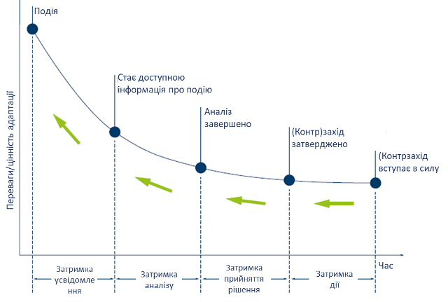
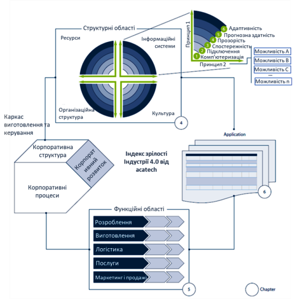
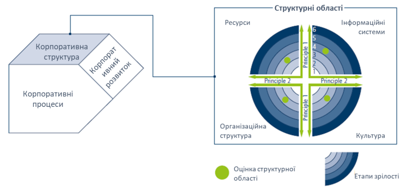
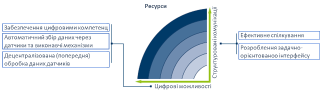
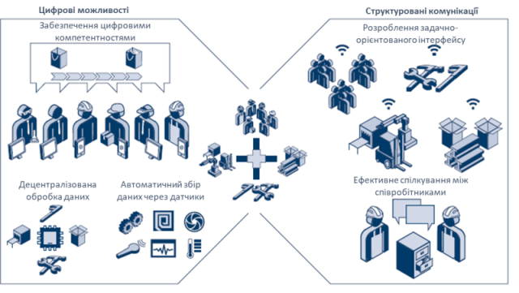
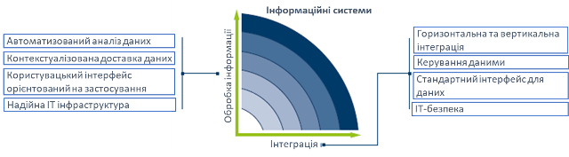
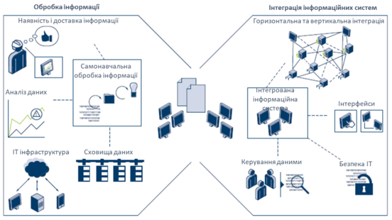

[2 <---](2.md) [Зміст](README.md) [---> 4](4.md) 

# 3. Технологічна зрілість виробничих підприємств в Індустрії 4.0

У 2020 році Німецька національна академія науки та інженерії (acatech, https://en.acatech.de/)  опублікувала результати дослідження [[1](https://en.acatech.de/publication/industrie-4-0-maturity-index-update-2020/)] "Industrie 4.0 Maturity Index. Managing the Digital Transformation of Companies – UPDATE 2020". Передумовою дослідження стала велика кількість невдалих проектів по цифровій трансформації підприємств. Великий конкурентний тиск спонукав до спроб реалізації в Німеччині та Європі проектів пов’язаних з Industrie 4.0, однак значна частина цих проектів зазнала краху. Як виявилося, це пов'язано з тим, що проекти недостатньо суттєво сприяли досягненню корпоративних цілей, натомість занадто сильно були зосереджені на окремих технологіях, або не могли бути розширені. Це спонукало до проведення системного дослідження та формування рекомендацій щодо визначення плинного стану підприємства щодо його індексу зрілості Індустрії 4.0 та руху до підвищення цього індексу, та вдалого впровадження пілотних проектів що цьому спонукають. Друга версія цього звіту містить оновлені рекомендації щодо успішної цифрової трансформації виробничих компаній, торкаючись як їх бізнес-стратегії, так і чотирьох структурних областей: ресурсів, інформаційних систем, культури та організаційної структури. Конкретні приклади компаній, які успішно впровадили цей підхід і досягли позитивного впливу на свою ефективність, наведено в іншій супутній публікації від acatech «Використання індексу зрілості промисловості 4.0 – поточні виклики, приклади та тенденції» [[2](https://en.acatech.de/publication/using-the-industrie-4-0-maturity-index-in-industry-case-studies/)]. Автори дослідження відмітили у вступі свого змісту:  "Індустрія 4.0 - це інтеграція інформаційних та комунікаційних технологій у промислове виробництво, що дозволяє підвищити ефективність процесів, процедур і систем та створити нові можливості для диференціації продуктів та послуг компаній. Проте, ***для використання всього потенціалу новітніх технологій недостатньо їх технічного впровадження, необхідна організаційна трансформація та культурна адаптація компаній***. Кінцева мета — стати гнучкою компанією, що навчається, яка здатна постійно й динамічно адаптуватися до руйнівного середовища, зокрема, щоб краще долати несподівані події, такі як, наприклад криза, пов’язана з коронавірусом."

Таким чином вони також дійшли до висновку, що на підприємстві потрібні системні зміни, які повинні відбуватися не тільки в технологічному напрямку але і організаційному та культурному. Матеріали цієї та наступної лекції базуються на цьому звіті, чорновий переклад якого можна знайти в [[3](https://github.com/pupenasan/dt/blob/main/articles/MatInd_2020.md)]. 

Для цифрової трансформації підприємства перш за все вони мають визначити свій поточний стан, після чого сформувати стратегії щодо поетапного переходу в кінцевий стан, з чіткою фіксацією очікуваних результатів на кожному етапі. Для формалізації станів компанії в термінах цифрової трансформації  дослідники acatech розробили показник Індекс зрілості Індустрії 4.0 (Industrie 4.0 Maturity Index). Цей індекс зрілості використовується як модель для визначення як плинного стану так і очікуваних на всіх етапах трансформації. Індекс має шість ступенів в в 4-х ключових сферах: ресурсів, інформаційних систем, організаційної структури та культури. Кожна сфера пов’язана з двома фундаментальними принципами. Посібник описує як визначити індекс зрілості в контексті кожної зі сфер і допомагає в побудові дорожнього кати цифрової трансформації, яка будується для кожного підприємства окремо.

## 3.1. Концепція оцінки стану підприємств щодо переходу до Індустрії 4.0    

Між виникненням та отриманням інформації на підприємствах про подію виникає певна затримка. Це у свою чергу приводить до затримки у прийнятті відповідних рішень та (контр)заходів (див. рис.3.1). Одна з причин цього  в тому, що відповідні інформаційні системи недостатньо інтегровані, щоб забезпечити наскрізну обробку даних, від збору даних до аналізу.

Рис.3.1. Корпоративні процеси адаптації [[1]( [цим посиланням](https://en.acatech.de/publication/industrie-4-0-maturity-index-update-2020/))]

Можливості Industrie 4.0 допомагають виробничим компаніям значно скоротити час між виникненням події та впровадженням відповідної реакції. На практиці це означає, що, наприклад, зміни у вимогах клієнтів на основі польових даних можуть бути включені навіть під час виробничого процесу продукту, оскільки компанія володіє гнучкістю, щоб адаптуватися до нової ситуації. Як наслідок, клієнт може отримати продукт, який відповідає його вимогам, у значно коротший період часу та вищої якості.

Метою трансформації є створення гнучкої компанії, що навчається, здатної постійно адаптуватися до мінливих умов завдяки використанню відповідних технологій, організаційного навчання та процесів прийняття рішень, які використовують переваги високої якості даних, які доступні швидше. Гнучка компанія, що навчається, здатна займати цифрові керовані точки. Індекс зрілості acatech Industrie 4.0 Maturity Index надає компаніям-виробникам вказівки щодо того, як прокласти власний індивідуальний шлях до того, щоб стати гнучкою компанією, яка навчається, і які заходи принесуть конкретні переваги.

Індекс зрілості базується на представленні внутрішніх аспектів керування з концепції «Каркасу (фреймворку) виробництва та керування» (Production and Management Framework), які будуть описані нижче. У цьому каркасі кожна компанія характеризується через корпоративну структуру, корпоративні процеси та корпоративний розвиток (рис.3.2). 

Риc 3.2. Індекс зрілості в контексті концепції «Фреймворку виробництва та керування» [[1]( [цим посиланням](https://en.acatech.de/publication/industrie-4-0-maturity-index-update-2020/))]

Індекс зрілості оцінює рівень корпоративної структури, який в цій моделі представлений через чотири структурні області: **ресурси**, **інформаційні системи**, **культура** та **організаційна структура**. Разом ці структурні області складають структуру організації. Вони з’єднані шістьма етапами шляху розвитку Industrie 4.0, які зображені у вигляді шести концентричних кіл. Кожна структурна область має два принципи, що проходять через неї, які служать керівництвом для її подальшого розвитку. Кожен принцип містить ряд можливостей, які необхідно послідовно розвивати для кожного етапу розвитку цінностей. Ступінь реалізації цих можливостей визначає стадію зрілості відповідного принципу. Щоб забезпечити загальну оцінку поточного етапу розвитку структурної області етапи зрілості обох принципів поєднуються. На рис. 3.3 оцінки структурних областей зображені чотирма зеленими крапками.

Рис 3.3 Зрілість корпоративної структури [[1]( [цим посиланням](https://en.acatech.de/publication/industrie-4-0-maturity-index-update-2020/))]

У цій та наступній лекції розглядаються можливості, якими повинна володіти виробнича компанія, щоб перетворитися на гнучку організацію, яка навчається. Вони розглядаються в контексті чотирьох структурних областей: ресурсів, інформаційних систем, культури та організаційної структури. У цій лекції розглядаються технологічні можливості, тобто в структурних областях ресурсів та інформаційних систем.  

## 3.2. Ресурси

Під ресурсами розуміються матеріальні та фізичні активи, такі як робоча сила (людські ресурси), машини та обладнання, інструменти, матеріали та кінцевий продукт. Робітники повинні володіти певними навичками, щоб максимально використовувати отриману інформацію, а правильно налаштовані технічні ресурси можуть допомогти зменшити затримку даних і дій. На додаток до виконання своїх конкретних функцій, компанії повинні намагатися забезпечити, щоб їхні ресурси мали інтерфейс між фізичним і цифровим світами. Тому при оцінці зрілості даної структурної області враховують два принципи (рис.3.4):

- Цифрові можливості
- Структуровані комунікації

Рисунок 3.4. Можливості структурної області «ресурси»

### Цифрові можливості

Ресурси повинні володіти необхідними можливостями для роботи на основі інформації. Щоб генерувати та аналізувати дані та впроваджувати відповідні рішення, наявні ресурси (робітники, машини та обладнання, інструменти, матеріали та продукти) повинні набути певних компетенцій або бути модернізовані відповідними технологічними компонентами (датчиками, засобами ідентифікації) щоб надавати та працювати з даними в цифровому вигляді. Ці базові вимоги до роботи та навчання на основі інформації в моделі називаються «цифровими можливостями».

- **Забезпечення цифровими компетентностями.** Щоб генерувати та аналізувати дані та впроваджувати відповідні рішення, наявні ресурси – тобто весь персонал, машини та обладнання, інструменти, матеріали та продукти – повинні набути певних компетенцій або бути модернізовані відповідними технологічними компонентами. Персонал повинен мати відповідні IT навички, загальне розуміння технологій Індустрії 4.0, розуміння важливості конфіденційності інформації та кібербезпеки. 
- **Автоматичний збір даних через датчики.** Для технічних ресурсів необхідно забезпечити збір даних і перетворення цих даних в інформацію, тобто підготовлених для підтримки прийняття рішень. Пріоритетним є їх розвиток для створення кіберфізичних систем (CPS, cyber-physical systems). У багатьох засобах вже є датчики в складі систем керування та контролю. У додаток до цього для кращої ідентифікації ресурсів можна використовувати RFID, засоби визначення геолокації та інші додаткові датчики.  
- **Децентралізована обробка даних.** У багатьох технічних засобах є вбудовані системи керування, які є також ключовими компонентами кіберфізичних систем. Вони утворюють зв’язок між рівнем зв’язку та електромеханічними компонентами (приводами). Збільшення їх обчислювальної потужності дозволяє децентралізувати попередню обробку та виконувати її безпосередньо у вбудованих системах, пов’язаних із технічними ресурсами. Зменшення затримки розповсюдження сигналу означає, що критичні за часом обчислення можна виконувати швидше, створюючи нові програми, наприклад, у сфері людино-машинного інтерфейсу. 

### Структуровані комунікації

Чітка загальна картина виникає лише після об’єднання різних фрагментів інформації, тому слід передавати дані та, якщо можливо, генерувати їх у максимально структурований спосіб. Для цього потрібні відповідні інтерфейси, а також консенсус щодо мети спілкування. Відповідно, принцип структурованої комунікації описує технічний підхід до комунікаційних засобів для працівників та інтерфейсів між людьми та машинами та між різними машинами.

- **Ефективне спілкування між співробітниками.** Комунікація між співробітниками завжди повинна бути задокументованою з можливістю відстеження, без надмірної деталізації і забезпечуватися таким чином, щоб відповідати потребам відповідних груп зацікавлених сторін. Зараз співробітники можуть витрачати багато часу на пошук і очікування інформації. Простежувана комунікація означає, що контекст повідомлення відомий завдяки автоматичному додаванню тегів, або доступ до нього можна отримати в режимі реального часу шляхом інтеграції з відповідною системою бізнес-застосунків. Запобігти надмірності можна за допомогою централізованого зберігання даних, лише однієї дійсної версії файлу (єдине джерело правди), якому надається дозвіл доступу замість відправки копії. Крім того, профілі ролей і облікові дані дають змогу додавати співробітників до процесу спілкування контекстно. Подібні вимоги застосовуються також до процедур затвердження, наприклад через запровадження цифрових підписів.
- **Розроблення задачно-орієнтованого інтерфейсу**. Тут варто виділити кілька сторін взамєодії.
  - Людино-машинний інтерфейс. Тут важливі технології ідентифікації та візуалізації. Через зростаючу складність процесів і збільшення кола завдань, які повинні виконувати співробітники  є важливими контекстно-залежні засоби допомоги, які можуть бути реалізовані через засоби автоідентифікації (автоматичне розпізнання об’єктів та їх атрибутів) та відповідні графічні інтерфейси. 
  - Машино-машинний інтерфейс. Апаратні інтерфейси відіграють ключову роль у забезпеченні взаємодії різних типів технологічних ресурсів один з одним. Технології ідентифікації уможливлюють (взаємне) розпізнавання технологічних ресурсів і людей, а також узгодження конкретних інформаційних вимог. В ідеалі інтерфейси повинні забезпечувати підключення до мережі підприємства.
  - Інтерфейс з матеріалами. Якщо фіксується достатня кількість точок звітності, можна відслідковувати та простежувати переміщення матеріалів (у тому числі готових виробів). Цьому сприяє їх автоматична ідентифікація або за допомогою носія, або за допомогою ідентифікаторів (RFID, QR-код, тощо) на самих товарах. У поєднанні з системною інтеграцією це дає змогу задовольнити зростаючі вимоги клієнтів щодо відстеження продукції. 

Рис.3.5 показує характеристики, якими повинні володіти ресурси виробничої компанії після того, як вона досягла максимальної стадії зрілості («адаптивності»). Встановлені профілі навичок працівників розширенні, щоб включити широкі ІТ-навички. Технологічні ресурси повинні мати рівень обробки даних, доданий до них, щоб контролювати підключені датчики та виконавчі механізми та генерувати дані зворотного зв’язку. Ресурси взаємодіють, щоб агрегувати ці дані та створювати цифрову тінь. Комунікація «людина-людина», «машина-машина» та «людина-машина» має бути налаштована таким чином, щоб дані та інформація могли обмінюватися в режимі реального часу та щоб усі групи зацікавлених сторін були включені в процес комунікації.

Рис. 3.5. Можливості, необхідні в структурній області «ресурси» на максимальній стадії зрілості 

## 3.3. Інформаційні системи

Інформаційні системи — це соціально-технічні системи, в яких інформація надається на основі економічних критеріїв як людьми, так і інформаційно-комунікаційними технологіями. У рамках даного дослідження під поняттям "ІТ-система" розуміється інше - це окремі прикладні системи (наприклад, системи ERP), тому тут це не є синонімами. Конфігурація інформаційних систем компанії є ключовою для того, щоб доступні дані та інформація могли використовуватися для прийняття рішень. Прогрес, досягнутий у цифровізації бізнесу, означає, що компаніям-виробникам стає все простіше й легше приймати ці рішення на основі даних у режимі реального часу. Тому при оцінці зрілості даної структурної області враховують два принципи (рис.3.6):

- Самонавчальна обробка інформації
- Інтеграція інформаційних систем

Рис 3.6: Можливості структурної області «інформаційні системи» 

### Самонавчальна обробка інформації

Дані повинні бути підготовлені та оброблені таким чином, щоб підтримувати прийняття рішень. Для того, щоб дані можна було використовувати, організація повинна відповідати технічним вимогам для доступу в режимі реального часу та мати інфраструктуру, яка забезпечує необхідну обробку даних і безперебійну доставку інформації а також представлення її у зручній для користувача формі. У цьому контексті самонавчання означає використання інформаційними системами нових технологічних рішень, здатних ідентифікувати причинно-наслідкові зв’язки з метою постійного вдосконалення своїх обчислювальних процесів. Це можливо завдяки таким технологіям, як штучний інтелект і машинне навчання.

- **Автоматизований аналіз даних.** Прийняття рішень на основі даних можливе завдяки автоматизованому аналізу даних, який постійно агрегує дані для отримання інформації, витягує знання з цієї інформації та надає її користувачам для підтримки своїх рішень. Це можливо зробити за допомогою визначення причинно-наслідкових зв’язків і прогнозування майбутніх подій використовуючи, наприклад, моделювання або регресії. Це стосується як окремих машин так і на загальному рівні виробництва. У випадку виробництва аналіз передбачає обробку та кореляцію дуже великих і часто різнорідних наборів даних. 
- **Контекстуалізована доставка даних (інформації).** Це означає, що замість того, щоб користувач шукав інформацію в кількох різних ІТ-системах і обробляв, сортував чи інтерпретував її самостійно, інформація готується та доставляється відповідно до вимог конкретного контексту (принцип надсилання). Співробітники отримують інформацію за допомогою ефективної та дієвої інформаційної логістики, яка доставляє правильну інформацію в потрібне місце, у потрібний час, належної якості, потрібній людині та в потрібній кількості. Наприклад, можна забезпечити зрозумілу візуалізацію складних операцій складання за допомогою контекстної 3D-анімації, або надання відділу виробничого контролю запланованих дат виконання замовлення, або технічним працівникам докладної інформації про причину поломки разом із додатковою детальною інформацією.  
- **Користувацький інтерфейс орієнтований на застосування (application)/завдання(task).** Надана інформація повинна постійно узгоджуватися з потребами одержувача, а її формат повинен бути адаптований до поточного використання. Його зміст і подання повинні бути адаптовані до завдання, яке виконується, і рівня кваліфікації працівника. Залежно від застосування, інтерфейс користувача може, наприклад, надавати дані у формі таблиць, анімації, доповненої реальності або мови (усних інструкцій, які допоможуть їм виконати процес). Залежно від завдання можна використовувати управління жестами або голосом. 
- **Надійна/стійка ІТ-інфраструктура.** Аналіз і доставка даних покладаються на стійку ІТ-інфраструктуру, яка відповідає відповідним технічним вимогам щодо збору, передачі, зберігання та обробки даних і гарантує функціональність ІТ-систем. Це вимагає постійної адаптації технічної продуктивності ІТ-інфраструктури до поточних вимог, що забезпечується резервним зберіганням даних або дизайном системи. Залежно від конструкції, ці резервування можуть бути реалізовані всередині або в хмарі. Резервне копіювання або спеціалізоване програмне забезпечення запобігає загрозам для людей і матеріальних активів і гарантує тривалу придатність системи. 

### Інтеграція інформаційних систем

Системи повинні бути інтегровані, щоб уможливити використання спільних даних у всьому ланцюжку створення вартості. Для цього необхідно створити архітектуру інформаційної системи, яка з’єднує існуючі ІТ-системи між собою та з ресурсами. Замість того, щоб дані дублювалися в різних ІТ-системах, усі вони містяться в єдиній первинній інформаційній системі (єдине джерело правди), що гарантує, що всі використовують однакові дані.  Створення платформи, що об’єднує різні інформаційні системи, потребує стандартних інтерфейсів, гнучкості, відкритості, комплексної ІТ-безпеки та належної якості даних.  

- **Горизонтальна та вертикальна інтеграція**. Використання загальних даних у всьому ланцюжку створення вартості можливе завдяки інформаційним системам, які повністю інтегровані як вертикально, так і горизонтально. Між усіма ІТ-системами в ланцюжку створення вартості безперервно обмінюються інформацією, щоб інформація про замовлення завжди була пов’язана з продуктом, інструкціями щодо роботи та процесу та інформацією про клієнта, а всі користувачі мали доступ до одного набору даних. Це означає відхід від статус-кво надто складних архітектур із резервним зберіганням даних. Основна ІТ-система, що містить інформацію про замовлення, пов’язана з усім, від систем виробництва та планування до рівня машини та поля. Після завершення роботи машини автоматично надсилають звіт про стан замовлення. Це створює «єдине джерело правди» – інформація зберігається лише в одній первинній логічній інформаційній системі, до якої мають доступ усі користувачі в ланцюжку створення вартості та системі записів. Сьогодні дані про продукт і дизайн часто знаходяться в системі PLM, тоді як дані про замовлення зберігаються в системі ERP, а пов’язані дані про клієнта знаходяться в системі CRM. Відсутність інтеграції метаданих означає, що функції розробки, виробництва та маркетингу мають власні, окремі набори даних, які не розподіляються ефективно між пов’язаними операційними програмами та інструментами підтримки прийняття рішень. У результаті зміни в одній із цих функцій не поширюються на інші. Таким чином, гнучким компаніям потрібна логічна або фізична платформа, яка інтегрує та надає користувачам інформацію, необхідну для операцій і прийняття рішень, і забезпечує доступ до даних та інформації. Також важливо забезпечити прозорість щодо використовуваних ІТ-систем – різним відділам не можна дозволяти використовувати власні "тіньові" ІТ-системи, які не контролюються ІТ-відділом.
- **Керування даними (очищення та стандартизація).** Окрім інтерфейсів даних, інтеграція ІТ-систем також залежить від достатньо високої якості даних. Низька якість даних в ІТ-системах призводить до неправильних агрегованих даних і неточного зворотного зв’язку, що зрештою підриває довіру як до ІТ-систем, так і до їх вмісту. Це унеможливлює досягнення мети прийняття рішень на основі даних. Тому компанії повинні придбати відповідні технічні та, зокрема, організаційні можливості, щоб покращити якість даних. Політика управління даними надає організаціям рекомендації щодо обробки, зберігання, управління та представлення високоякісних даних у компанії. Технічні можливості для покращення якості даних включають автоматизоване очищення даних (ідентифікація, стандартизація, видалення дублікатів, консолідація та покращення даних) і системи керування основними даними.
- **Стандартний інтерфейс для даних.** Замість того, щоб вимагати централізованого зберігання всіх даних, ключем до створення єдиного джерела правди є з’єднання всіх ІТ-систем одна з одною через стандартні інтерфейси даних. API, мікросервіси та інтерфейси даних сприяють обміну даними та інформацією з окремих ІТ-систем і, отже, повинні вибиратися на основі необхідного потоку інформації. Щоб завжди забезпечити гнучкий інформаційний потік і перехід обміну даними під час переходу від однієї інформаційної системи до іншої, необхідно впровадити нейтральні або стандартні інтерфейси та формати обміну даними в усіх відповідних системах. Вони повинні використовувати відкритий стандарт що є універсальним для відповідної категорії застосування. Одним із прикладів стандартного інтерфейсу, який особливо популярний у сфері Industrie 4.0, є архітектура OPC-UA для інтерфейсів машина-машина.
- **ІТ-безпека.** Посилення інтеграції інформаційних систем, а також людського фактору та інших факторів супроводжується ризиком злочинних атак. Потенційна шкода, яку можуть завдати ці атаки, зростає пропорційно до ступеня інтеграції. ІТ-безпека охоплює різні стратегії визначення та впровадження заходів безпеки. Відповідність таким стандартам, як IEC 62443, може допомогти стримати ризики. Такі стандарти включають проактивні заходи для підтримки ІТ-безпеки та її адаптації до мінливих обставин. Заходи стосуються питань адміністрування активів, ідентифікації та автентифікації користувачів, перевірки справності системи та контролю потоку даних. Реагування на існуючі інциденти безпеки ІТ також охоплюються стандартами безпеки ІТ.

Рис.3.7 показує характеристики, якими повинні володіти ресурси виробничої компанії після того, як вона досягла стадії зрілості «адаптивності». 

Рис. 3.7: Можливості, необхідні в структурній області «інформаційні системи» на максимальній стадії зрілості  

## Питання для самоперевірки

1. За яких причин на думку дослідників велика кількість спроб цифрового переходу до підприємств рівня Industrie 4.0 зазнала невдач?
2. Для чого дослідники acatech розробили показник Індекс зрілості Індустрії 4.0?
3. Прокоментуйте гафік залежності переваг/цінності адаптації від часу (рис.3.1).   
4. У яких структурних областях проводиться оцінка індексу зрілості Індустрії 4.0 від acatech?
5. Як в загальному оцінюється індекс зрілості Індустрії 4.0 від acatech?
6. Що розуміється під "ресурсами" в Індексі зрілості Industrie 4.0 від acatech?
7. Що розуміється як Інформаційні системи в Індексі зрілості Industrie 4.0 від acatech?
8. Що розуміється під оцінкою цифрових можливостей в Індексі зрілості Industrie 4.0 від acatech?
9. Що розуміється під структурованими комунікаціями в Індексі зрілості Industrie 4.0 від acatech?
10. Якими можливостями, повинні володіти ресурси на максимальній стадії зрілості Industrie 4.0 від acatech?
11. Що розуміється під "іфнормаційними системами" в Індексі зрілості Industrie 4.0 від acatech?
12. Що розуміється під оцінкою самонавчальною обробкою інформації в Індексі зрілості Industrie 4.0 від acatech?
13. Що розуміється під інтеграцією інформаційних систем в Індексі зрілості Industrie 4.0 від acatech?
14. Якими можливостями, повинні володіти інформаційні системи на максимальній стадії зрілості Industrie 4.0 від acatech?    

## Посилання

[[1]](https://en.acatech.de/publication/industrie-4-0-maturity-index-update-2020/) Industrie 4.0 Maturity Index. Managing the Digital Transformation of Companies – UPDATE 2020 https://en.acatech.de/publication/industrie-4-0-maturity-index-update-2020/

[[2]](https://en.acatech.de/publication/using-the-industrie-4-0-maturity-index-in-industry-case-studies/) Industrie 4.0 Maturity Index in Industry – current challenges, case studies and trends  https://en.acatech.de/publication/using-the-industrie-4-0-maturity-index-in-industry-case-studies/

[[3](https://github.com/pupenasan/dt/blob/main/articles/MatInd_2020.md)] Індекс зрілості Industrie 4.0  https://github.com/pupenasan/dt/blob/main/articles/MatInd_2020.md