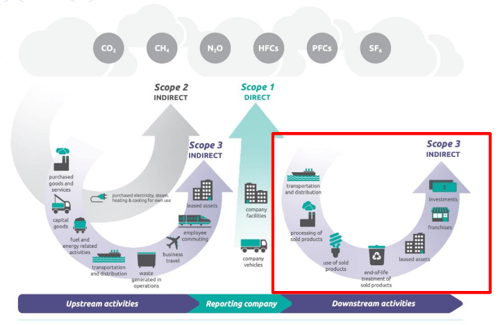

[2 <---](2_2024.md) [Зміст](README.md) [---> 4](4_2024.md) 

# 3. Модель сталої економіки 

## 3.1. Ланцюг доданої вартості в новій економічній моделі

На попередній лекції було згадано про кризу капіталу та проблеми екологічного характеру. Сьогодні можна констатувати, що багаторічна концепція масового виробництва завершилася. Неможливо досягти цілей, які поставлені як глобально, так і на рівні європейського континенту та окремих країн, не змінюючи при цьому весь ландшафт. Крім того, ця криза на ринку капіталів по суті не дає можливості надалі розвивати масове виробництво, бо масове виробництво - стимулювалося з двох боків:

- з одного боку виробникам видавилися дешеві гроші у вигляді кредитів і ті виробляли продукцію 24х7
- з іншого боку такими ж кредитами стимулювалися споживачі. 

Якщо раніше підприємство фокусувалося на одному параметрі - це отримання прибутку та відповідно підвищення ефективності виробництва, то сьогодні воно повинно дбати вже про людей а також про планету. Тобто компанії вже недостатньо задовольняти потреби акціонерів а потрібно вже дбати про великі екосистеми. А це значно складніше, бо потребує взаємодії між учасниками ринку з урахуванням більшої кількості факторів.

Розглянемо класичний **ланцюг створення вартості (Value Chain)** - це серія послідовних кроків, які йдуть у створення готового продукту, від його початкового дизайну до його прибуття до дверей клієнта. Ланцюг означує кожен крок у процесі, на якому додається вартість, включаючи етапи постачання, виробництва та маркетингу його виробництва. Вперше цю ідею представив Майкл Портер у своїй книзі "Конкурентна перевага". Ланцюг складається з двох основних типів діяльності (рис.3.1):

1. Основні (primary activities):
   - Логістика постачання: отримання та управління ресурсами.
   - Операції: виробничі процеси чи обробка.
   - Логістика збуту (зовнішня): зберігання та доставка кінцевого продукту.
   - Маркетинг і продажі: залучення клієнтів та просування продукту.
   - Обслуговування (сервіс): підтримка клієнтів після покупки.
2. Підтримуючі діяльність (support activities):
   - Інфраструктура: фінанси, управління, юридична підтримка.
   - Управління персоналом: найм, навчання та розвиток кадрів.
   - Розвиток технологій: інновації, IT-рішення.
   - Закупівлі: придбання матеріалів та послуг.

Мета ланцюга створення вартості як моделі — ідентифікувати ті елементи, які приносять найбільшу вигоду або які можна вдосконалити для підвищення конкурентоспроможності компанії.

рис.3.1. Ланцюг доданої вартості Майкла Портера

Компанія проводить аналіз ланцюга створення вартості, оцінюючи детальні процедури, задіяні на кожному етапі її бізнесу. Метою аналізу ланцюжка створення вартості було підвищення ефективності виробництва, щоб компанія могла забезпечити максимальну вартість за найменші можливі витрати. Однак сьогодні компанії змушені враховувати ширший контекст, що виходить за межі їхньої внутрішньої діяльності. Це можна зробити через так звані **екстерналії** (зовнішні ефекти), які тісно пов’язані з вартістю, оскільки вони впливають на загальну вартість, створювану або руйновану в процесі діяльності підприємства. Тобто екстерналі - це позитивний або негативний ефект впливу на інші економічні агенти, тобто на компанії, які знаходяться поряд з цим підприємством, або на частину суспільства та навколишнє середовище. Наприклад, якщо компанія побудувала завод і при цьому робить викиди шкідливих речовин - це негативна екстерналі. У цьому прикладі компанія заробляє гроші, негативно впливаючи на людей, які живуть поруч з підприємством. Приклад позитивних екстерналій - коли компанія побудувала дитячий садок поруч з підприємством для стимулювання того, щоб працівники могли розвивати там сім'ї. Тут важливо також розуміти що вартість не є аналогом ціни, це різні категорії, ціна - це вимір для вартості, яка створюється. 

У контексті зв’язку екстерналій із цінністю та ланцюгом створення вартості, **транзакції** означають взаємодії або обміни між сторонами, які включають передачу ресурсів, прав чи послуг. Це можуть бути як економічні, так і соціальні або екологічні транзакції. Це будь-які взаємодії, які прямо чи опосередковано впливають на створення вартості (value) і можуть породжувати або врегульовувати екстерналії. 

Екстерналії впливають на вартість як ключовий фактор конкурентної переваги. Компанії, які враховують соціальні чи екологічні аспекти, можуть отримати вигоду у вигляді підвищення лояльності клієнтів або доступу до нових ринків. Водночас ігнорування екстерналій може збільшити витрати через штрафи, регуляції або втрату ринкової позиції.

Екстерналії прямо чи опосередковано впливають на всі етапи ланцюга доданої вартості, зокрема: 

- Закупівлі: Екологічно чисті постачальники створюють позитивну вартість.
- Виробництво: Мінімізація відходів чи впливу на довкілля знижує негативні екстерналії.
- Маркетинг: Орієнтація на соціально відповідальних споживачів додає цінності бренду.
- Обслуговування: Упровадження програм переробки товарів після використання створює позитивний вплив.

Наприклад, Tesla враховує екстерналії, розвиваючи екосистему електромобілів і створюючи інфраструктуру зарядних станцій. Це не лише підвищує цінність для клієнтів, але й сприяє зниженню викидів вуглецю.

Вартість є основою компенсації екстерналій. Екстерналії можна компенсувати шляхом угод між сторонами, якщо витрати на транзакції невеликі (див. нижче). Варість тут стає інструментом розподілу. Компанія, яка створює позитивні екстерналії, може вимагати додаткової плати (наприклад, за органічні продукти). Негативні екстерналії змушують бізнес нести витрати (штрафи, податки) або інвестувати в заходи їх зменшення.

Екстерналії впливають на вимірювання вартості. Сучасні методи оцінки вартості бізнесу враховують зовнішні ефекти. Наприклад:

- ESG-критерії (Environmental, Social, Governance) використовують для оцінки сталості та цінності компанії.
- GRI-звіти показують, як компанія впливає на суспільство й довкілля, що дозволяє оцінити її внесок у створення загальної цінності.

Отже екстерналії прямо впливають на створення вартості (value) як усередині компанії, так і за її межами. Вміння керувати екстерналіями дозволяє бізнесу не лише мінімізувати ризики, але й створювати конкурентну перевагу, забезпечуючи стійке зростання. Таким чином компанії мають враховувати цей зовнішній ефект на:

- Людей (People): Підприємства мають забезпечувати добробут працівників, клієнтів і локальних громад. Це означає врахування соціальних екстерналій, таких як умови праці, рівень життя і розвиток суспільства.
- Планету (Planet): Компанії зобов'язані зменшувати екологічний вплив (негативні екстерналії) і сприяти сталому розвитку через збереження ресурсів, впровадження "зелених" технологій та зменшення викидів.

Внаслідок цього ланцюг створення вартості перестає бути замкнутим процесом всередині компанії і трансформується в частину глобальної екосистеми. Для досягнення сталого розвитку підприємства повинні:

1. Взаємодіяти з іншими учасниками ринку: Партнери, постачальники, регулятори й суспільство повинні спільно працювати над зменшенням негативних і посиленням позитивних екстерналій.
2. Ураховувати більше факторів: Екологічні, соціальні й економічні аспекти повинні бути інтегровані в кожний етап ланцюга створення вартості.

У новій економіці ключову роль будуть відігравати так звані нематеріальні активи тобто intangible. Це як приклад різні елементи інтелектуальної власності (типу знання, досвід) тобто те, що не можна матеріально побачити. Іноді цю економіку нову економіку сталого розвитку також називають економікою знань.

Але для реалізації такої бізнес-моделі сталої економіки з'являються нові виклики:

- Забезпечення балансу між економічними, соціальними та екологічними цілями.
- Високі початкові витрати, тобто інвестиції у стійкі технології та процеси.
- Регуляторний тиск:, тобто дотримання глобальних і локальних стандартів сталого розвитку.
- Вимога звітувати про вплив бізнесу на суспільство і довкілля.
- Співпраця з екосистемою, тобто налагодження партнерств із зацікавленими сторонами.
- Зміна корпоративної культури, а саме перехід від короткострокових до довгострокових цілей.
- Складність вимірювання вартості, тобто монетизація соціального та екологічного впливу.

Тим не менше з появою нових технологій це все можливо реалізувати. Для початку розглянемо сучасні методології, які використовуються для реалізації.   

## 3.2. Методології

### Економічна модель на базі ESG

**ESG** - це абревіатура, яка включає три компоненти: Environmental (довкілля), Social (соціальна сфера), Governance (корпоративне керування). Тобто діяльність бізнесу розглядається у трьох компонентах: екологічний, соціальній та керівний. Екологічні принципи означують, наскільки компанія  дбає про навколишнє середовище і як намагається скоротити збитки, які завдаються екології. Соціальні принципи показують ставлення компанії до  персоналу, постачальників, клієнтів, партнерів та споживачів. Це в тому числі стосується якості умов праці, гендерного балансу в компанії та інвестування у соціальні проєкти. Керівні принципи стосуються якості керування: прозорість звітності, зарплати менеджменту, здорова обстановка в офісах, відносини з акціонерами, антикорупційні заходи, тощо. Тобто це абревіатура, яка включає так звані фактори, або параметри діяльності підприємства, в якому підприємство аналізує, як виробничі процеси впливають на ці складові. 

На рис.3.2 показані ключові елементи цих компонентів. Одним з них є викиди парникового газу (GHG). Хоч ми не можемо зосереджуватися виключно на ньому, він був вибраний як ключова метрика, яка вимірює практично все інше. Тобто це такий універсальний показник, який був обраний за різними критеріями, принципами і він є основним для сьогоднішнього виробничого підприємства. Тобто оцінювання роботи підприємства в контексті ESG починаються з вимірювання викидів парникових газів. Інший приклад - екологічний вплив (ecologocal impact) - це створення та виникнення екстерналів, наприклад як підприємство впливає на якість повітря при виробництві. Ще приклад, енергоменеджмент - які енергоресурси ми використовуємо, так званий енергетичний портфель підприємства. 

рис.3.2. Ключові елементи компонентів ESG

Як приклад з соціальних елементів, тобто впливу на суспільство, це дотримування прав людини та побудова принципів роботи з працівниками. Це також політика підприємства щодо охорони здоров'я. Тобто оці функції, які багато років були функціями держави перекладаються в якомусь сенсі на плечі підприємств та компаній. Це відбувається тому, що глобалізована економічна та фінансова система вже не спроможна вирішувати ці питання. І тому за кожним підприємством буде закріплена така функція. До Governance (корпоративне керування) входять етичні принципи, за якими будується діяльність підприємства, як воно керує ризиками та інші аспекти. 

Таким чином в термінах ESG, поточну концепцію можна сформулювати так, що бізнес - це компанія, або фірма яка виробляє сталу вартість, що складається з двох компонентів: 

1. процеси, які задіяні у виробленні продукту з одночасним досягненням цілей ESG 
2. генерація прибутку для власників та акціонерів 

Перший компонент передбачає, що виробничі процеси, процеси постачання та процеси, що пов'язані зі споживанням продукції повинні враховувати параметри ESG. У цьому формулюванні вже є перша відповідь на питання, як вимірювати вартість - це та сама вартість, як і була раніше, тільки  з урахуванням ESG. Для розрахунку цієї вартості треба враховувати набагато більше показників, і це вимагає складнішого розрахунку та інформаційних систем. Тепер треба враховувати як саме виробництво продукції, та як ця продукція впливає на ESG. 

Тобто дуже важко на рівні окремого виділеного підприємства пояснити що потрібно робити для зменшення шкоди навколишньому середовищу.  Тому був вироблений такий універсальний показник - викиди парникових газів, який оцінюється як **карбоновий еквівалент**. Тобто це двуокис вуглецю, який був взятий як елемент, який ми повинні вимірювати в процесі виробництва продукції, товарів та послуг. 

Це закріплено в міжнародному промисловому стандарті **Greenhouse Gas Protocol**. Це найбільш універсальний та прийнятий стандарт щодо вимірювання викидів парникових газів на промислових підприємствах. Відповідно до нього є так звані три сфери охоплення (Scope) які показані на рис.3.3. Цей протокол розділяє викиди на три категорії :  

- Scope 1 - прямі викиди, 
- Scope2 - непрямі викиди, які відбуваються в процесі споживання енергетичних ресурсів, перш за все електроенергії.  
- Scope 3 - непрямі викиди, вплив яких відбувається як в процесі виробництва продукції так і споживання. 

рис.3.3.  Категорії викидів згідно Green House Protocol

До третьої категорії відносять впливи, які були сформовані постачальниками матеріалів підприємства, з яких виробляється продукція. Усі викиди при процесах, коли хтось виробляє певну кількість матеріалу яку використовує дане підприємство є цим непрямим викидом. У той же час після того як підприємство реалізовує продукцію, ці непрямі викиди продовжують свій рух по життєвому циклу. У той же час, коли необхідно транспортувати цю продукцію до споживача, в іншій країнї або навіть інший континент, то викиди при здійсненні транспортування якоюсь логістичною компанією також відносяться до категорії 3. 

Тому сьогодні в рамках цієї концепції усі підприємства вже пов'язані в цей ланцюг. А це значить, що **задачу обліку викидів не може вирішити одне підприємство самостійно**, бо третя категорія викидів потрібує вимірювання, що у свою чергу приводить до необхідності отримання даних по всьому ланцюгу створення вартості задіяних в процесах виробництва продукції та процесів, які прямими або непрямим чином пов'язані з цим.

### Врахування викидів CO2

Таким чином сьогодні підприємству необхідно враховувати викиди CO2. На сьогоднішній день дозволи на викиди є ринковим активом, які торгуються на організованих ринках. Ще 2021 року за прогнозами щодо ціни за ці викиди була означена планка в 100 $ за еквівалент тони CO2, і ця планка вже була подолана на Європейському ринку. Максимальний прогноз reuters прогнозує рівень 250 доларів за тону.  А це означає, що якщо при виробництві одиниці продукції або партії продукції був викид 100 тон СО2 то підприємству необхідно в якомусь сенсі компенсувати цей негативний вплив заплативши в розмірі цього еквіваленту за тону. При врахуванні цих компенсацій, їх закладають в собівартість продукції, що дуже змінює параметри цієї нової економічної моделі. І за цими принципами деяка продукція може стати нерентабельною.

На рис.3.4 показаний графік зміни вартості викидів CO2 на Європейському ринку за останні 15 років, на якому видно загальний тренд до зростання. Максимальна ціна в 100 доларів та вище, вже була досягнута в 2023 році. 

рис.3.4.  Графік зміни вартості викидів CO2 на Європейському ринку 

Зараз загальний вуглецевий слід промисловості становить десь на рівні 50 млрд тон, що приблизно коштує 5 трлн доларів в еквіваленті, який є негативним з точки зору впливу на навколишні екосистеми. У розрізі окремих секторів промисловості першою є енергетика, де більше 30-35 гтон викидів, та сільське господарство, а далі йдуть промислові виробництва (рис.3.5). Однак варто зауважити, що енергетика - це те, що споживає промисловість, а отже її викиди є частиною, що входить до вуглецевого сліду продукції виробництва. Ось чому зелений перехід називають енергетичним переходом, і чому він неможливий без тотальної електрифікації сфери промисловості, транспорту та будівництва. За аналітичними моделями до 2050-го року максимальна електрифікація  може знизити викиди CO2 на 60%. Транспорт електрифікується саме тому, що потрібно також перейти до нових параметрів виробництва та економіки.  

 

рис.3.5. Рівні викидів по різним секторам промисловості

Електрифікація йде ще в розрізі того, які джерела енергії використовуються при споживанні. І  на зміну структури енергетичного портфелю виробництв також буде впливати цей параметр вартості викидів CO2. Тобто це сприяє появі більш чистих відновлюваних джерел.  При цьому ще до 2035-го року очікується постійне збільшення попиту на нафту та газ. Це пов'язано з перехідним періодом, який необхідній для перебудови промисловості. За кількома аналітичними моделями пік буде досягнуто у 2035 році, після чого буде поступове зниження попиту на споживання нафтогазових продуктів за секторами та регіонами.  

### Ризики і можливості, пов'язані з кліматом

Хоч в Україні немає ринку карбонового еквіваленту, українське підприємство повинно враховувати цей фактор. Один з аргументів -  це залучення зовнішніх потоків капіталу, зокрема кредитів, послуг страхових компаній, грантових коштів. Наразі кредитний механізм вже практично неможливий в тій формі, яка була раніше, бо інвестори розуміють що на результати роботи підприємства дуже впливають кліматичні зміни.

Підприємствам необхідно розробляти власну стратегію керування кліматичними ризиками та інтеграцію ESG-принципів, яка передбачає:

1. Врахування кліматичних ризиків як частини фінансових ризиків для збереження доступу до інвестицій і ринків.
2. Збір та розкриття ESG-даних, щоб відповідати міжнародним стандартам сталого розвитку.
3. Підготовку до змін у бізнес-процесах, включаючи адаптацію організаційної структури для інтеграції принципів сталого розвитку.

Основна мета — зберегти конкурентоспроможність, забезпечити доступ до капіталу та відповідати вимогам ринків Європи й Азії. Тому підприємствам необхідно вже зараз почати робити набори даних (датасети), які описують керування кліматичними ризиками за трьома параметрами ESG і рухатися до принципів сталого розвитку. Інакше із кожним роком для підприємства все більше будуть закриватися споживчі ринки. Адже продукція, яка не має відповідності цим стандартам не зможе бути реалізована на ринках Європи. В Азії та ж сама історія, бо там з'являються вимоги щодо параметрів стандартів екологічності продукції. Крім того, якщо не враховувати ESG, то підприємство втрачає можливість зовнішнього фінансування. Інвестор не інвестує, якщо компанія не показує як будується стратегія управління кліматичними ризиками.

Кліматичні ризики відносяться до категорії фінансових ризиків, вони напряму впливають на отримання потоків доходу від діяльності підприємства, на витрати підприємства а також, що головне, впливає на оцінку активів підприємства. І це говорить про те, що якщо не враховуються ці ризики, то загальна вартість підприємства, як інвестиційного активу, як економічного активу, є невідомою. Тобто для інвестора рішення щодо інвестування в таку компанію не може бути прийнято. Саме тому необхідно почати збирати ці дані та розкривати ці дані в тому чи іншому форматі. Також кліматичний ризик є недиверсифікованим. Тобто ми не можемо застрахуватися, тобто піти в страхову компанію та застрахувати ці ризики. Тобто підприємство повинно вибудовувати цю стратегію самотужки, змінюючи мабуть навіть організаційну структуру.

### Фреймворк TFCD

Вище було показано, які зараз відбуваються зміни, і як і чому вони впливають на окреме підприємство, зокрема через ринкову і інвестиційну складову. Навіть маленькі підприємства крок за кроком будуть відчувати вплив цих параметрів. За таких обставин підприємству треба розуміти яку методологію треба використовувати, щоб побудувати цю стратегію керування кліматичними ризиками та ESG і з чого саме почати. 

Наразі є промисловий фреймворк **TFCD** (**Task Force Climat Related Financial**), який описує як саме компаніям будувати цю стратегію. Розробником цього фреймворку стали Міністерства фінансів від ключових 20 економік, такі як центрабанки та фінансові регулятори. Цей фреймворк - це така мова спілкування між підприємством, бізнесом та інвестором, коли інвестору надається інформація щодо керування кліматичними ризиками в процесі виробництва. По суті мова йде про розкриття інформації або публікація специфічних звітів, як для інвестора так і для споживачів. Для останніх це також сигнал для прийняття рішень щодо, наприклад закупівлі продукції у того чи іншого постачальника. Або якщо ми говоримо про кінцевого споживача це сигнал щодо того, чи буде він споживати таку продукцію. І вже зараз можна побачити такі тенденції щодо екологічності продукції різних компаній.

TCDF практично узагальнив близько 20 основних стандартів, з'єднавши їх в єдину універсальну систему, з якою синхронізуються усі інші стандарти. Європейська комісія на основі TCFD рекомендацій розробляє відповідні європейські директиви. Така ж історія у Північній Америці та Азії. У якомусь сенсі TFCD передає місію наступній організації - International Sustenability Standard Board ([ISSB](https://www.ifrs.org/groups/international-sustainability-standards-board/)), яка розроблювала і продовжує розроблювати промислові стандарти. 

Цей фреймворк систематизує роботу як з **ризиками** (негативний вплив) так і з **можливостями** (позитивним впливом). Перш за все необхідно на підприємстві побудувати стратегію керування кліматичними ризиками, які поділяються на дві ка категорії: 

- перехідні ризики transition risks 
- фізичні ризики 

Прикладами перехідних ризиків є зміна основних параметрів бізнес-моделей та моделей собівартості продукції, зміни в регуляції, поява нового податку на викид CO2 та ін. Зараз вже є реальною поява якихось нових технологій, які будуть впливати на продукцію - це зміна на ринках, наприклад зміна вартості викиду вуглецю, як один з параметрів, а також зміна в моделях споживачів. Споживачі будуть бажати споживати більш екологічну продукцію.  До фізичних ризиків відносяться такі кліматичні ризики, як наприклад збільшення частоти виникнення екстремальних погодних умов. Наприклад засухи, або велика кількість опадів сильно впливає на сільське господарство. Якщо виробничі потужності підприємства знаходяться в таких зонах ризику, це буде впливати на оцінку вартості підприємства, на оцінку вартості активів. Тому зрозуміло, що наприклад страхова компанія може не застрахувати якийсь проект, або виробництва продукції в даному випадку без управління цими ризиками. 

З іншого боку це можливості (opportunities). Тобто підприємство може, навіть виграти від цих змін. Можна підвищувати енергоефективність завдяки впровадженню нових практик та технологічних процесів, почати використовувати більш дешеві енергетичні ресурси, почати виробляти нову продукцію з новими параметрами. Це відкриває підприємству доступ до нових сегментів ринку, або до нових регіонів. По суті на підприємстві, балансуючи між стратегією управління ризиками та можливостями будується стратегія сталого розвитку, і це як результат впливає позитивним чином на дохід та прибуток підприємства, на витрати підприємства та приваблює підприємства з точки зору інвестицій. Це є можливість перейти до більш привабливих фінансових інвестиційних можливостей для підприємств.

Як і будь який фреймворк, який є набором інструментів, які дозволяють вирішувати якісь завдання, TCFD рекомендації призначений для спрощення ідентифікації інформації. Тут говориться про дані та контекст, які необхідні для інвесторів, страхових компаній для того, щоб вимірювати ціну ризику. Далі це стає вже в основі прийняття інвестиційних рішень, бо підприємство не може зараз працювати, не взаємодіючи зі страховими компаніями, з інвесторами, з фінансовими потоками. Всередині (рис.3.6) цей фреймворк складається з чотирьох елементів, це Governance (корпоративне керування), Strategy (стратегія), Risk Management (керування ризиками), Metric and targets (метрики та цілі).

рис.3.6. Рекомендації TFCD

Тобто рекомендації включають ці чотири розділи, які описують як підприємство вибудовує стратегію керування кліматичними ризиками. Рекомендовані розкриття - це специфічна інформація, дані які необхідно розкрити у звіті. Цей фреймворк є спільним для всіх секторів, але є специфічні вимоги щодо рекомендації з урахуванням конкретних секторів. Наприклад для сільського господарство та енергетики будуть різні метрики і цілі.

У першому розділі звітності відповідно до TCFD необхідно описати та розкрити інформацію яким чином корпоративне керівництво керує ризиками та можливостями. Наприклад описується організаційна структура того комітету, або робочої групи з розвитку, який буде формувати цю стратегію, потім описується яку роль виконує менеджмент. Тут є різниця між керівництвом та меджментом. Перше - це більш широке поняття, більш стратегічний рівень, менеджмент - це вже реалізація стратегії на рівні окремих підрозділів підприємства. 

Стратегія - це як підприємство бачить свою стратегію в короткостроковому, середньостроковому та довгостроковому горизонті. Як впливають ці ризики на організацію, на її стратегію та фінансове планування. Тобто необхідно підприємству провести аналіз, побудувати мапу кліматичних ризиків та включити цю компоненту в загальну стратегію управління ризиками. 

Третій розділ - це ризик менеджмент, там вже описуються конкретні підходи, як підприємство буде зменшувати вплив потенційних кліматичних ризиків, як буде використовувати ті можливості які відкриваються, завдяки тим напрямкам, які були розглянуті вище. 

У метриках і цілях вказуються окремі показники, щодо різних категорій. Тут вже йде описання структури викидів CO2 за трьома сферами охоплення sсope 1 - scope 3. У цьому розділі підприємство також формулює цілі щодо управління кліматичними змінами, ризиками, за якими, як правило, звітується кожен рік перед стейкхолдерами, на скільки успішно підприємство реалізує цю стратегію. А від цього залежить цей перший параметр. Отже підприємство повинно займатися цим для підвищення ефективності, також це відкриває доступ до нових інвестиційних можливостей. Це також означає, що через деякий час буде закритий доступ до фінансування тих підприємств, які не будуть здатні побудувати цю стратегію і її реалізовувати. Враховуючи що зміни відбувається дуже швидко, то необхідно вже сьогодні підприємству дбати про це.

### Нормативні акти Європейської комісії

До діяльностей Європейської комісії, які регулюють сталі ланцюги доданої вартості відносяться наступні.

- Green Deal,  який буде рухати промисловість у напрямку зниження викиді вуглецю. По суті Green deal складається з двох компонентів: це так звана концепція Індустрії 4.0 а сьогодні це вже 5.0 і так звані сталі фінанси. Це і є умовний Green Deal.

- Механізм регулювання карбону на кордоні (Carbon border adjustment mechanism, CBAM) - це виплати, які виробники будуть виплачувати з кожної тони викидів CO2, коли будуть перетинати кордон з країнами Європейського Союзу. Тобто це така форма податку, які же з'явилися майже в кожній країні. З жовтня 2023 року цей механізм вступив в так звану перехідну стадію, тобто він почав працювати. 

- Директива щодо корпоративної звітності пов'язаної з сталістю (Carbon sustainablity reporting directive, CSRD). Там є дорожня карта щодо реалізації цієї директиви. З 1 січня 2023 року більше 50 000 компаній повинні звітувати щодо того, як вони керують оцією сталістю. Ця директива розроблювалася з урахуванням рекомендацій TCFD. Сьогодні ця директива розповсюджується на великі компанії, а також на деякі МСП. Але як ми пам'ятаємо підприємствам необхідно звітувати про sсope 3, тобто усі підприємства незалежно від розміру, та входження в цей перелік, які приймають участь в створенні доданої вартості, по суті знаходяться в єдиній системі. А отже для того, щоб корпорація змогла звітувати про свої викиди вона повинна отримати дані у всіх задіяних підприємств в ланцюгу доданої вартості. А це значить, що ми знаходимося в такій ситуації, де кожний учасник виробничих процесів ланцюжка постачання або ланцюжка створення вартості повинен почати збирати ці дані. 

- Ринковий механізм, який стимулюватиме перехід на низьковуглецевих моделей виробництва. Як вже зазначалося є рекомендована вартість викиду двоокису вуглецю на рівні 100$ за тонну, і вже сьогодні підприємство в собівартість повинно вкладати цей параметр. Як рекомендація, як гіпотетичну виплату нараховувати на так званий sustinability Fund. Підприємство із цього фонду інвестує в нові технології переходу до більш наприклад енергоефективного виробництва.

## 3.3. Технології

Отже зараз змінюються принципи керування капіталом, що впливає також на рух капіталу до промислового сектору. Промисловість є одним з ключових факторів щодо викидів CO2, тому переорієнтація капітальних потоків буде йти до більш сталих моделей виробництва. Тому підприємству треба почати переходити на нову модель виробництва, керувати кліматичними ризиками з використанням наприклад TFCD. У цьому підрозділі розглянемо технології, яким чином це можна реалізовувати.

### Технологічна еволюція

Сьогодні ми бачимо нові виклики, які стоять перед підприємством - йому потрібно почати керувати ресурсами, як фінансовими активом. Саме тому сьогодні вже говорять що наступним кроком є так звані фінансові технології. На додаток до шару що забезпечує збирання, оброблення та керування даними, реалізації керуючих дій на основі цих даних та штучного інтелекту на рівні окремого підрозділу або іншого підприємства добавляється нове завдання: елементами виробництва необхідно керувати як фінансовими активами. 

У той же час з'явилися нові технології, які дозволили передавати вартість у цифровій формі. Так у 2009 році з'являється так званий біткойн. Хоч біткойн більш відомий як криптовалюта, - це перш за все протокол, який описує яким чином можна створювати та передавати вартість у цифровій формі. Це приклад першої технології з обліку та передачі вартості без участі третьої сторони, тобто дає можливість робити так звані пір-ту пір транзакції. Хоч біткойн не був першим блокчейном він агрегував кілька важливих технологічних рішень. Про блокчейн коротко описано в першій лекції.  

### Ключові терміни та концепції нової інституційної економіки

Завдяки технології блокчейн сьогодні можна почати збирати вартість, обробляти вартість та передавати вартість через мережі.  Це як шар, який йде наступним після шару обробки та передачі даних, який можна назвати економічними цифровими технологіями, відповідно який складається з двох елементів: економічні і цифрові технології. Тобто просто цифрових технологій недостатньо, бо вони не виконують цієї важливої функції обліку, та вартості активів, з яких складається вартість.

Для опису економічної теорії є цілий підрозділ економічної науки, так звана нова **інституційна економіка**. Ще у 1937-му році її принципи заклав Рональд Коус, а в 1991-му отримав за свою роботу Нобелівську премію. У своїй роботі він описав механізм керування фірмою (він використовував саме цей термін), як з множиною транзакції. Тобто він описав по суті принципи роботи економічних платформ та економічних технологій, які сьогодні є необхідними. Роботу інституційної економіки ми побачили на прикладі виникнення нового ринку вуглецю, у якому торгують викидами як ринковим активом, на які є вартість.  

Наведемо кілька означень для нової інституційної економіки.  

- Інститути (**institution**) - це правила за якими відбувається взаємодія так званих  економічних агентів або акторів. Тобто це можуть бути регуляції, або якісь норми, або законодавство, яке описує як ті чи інші економічні Агенти працюють в рамках єдиного економічного простору.  

- Інституція (**institute**) - це організація, яка може гарантувати виконання тих правил.  Тому по суті нова економіка - це цифрова економіка, економіка створення цифрових платформ, які будуть замінювати інститути, правила взаємодії на ринках. А ринок в даному випадку - це також одне з ключових понять нової інституційної економіки. 

- **Контракти** - це форма комунікації між учасниками в даному випадку ринку. 

- **Фірма** - це основний економічний суб'єкт, який узагальнює такі поняття як компанія або підприємство. Фірма розглядається в даному випадку як система економічних взаємовідносин між усіма учасниками процесу, тобто "стейкхолдерів". Тобто фірма це множина транзакцій між усіма стейкхолдерами підприємства. Раніше під цим кутом підприємство не розглядалося. Воно могло розглядатися як множина ресурсів, які оброблюються, множина виробничих процесів, множина логістичних процесів. А сьогодні ми говоримо що фірма - це є множиною економічних транзакцій, якщо більш коректно використовувати транс-акцій. 

- **Транс-акція** - це передача або обмін вартістю, тобто товарами, послугам, або активами, як також однією з форм вартості, використовуючи так звані технологічні інтерфейси. У даному випадку ми можемо вважати, що ринок може бути таким інтерфейсом, в якому відбувається передача вартості. Також це відображає саму суть трансакції - це встановлення та підтримання прав власності на вартість. Тобто це процес, який показує, як можна змінити права власності на той чи інший товар, або послугу, або актив, і як ці права підтримуються. Тобто коли людина купляє автомобіль, по суті, до автомобілю, як фізичного тобто як до матеріального об'єкту, людина отримує права власності на використання цього автомобіля, бо він стає його власником. До цього моменту власником автомобіля був виробник, потім ділери, вони виступають як правило просто як брокер. Але цього недостатньо, якщо у вас немає прав на керування автомобілем. Якщо ми будемо розбирати від чого залежить можливість рухатися автомобілем ми зрозуміємо що ви пов'язані великою кількістю цих транзакцій з іншими агентами ринку - це страхові компанії, постачальники палива, постачальники запчастин і той же виробник, з яким ви продовжуєте відносини, тому що вам необхідно обслуговувати автомобіль певним чином в авторизованих центрах. І це вся історія вона по суті тягнеться як такий набір транзакцій або зв'язків між всіма учасниками процесу. 

- Кожен зв'язок генерує оцей **Імпакт**, тобто вплив. Простий приклад: коли виробник виробив автомобіль, він по суті зробив викид певної кількості CO2. Крім цього, він міг ще впливати на мешканців того міста, де була вироблена оця вартість. Для того щоб здійснювати оці транзакції, тобто передавати права власності, економічні агенти несуть транзакційні витрати, тобто на передачу оцих товарів, послуг та прав власності на них, а також право власності на використання цих товарів та послуг. Ми можемо говорити що транзакційні витрати - це витрати на здійснення економічних транзакцій, або плата інститутам за те, що вони обслуговують оці транзакції. Наприклад, ринок і ціновий механізм є одним з прикладів інституту. Коли ми говоримо про те, що підприємство сьогодні повинно обліковувати викиди CO2, а вартість CO2 - це 100 євро за тонну, то ми говоримо, що це плата цьому ринку, за те щоб здійснити певний об'єм транзакцій.

Транзакційні витрати діляться на чотири категорії:

- це витрати на пошук і отримання інформації, коли там необхідно здійснити якусь економічну взаємодію 
- це витрати на те, щоб сформувати так званий контракт на здійснення чи взаємодії 
- це так звані моніторингові затрати на те щоб контракт продовжував працювати для обох сторін
- і підтримка по суті цього контракту, який був між двома сторонами, і це можливо зміни в контракті якщо це необхідно нашій транзакції

Рональд Коуз отримав Нобелевську премію за те, що аналітично довів, що є, так звані, зовнішні транзакційні витрати, тобто витрати які є в ринку, коли хтось щось хоче купити на ринку, а є фірми, які існують тільки завдяки тому. Тобто або компанії, або підприємство існують тільки завдяки тому, що вони беруть економічні зовнішні транзакції та перетворюють їх у внутрішні транзакції. І він довів, що внутрішні транзакційні витрати набагато менші ніж зовнішні. Це фундаментальний момент, який повністю описав, чому фірма відіграє ключову роль в економіці.

Є також так звана теорема Коуза, яка складається з чотирьох компонентів. Вона описує, як може стабільно працювати в нашому випадку економічно стійка економіка. 

1. Необхідно щоб ринок, на якому здійснюються транзакції, був відкритий та конкурентний
2. Усі учасники ринку повинні мати вільний доступ до ринкової інформації 
3. Ринкові права власності повинні бути чітко означені 
4. Транзакційні витрати повинні бути близькі до нуля 

Тобто по суті, якщо ми розбираємо оцю теорему, вона є аргументацією створення цифрових платформ. Вже є ринкові цифрові платформи, наприклад європейська ринкова платформа для торгівлі вуглецем. На цій платформі ви можете отримати інформацію за транзакціями. Тобто учасники цієї платформи можуть побачити в прозорому вигляді, як відбувається торгівля цими викидами. Тому, по суті, якщо ми задовольняємо чотири ці вимоги, ми можемо говорити, що ми наближуємося до побудови економічно оптимальної системи.

Тобто якщо ми говоримо про те, як будувати сталу економіку, або стале виробництва, по суті це є економіка, яка складається з окремих ринків, які поступово трансформується у вигляд цифрових платформ, тобто на базі використання цих економічних або фінансових технологій.

рис.3.7. Цифрові економічні платформи як основа сталої економіки

Сучасний інженер - це інженер, який моделює, будує ці економічні платформи, які є в основі виробничих процесів. 

### Технології фінтех платформ

Ми звикли до підприємств, які використовують MES системи, тобто систем, які супроводжують процес виробництва, ERP системи - які дозволяють підвищувати ефективність управління ресурсами. З'явилися системи керування бізнес-процесом, тобто моделювання окремих бізнес-процесів в середині підприємства, які вже формують наприклад те, як окремий підрозділ виробляє продукцію. А сьогодні ми можемо говорити, що цих систем вже недостатньо, вони не можуть почати враховувати наведені вище транзакції, бо вони відбуваються між підприємствами по всьому ланцюгу. Тобто, це означає, що нам по суті необхідно зшити в одну платформу ERP системи всіх виробників і постачальників, які є в ланцюгу. Але проблема в тому, що в цьому випадку жоден з учасників не буде мати довіри до іншого, бо це закриті системи, а ми до них не маємо доступу. 

Тому є необхідність певної надбудови над цими системами. Це не значить, що ERP системи в найближчому майбутньому будуть відмінені, або замінені на щось інше, це радше доповнення над існуючим парком інформаційних систем підприємства. Ці системи можна називати Enterprise Value Planning Platform. Тобто які призначені для керування саме вартістю, які будуть обліковувати всі параметри щодо впливу за трьома напрямками Environmental, Social,  Governnance. Існують методології, як це робити, один з прикладів наведених вище це врахування викидів CO2.

По суті сьогодні сучасне підприємство вже має на борту цифрові технології, без цього сьогодні неможлива робота підприємства, у наступні 5-7 років компанії трансформуватимуться з технологічних до FinTexh компаній, бо промислові підприємства сьогодні поивнні дивитися на свої процеси, як на процеси з управління фінансовими активами.

Подвійний перехід (Twin transition) базується на наступних процесах:

- Декарбонізація - це перехід до net-zero виробництва, тобто виробничі процеси з нульовими викидами вуглецю. Ми зрозуміли що це також електрифікація виробничих процесів.
- Цифровізація та комодитизація, тобто перетворення всіх активів і врахування всіх активів підприємємства, як ринкових активів. Технологічними елементами є цифрові технології, звичні нам програмні рішення, та платформи, які будуються на базі цих цифрових технологій. Це платформи для управління оцими активами, або вартістю, для того щоб ми могли перетворювати ресурси в активи, та управляти активами як commodities. Тобто торгуй такими активами, які мають ринкову вартість, а тому основні компоненти для таких платформ - це блокчейн, Індустріальний інтернет речей та штучний інтелект

Для поєднання цих прпоцесів використовуються наступні технології: 

- Блокчейн необхідний для такої платформи для обліку транзакцій, активів та передачі активів по всьому ланцюгу створення вартості.
- Інтернет речей необхідний для того, щоб з фізичного виробничого шару отримувати дані в тому числі для побудови цифрових двійників. Тобто це телеметрія, яка дозволяє зрештою створити цифровий двійник.
- Штучний інтелект - узагальнені терміни, який використовується тут для прийняття управлінських рішень

рис.3.8. Технології в основі подвійного переходу

Блокчейн у даному випадку дає можливість керувати вартістю та активами, яка дозволяє перетворити інститути до цифрових форм, цифрових платформ, зробити їх ефективними, дешевими у використанні і на базі них побудувати нову епоху індустріального розвитку. Тобто ці транзакції, які обліковуються у блокчейн системах, це саме ті транзакції зі створення та передачі прав власності на активи. До 2010 року Блокчейн використовувався як елемент Інтернету інформації. Наразі йде перехід від інтернету інформації до інтернету контента, в кінцевому випадку до так званого Internet of Value, де блокчейн буде забезпечувати передачу вартості.

Одним з прикладних елементів блокчейн-технологій є смартконтракт. **Смарт-контракти** (англ. smart contracts) — це програми або протоколи, що автоматично виконують, контролюють або документують події та дії відповідно до умов договору. Вони працюють на блокчейн-платформах, таких як Ethereum, і забезпечують самостійне виконання контрактних умов без необхідності в посередниках. Вони базуються на наступних принципах роботи.

- Автоматизація виконання. Смарт-контракти містять код, який автоматично виконує певні дії, коли задовольняються означені умови. Наприклад, якщо дві сторони укладають угоду на постачання товару, смарт-контракт автоматично здійснить платіж при отриманні підтвердження доставки.
- Децентралізація. Смарт-контракти зберігаються і виконуються в розподіленій мережі блокчейну, це забезпечує надійність та стійкість до збоїв, оскільки немає єдиної точки відмови.
- Незмінність та прозорість. Після розгортання смарт-контракту на блокчейні його код і умови не можуть бути змінені. Всі транзакції, пов'язані з контрактом, записуються в блокчейн, забезпечуючи повну прозорість і аудит.
- Безпека. Використання криптографії для забезпечення цілісності даних та захисту від несанкціонованих змін. Смарт-контракти виконуються у захищеному середовищі блокчейну, що унеможливлює втручання.

Смарт-контракти дають можливість автоматизувати процеси та знизити потребу в ручній обробці та посередниках, що у свою чергу зменшує витрати на адміністративні та юридичні послуги. Всі транзакції відкриті для перевірки, що підвищує довіру між учасниками, а для захисту даних використовується криптографія. При цьому є потреба в кваліфікованих розробниках для написання безпечних смарт-контрактів і наразі відсутні чіткі регуляторні рамки і визнання смарт-контрактів в деяких юрисдикціях. При виникненні помилок неможливо внести зміни у смарт-контракт після його розгортання.

рис.3.9. Смартконтракти

Зараз вже є приклади використання смарт-контрактів, в окремих випадках, коли можливо знизити транзакційні витрати практично до нуля, тобто підтримання та здійснення контракту близького до нуля витрат.

Фінтехплатформа складається з трьох шарів. 

- Перший шар - це шар обладнання та пристроїв, де є виробничі потужності. Тобто це лінія зборки, або якісь станки з інтелектуальним управлінням, це фізичний шар.
- Другий шар, який будується над цим шаром, це шар програмного забезпечення. Тобто тут ми можемо виділити цифрові двійники, як шар, який керує процесами на фізичному рівні.
- Третій шар нам необхідний для того, щоб керувати вартістю. Тут якраз з'являються сигнали, які пов'язані в тому числі з ринковими механізмами, які передають контрольний сигнал до рівня програмного забезпечення Digital Twins, а потім вже це впливає на те, що наприклад, вмикається якась виробнича лінія в цеху. 

рис.3.12. Архітектура фінтехплатформ

Тут ми можемо побачити, як приклад, іншу концепцію промислового підприємства, протилежну масовому 24х7 - виробництво за потребою від ринку, наприклад від споживача в конкретній продукції. Спочатку на верхньому шарі збираються заявки в пакет і відправляється інформація до другого шару - шару програмного забезпечення. Це може бути цифровий двійник, який об'єднує різні інформаційні системи та шари телеметрії, і він вже відправляє керуючий сигнал до виробничої лінії, яка вмикається,  виробляє певну кількість продукції, наприклад 1000 одиниць продукції, і потім ця продукція отримується споживачем. 

У даному випадку ми переходимо до зовсім інших за ефективністю виробничих процесів. Крім того, завдяки оцьому третьому рівню ми можемо закладати у виробничі процеси параметри того, як продукція буде впливати на всьому ланцюгу створення вартості. Тобто ми передаємо з цього слою до слою наступного нашого контрагенту (наприклад якщо ми постачальник, то це наш споживач) інформацію щодо вуглецевого викиду продукції (Scope 3). Дуже важке завдання враховувати наприклад викиди за всім ланцюгом створення вартості. І поступово з'являються та імплементується рішення, тобто платформи, які дозволяють зшивати по суті розрізнені виробничі процеси у єдину систему.  Таким чином ця конструкція дозволяє з одного боку оперувати даними і захищати дані підприємств, які необхідні для прийняття управлінських рішень, які є конфіденційними даними, а з іншого боку - у цьому шарі розподілених систем та реєстрів відбувається обмін транзакційними даними, які необхідні для здійснення цих операцій. І ці дані необхідні в відкритому доступі для всіх учасників виробничих і економічних процесів. 

Прикладом реалізації кінцевої технології - є Framework Hyperledger Fabric, який був розроблений компанію IBM, а пізніше був відправлений в Open Source і зараз існує в рамках однієї з ініціатив Linux foundation. Тут слово Fabric - значить якусь тканину, яка зшиває транзакції, які до цього часу були розрізнені. І спеціалізація цього фреймворку - це побудова так званих індустріальних рішень, він дозволяє будувати приватні мережі та додатки які існують у приватних мережах підприємств.

### Застосування в промисловості 

У Європейському Союзі економіка сьогодні будується на основі кластерної спеціалізації, так званої смарт спеціалізації. Сьогодні в Європі більше 3 000 індустріальних кластерів, у світі більше 7 000. Продуктивність кластеру в Середньому на 25% вище ніж середня продуктивність. Якщо взяти 200 (трошки менше 10%) найбільш ефективних кластерів, то їх продуктивність на 140% вище ніж середня по індустрії. І ці дані є відображенням тих принципів, які дозволяють знижувати транзакційні витрати. Тобто за допомогою кластерів можна перейти до зовсім іншої економіки, з зовсім іншим рівнем ефективності, щодо використання усіх ресурсів. Крім того, ми можна враховувати вплив виробничих процесів на великі екосистеми.

Тобто, коли ми говоримо про сталу економіку, вона складається з цифрових платформ, які по суті управляють промисловим кластером, всередині якого є вже конкретні виробники, постачальники. І вони, по суті, формують ланцюг всередині окремого кластеру. Наприклад, це агріфуд класстер, в якому можна будувати дуже швидко дуже кастомізовані ланцюги створення вартості.

У Європейському Союзі почалася робота над побудовою такої глобальної цифрової екосистеми, одним із елементів якої є глобальний проект, так званий Connecting European facilities. Тобто це створення єдиної цифрової економіки з використанням саме оцих технологій. Одним з елементів цієї інфраструктури є European Blockchain Services один з компонентів якої дозволить по суті побудувати і вже дозволяє будувати окремі сегменти цифрової економіки та промисловості. Зараз ця стратегія сфокусована на трьох елементах: це транспорт, енергетика та телеком.  Тобто на ідея в тому, щоб створити єдину екосистему транспортну, енергетичну та цифрову, яка використовувала конкретні цифрові рішення. 

Є ряд проектів, реалізовані українською компанією 482.solution з партнерами. Один з них - це пілотний проект ДТЕК, в якому збудували платформу для керування енергетичними активами підприємства з використанням елементів механізмів розподіленого реєстру. Ця платформа продемонструвала, як по суті можна збудувати новий сегмент енергетичного ринку, який був би прозорий, зрозумілий для всіх учасників процесу. Тобто для виробника електроенергії, для споживача електроенергії, яким є як промислові підприємства, так і окремі фізичні особи, і інші учасники ринку - тобто це трейдингові компанії та інвестори які інвестують в цю історію.

Другий проект це побудова dataSpace для управління транзакціями і даними, які би враховували параметри ESG для сфери агріфуд. Тут приймали участь шість організацій з України та Іспанії - це виробники промислової продукції, виробники сільськогосподарської продукції. По суті в рамках єдиної цієї системи використовуючи наведені вище технології побудували систему обліку даних ESG та розкриття таких даних по всьому ланцюгу створення вартості .

1. Принципи та технології сталої індустрії. https://github.com/pupenasan/digitalntransform/blob/main/articles/482solutions.md