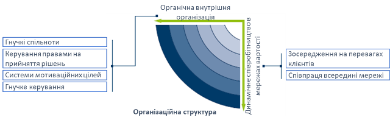
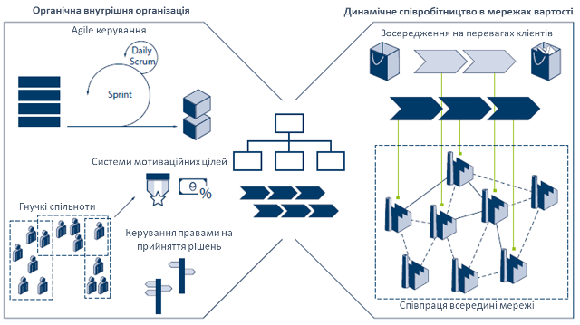
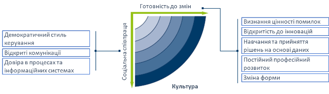
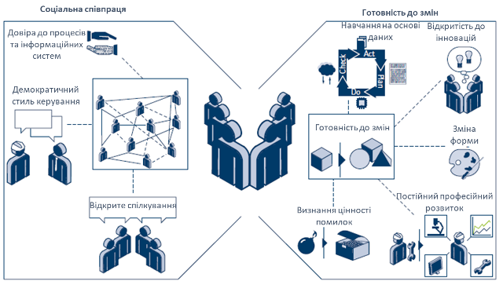

[3 <---](3.md) [Зміст](README.md) [---> 5](5.md) 

# 4. Культура та організація на виробничих підприємствах в Індустріях 4.0/5.0

## 4.1. Організаційна структура

У той час як трансформація в гнучку компанію, що навчається, можлива завдяки технологіям, описаним вище, для її впровадження потрібна правильна організаційна структура. У наведеній моделі організаційна структура відноситься як до внутрішньої організації компанії (структура та операційні процеси), так і до її позиції в мережі доданої вартості. На відміну від структурної області «культури» (див. нижче), «організаційна структура» встановлює обов’язкові правила, які організовують співпрацю як всередині компанії, так і за її межами. «Культура» охоплює систему цінностей всередині компанії і, таким чином, описує м’які фактори співпраці. Тим не менш, обидві структурні області взаємозалежні і повинні бути узгоджені одна з одною. Структурна область «організаційна структура» охоплена двома принципами: органічної внутрішньої організації та динамічної співпраці в рамках мережі цінностей. Тому вона описує організацію як з внутрішньої, так і з зовнішньої точки зору (див. рис.4.1):

- Органічна внутрішня організація
- Динамічне співробітництво в мережах вартості

Рис. 4.1: Можливості структурної області «організаційна структура»  [[1]( [цим посиланням](https://en.acatech.de/publication/industrie-4-0-maturity-index-update-2020/))]

### Органічна внутрішня організація

Органічна організація є антиподом механістичної організації. Її співробітники мають менше обмежень і високу індивідуальну відповідальність. Таким чином, ця форма організації особливо добре підходить для організацій з висококваліфікованою робочою силою, яка існує в динамічному середовищі.

- **Гнучкі спільноти**. У гнучкої організації необхідні ресурси всередині компанії мають бути налаштовані динамічно. З точки зору організаційної структури компанії, це означає, що співробітники будуть змушені регулярно змінювати завдання, які вони виконують, і переходити в інші команди. Незважаючи на те, що вони й надалі будуть приписані до певного відділу в організаційній діаграмі компанії, на практиці вони виконуватимуть свою роботу як члени команд, орієнтованих на завдання або ціль. У той же час компанії необхідно сприяти співпраці між експертами з конкретних тем, створюючи паралельні групи експертів для вирішення спеціалізованих тем. Цей підхід спрямований на покращення зв’язку між різними відділами та об’єднання навичок співробітників. Це дозволяє компанії переконатися, що люди з різними навичками з різних частин бізнесу рухаються в одному напрямку для досягнення спільної мети. Тому те, як компанія організована, має забезпечувати співпрацю в окремих командах на основі потреб. Цей підхід зрештою призводить до концепції спільнот, де організаційні підрозділи формуються навколо певної теми (наприклад, впровадження нового ІТ-рішення) або завдання (наприклад, керування фрезерними верстатами). У той час як постійні спільноти можуть займатися повсякденною діяльністю компанії, інші спільноти можуть бути засновані на проектах і створюватися виключно на тимчасовій основі, перш ніж їх знову розформують. Мета цієї форми організації полягає в тому, щоб гарантувати, що робота виконується працівниками з відповідними навичками для роботи, незалежно від того, де вони сидять в ієрархії або до якого відділу належать. Переваги цієї концепції передусім стосуються інновацій та завдань, орієнтованих на вирішення проблем. У цих випадках найсильніші навички співробітників використовуються, якщо вони здатні гнучко брати участь у різних спільнотах. Ця форма організації має певні обмеження - для процесів, які вимагають високої ефективності та стабільності, ступінь гнучкості повинна бути обмежена. Гнучкі організації здатні підтримувати стабільні процеси, водночас здатні швидко адаптуватися. Це також дозволяє швидко реагувати на нові події та знання. 
- **Керування правами на прийняття рішень**. При розподілі повноважень для прийняття рішень або виборі найкращої процедури прийняття рішень необхідно зважити один проти одного два протилежні механізми: централізований та децентралізований. Очевидно, що для прийняття правильного рішення має бути доступна вся відповідна інформація. Якщо рішення приймаються децентралізовано, місцеві особи, які приймають рішення, матимуть кращу інформацію про фактичні обставини, оскільки вони ближчі до фактів. Досягнення такої ж якості в централізовано прийнятому рішенні буде дорожчим через вартість передачі інформації на центральний рівень. З іншого боку, децентралізовані рішення також спричиняють витрати або через те, що вони не узгоджені належним чином одне з одним і, отже, потенційно не враховують те, що є найкращим для компанії в цілому, або тому, що вони вимагають додаткового втручання керівництва, щоб узгодити їх із рішеннями з загальними цілями компанії. Отже, певні рішення повинні прийматися централізовано, наприклад, рішення щодо стратегії компанії, тоді як інші рішення можуть бути прийняті більш економічно ефективними, якщо вони децентралізовані. Однією з переваг Industrie 4.0 є краща доступність інформації. Це означає, що навіть на децентралізованому рівні можна досягти прозорості щодо наслідків рішень та їх узгодженості з цілями компанії, забезпечуючи швидше та ефективніше децентралізоване прийняття рішень. Також можуть бути використані процеси колективного прийняття рішень. Це передбачає об’єднання зацікавлених сторін у компанії, які є найбільш компетентними для прийняття рішень з даного питання. Наприклад, члени експертних спільнот можуть бути обрані шляхом проведення свого роду експертної оцінки кандидатів. Подібним чином потенціал нових проектів розвитку може оцінювати всі працівники, а не лише жменька керівників. Компанії повинні розвинути здатність керувати правами прийняття рішень таким чином, щоб знайти правильний баланс між централізацією та децентралізацією, щоб максимізувати ефективність і ефективність процесів прийняття рішень.
- **Системи мотиваційних цілей**. Для збільшення автономії працівників і забезпечення їх зосередженості на загальній меті компанії — досягнення цінності для клієнтів, необхідні відповідні системи цілей. Занадто конкретні цілі, які вимірюються одновимірно (наприклад, кількість вироблених штук), призводять до локальної оптимізації та до «силосного менталітету». Натомість компанії повинні запровадити багатовимірні системи цілей, які заохочуватимуть працівників зосереджуватися на ефективності процесів і постійному вдосконаленні. Це вимагає розвитку абсолютно нових компетенцій, таких як фінансове регулювання спільнот або вимірювання успіху команд експертів. Одним із прикладів можливої цілі для працівника, який працює у сфері розвитку, було б вимагати від нього виступати з певною кількістю презентацій на конференціях, у яких беруть участь експерти з-за меж компанії. Це забезпечило б цілеспрямований засіб заохочення їх піддавати власні ідеї критичній оцінці третіми сторонами. Системи цілей тісно пов'язані з системами оплати праці. Це не повинно створювати суто трансакційну організацію, де єдиним мотивом працівників є їхня оплата. Цілі та системи винагороди повинні поєднуватися, щоб забезпечити працівникам певну безпеку та впевненість у тому, що їм дозволено робити випадкові помилки, водночас мотивуючи їх вкладати всі свої навички в організацію. Це вимагає правильного поєднання грошових і негрошових стимулів, таких як можливості навчання, перспективи розвитку та особиста свобода 
- **Гнучке керування**. Негнучкі звичайні процеси розробки не в змозі впоратися з нечіткими або мінливими вимогами, що виникають у динамічному середовищі. Натомість необхідні підходи характеризуються швидкою розробкою прототипу, конкретними (проміжними) результатами та високочастотними циклами зворотного зв’язку із зацікавленими сторонами. Одним із принципів, якого дотримуються гнучкі проекти розробки, є перевірка припущень і гіпотез про продукт або результат якомога раніше в реальному середовищі. Це передбачає зосередження на основній функціональності продукту, щоб створити так званий «мінімально життєздатний продукт» (MVP).  MVP — це товарні продукти з обмеженою функціональністю, які можна протестувати безпосередньо на ринку, що дозволяє систематично та швидко продовжувати розвиток продукту на основі відгуків споживачів. Ці підходи можна застосовувати не лише для розробки продуктів і послуг, але й для керування внутрішніми проектами. Фізичні виробничі процеси можна порівняти з цифровими моделями, щоб ідентифікувати можливості для подальшого вдосконалення. Іншим прикладом такого процесу є підхід Scrum, який виник у сфері розробки програмного забезпечення. Цей процес прискорює ініціативи безперервного вдосконалення за допомогою підходу до інновацій, який базується на даних і базується на принципі «почніть з малого та швидко розширюйте». Розумні продукти з дедалі більшою програмною функціональністю підтримують цей тип підходу, уможливлюючи широке спостереження на основі даних за поведінкою реальних користувачів, щоб функціональні можливості продукту згодом можна було покращити, добавити або навіть видалити. Ландшафт інтегрованої системи також діє як каталізатор для використання подібних методів у самій компанії. Наприклад, зміни в дизайні продукту можуть бути автоматично повідомлені всім відповідним учасникам (наприклад, у формі переглянутого графіка роботи).

### Динамічне співробітництво в мережах вартості

Автоматизований та безперебійний обмін інформацією між різними компаніями дозволяє їм співпрацювати більш динамічно та забезпечує підвищену прозорість щодо ринку. Це також допомагає зменшити деякі бар’єри на шляху до більшої гнучкості, такі як ручні процеси для запитів, замовлення та обробки замовлень. Операційну видимість можна розширити, включивши в неї статус виробництва постачальника та показники якості за допомогою сучасних технологій IoT. Результатом є більш ефективний обмін інформацією, товарами та послугами.

- **Зосередження на перевагах клієнтів**. Відповідно до концепції основної компетенції або «стратегічних позицій успіху», компанії повинні чітко зосередитися на обмеженій кількості компетенцій, щоб забезпечити унікальну пропозицію для ринку. Ця концепція стає ще більш важливою, оскільки ринки стають більш прозорими, а створення вартості стає все більш мережевим і динамічним. Динамічний ринок — це ідея, яка стане надзвичайно важливою. Постачальники, які досягнуть успіху на прозорому ринку з добре функціонуючими ринковими механізмами, будуть тими, хто найкраще зможе задовольнити індивідуальний попит. Зокрема, компанії мають визначити, як вони можуть сприяти задоволенню потреб кінцевого споживача. Навіть якщо компанія сама не доставляє продукцію безпосередньо кінцевому споживачу, її продукт або послуга все одно є частиною рішення кінцевого клієнта. Чим більший внесок у це рішення зробили окремі партнери, тим успішніше ці компанії зможуть виділитися серед конкурентів. Прикладом може бути виробник роликових підшипників, який зосереджується не лише на безпосередніх вимогах виробника машини, який є його прямим клієнтом, але й на тому, як його підшипники використовуються кінцевими користувачами машин. Аналізуючи дані про стан роликових підшипників за допомогою хмарного рішення, він може надавати кінцевому користувачеві додаткові послуги, які допомагають їм працювати з машиною ефективніше. Це глибоке розуміння вимог кінцевого клієнта також робить його більш привабливим, ніж конкуренти, для його безпосереднього клієнта (виробника машини), оскільки це означає, що загальне рішення, яке надає машина, більш успішно задовольняє потреби клієнта. Компанії повинні мати можливість постійно переглядати свої компетенції та, якщо необхідно, адаптувати їх до обставин, що змінилися. Вони також повинні точно визначити, яку роль вони повинні відігравати в мережі цінностей. Цільовий внесок спеціалізованих компетенцій у загальне рішення та інтеграція кількох окремих рішень для створення єдиного загального рішення можуть бути потенційно успішними стратегіями.
- **Співпраця всередині мережі**. Компанії можуть свідомо прийняти стратегію або передати певні виробничі та транспортні операції на аутсорсинг, або позиціонувати себе як постачальників певних компетенцій для мережі вартості. Керування компетенціями означає систематичну інтеграцію компетенцій різних партнерів. Компанії, які об’єднують свої компетенції для задоволення конкретних потреб, здатні швидше реагувати на зміни вимог ринку. Працюючи разом, партнери можуть розробляти та постачати нові продукти, які вони ніколи не змогли б поставити самостійно або для яких спочатку потрібно було б розпочати тривалий внутрішній процес підвищення кваліфікації. Гнучкі ринки, які контролюють увесь ринок, уже існують сьогодні для менш складних стандартних послуг (наприклад, у сфері логістики). Одним з викликів є надання дуже точних описів, необхідних для торгівлі послугами. У  випадках, коли компанії, які раніше не співпрацювали, бажають  співпрацювати, не маючи при цьому довіри одна до одної, зусилля,  необхідні для переговорів про угоду про співпрацю, ймовірно, переважать  над перевагами короткострокової та потенційної співпраці, яка може бути  одноразовою. Керування цифровими правами відіграє важливу роль у цьому контексті. Безперебійний обмін конфіденційними даними, наприклад CAD-моделей супроводжується ризиком використання даних не лише за призначенням. Необхідно вжити запобіжних заходів, щоб забезпечення правильного доступу до даних для визначеної мети, наприклад використовувати модель CAD для запчастини, надрукованої на 3D, лише один раз, а не кілька разів.

Рис.4.2 показує характеристики, якими повинні володіти ресурси виробничої компанії після того, як вона досягла стадії зрілості «адаптивності». 

Рис. 4.2: Можливості, необхідні в структурній області «Організаційна структура»  [[1]( [цим посиланням](https://en.acatech.de/publication/industrie-4-0-maturity-index-update-2020/))]

## 4.2. Культура

Гнучкість компанії сильно залежить від поведінки її співробітників. Досвід ощадливого менеджменту в 1990-х і 2000-х роках показав, що ключем до успішного впровадження ощадливого менеджменту в бізнесі є зміна культури компанії, іншими словами, зміна менталітету її співробітників. Те саме стосується цифрової трансформації в гнучку компанію, що навчається. Компанії не зможуть досягти бажаної гнучкості, якщо вони просто запровадять цифрові технології, не звертаючи уваги на свою корпоративну культуру. Натомість вони повинні почати з того, що вирішити, як вони хочуть, щоб їхня компанія працювала в майбутньому, і які навички знадобляться їхнім працівникам. Лише тоді вони повинні визначити та запровадити технології, необхідні для підтримки бажаного способу роботи. Показовим прикладом є цифрові системи допомоги. Саме по собі впровадження таких систем не додає цінності компанії. Перш ніж цифрові системи допомоги почнуть приносити додаткову цінність, компанія повинна створити культуру, за якої співробітники довірятимуть цим системам і будуть готові прийняти їхні пропозиції. Необхідна трансформація корпоративної культури заключається в двох ключових принципах:

-  Готовність до змін
- Соціальна співпраця

Рис. 4.3: Можливості структурної області «культура»  [[1]( [цим посиланням](https://en.acatech.de/publication/industrie-4-0-maturity-index-update-2020/))]

### Готовність до змін

Ідеальний сценарій полягає в тому, щоб усі співробітники були готові до змін. Крім того, ця готовність до змін не повинна обмежуватися ситуаціями, коли зміни вже впроваджуються. Важливо, що це також означає, що люди повинні дивитися на своє власне оточення та корпоративне оточення відкритими очима, розпізнавати, коли є можливість або потреба для змін, і самостійно ініціювати відповідні дії. Бажання змінюватися є першим принципом культури та ключовим фактором спритності. Перший принцип структурної області «культура» базується на п’яти здібностях, які не слід розглядати окремо одна від одної, бо лише коли вони поєднуються, вони призводять до бажання змінюватися.

- **Визнання цінності помилок**. Гнучкі компанії що навчаються надають великого значення помилкам. Ці компанії зрозуміли, що процеси навчання та змін можуть бути започатковані лише за наявності помилок. Помилки надають можливість отримати краще розуміння процесів компанії та виявити раніше невідомі причинно-наслідкові зв'язки. Таким чином, спосіб, яким компанія вирішує проблему помилок, є ключовим аспектом її корпоративної культури. Існують два фундаментально різних підходи до помилок. Негативне ставлення до помилок відображається в стратегії, заснованій на систематичному уникненні помилок, жорстких покараннях за помилки та виправленні помилок якомога швидко та непомітно. Працівники компаній, де панує така культура, зазвичай не готові визнавати свої помилки. Це гальмує їх бажання змінюватись. З іншого боку, культура, яка визнає цінність помилок, характеризується відкритим обговоренням помилок при їх виникненні, систематичною документацією помилок та вирішенням причин помилок та їх рішень. При розслідуванні помилок критично важливо зосередитися на розумінні причин, а не на встановленні винних.
- **Відкритість до інновацій**. Комплексне розуміння того, як працюють нові технології та підходи, є  необхідним, щоб забезпечити їх інтеграцію в компанію таким чином, щоб  вона приносила значну додану вартість. Переваги нововведень не завжди  відразу ж очевидні, оскільки спочатку люди не знайомі з технологіями,  які ще не використовувалися в компанії. Один з прикладів - використання  систем підтримки на основі даних в сільському господарстві. Оптимізація  маршруту, який пройде комбайн по полю, може збільшити врожайність на  20%. На ринку існує кілька систем, які можуть обчислювати оптимальний  маршрут на основі поточних екологічних умов та рівня заповненості  комбайну. Однак багато фермерів не хочуть змінювати звички попереднього  життя. Отже, один виробник сільськогосподарської техніки вирішив  встановити свою систему безкоштовно на пробній основі. Це дало  можливість фермеру побачити безпосередню користь від використання  системи та переконатися, що настав час починати робити речі по-іншому.  Пробний період продемонстрував значення «прихованих» даних та  інформації, отриманої з них. Готовність до інновацій та нових способів  роботи є важливою здатністю, яка потрібна для запуску змін та прийняття  правильних заходів, навіть якщо вони іноді є дещо незвичними.
- **Навчання та прийняття рішень на основі даних**. Інноваційні цикли виробничих компаній стають все коротшими. Іншими  словами, на розробку адекватних відповідей на зміни в бізнес-середовищі  залишається менше часу. Це також означає, що помилки необхідно виявляти  якомога швидше та ідентифікувати їх причини. Замість вирішення проблем  за допомогою інтуїції, важливо отримувати розуміння причин помилок на  основі даних, щоб приймати відповідні заходи для їх вирішення.  Навчальні, гнучкі компанії здатні до цього, оскільки вони постійно  відслідковують свої процеси додавання вартості, за допомогою збору  відповідних даних. Потім аналізують ці дані, порівнюючи цифрову модель з фізичними даними та приймають заходи на основі результатів аналізу.  Їхні співробітники мають довіру до даних та готові навчатися на їхніх  основах та приймати рішення на їхній підставі. Наприклад, в Google  рішення співробітників щодо нових заходів ґрунтуються майже виключно на  даних, які були зібрані та проаналізовані. Це можливо через те, що  працівники зобов'язані до постійного вдосконалення та розуміють, що  рішення не повинні ґрунтуватися виключно на досвіді однієї людини. Вони  розуміють, що прийняття рішень на основі даних дає швидші та кращі  результати, ніж покладатися на досвід окремих осіб.
- **Постійний професійний розвиток**. Цифровізація промисловості кардинально перетворює набір навичок,  необхідних для працівників виробничих компаній. Зміни в технології  виробництва та все більше використання інформаційно-комунікаційних  технологій означають, що потрібні навички змінюватимуться все частіше.  Якщо раніше було величезне попит на спеціалістів з глибокими знаннями,  то в майбутньому зростатиме попит на "універсальних спеціалістів". Це  працівники, які мають міждисциплінарне розуміння взаємопов'язаних  процесів та можуть швидко набути необхідні спеціалізовані знання. Такі  працівники розуміють, що деякі з навичок та знань, які вони набули в  минулому, залишаться корисними тільки на обмежений час. Вони  характеризуються бажанням навчатись протягом усього життя. Факт того, що вони стежать за змінами у своєму середовищі, означає, що вони швидко  визначають будь-які нові потреби у навчанні. Тому вони можуть разом  формулювати програми навчання, які відповідають необхідним компетенціям і задовольняють потреби працівників.
- **Зміна форми**. Чим швидше компанія може забезпечити адекватну відповідь на зовнішні  події, тим більші переваги зміни матимуть для тих, на кого вони  впливають. Тому необхідно ініціювати, реалізувати та завершити правильні зміни якомога швидше. Для цього важливо забезпечити, щоб ініціатива  була взята тими працівниками, які найкраще зможуть інтерпретувати  зовнішню подію на основі своїх знань. Оскільки це часто будуть  працівники, які найбільше працюють з системою або машинами, вони не обов'язково мають повноважень приймати рішення. Тому важливо передавати  повноваження, надавати працівникам більше можливостей для дій та давати  фахівцям з відповідною технічною експертизою можливість ділитися своїми знаннями. Однак критичним фактором є розуміння працівниками, що вони  також несуть відповідальність за формування змін. Замість простого  прийняття змін, вони повинні бути готові ініціювати їх самостійно і бути готові взяти перший крок для їх втілення.

### Соціальна співпраця

Ідеальний сценарій полягає в тому, щоб працівники вірили, що їхні дії повинні повністю базуватися на знаннях. Термін «знання» охоплює будь-які знання, отримані шляхом цілеспрямованого спостереження, випадково, шляхом аналізу даних або практичного досвіду. Середовище, яке характеризується довірою та соціальними стосунками, створює основу для відкритого, вільного обміну знаннями між співробітниками. Отже, другий принцип культури, соціальна співпраця, допомагає прискорити обмін знаннями в компанії. 

- **Демократичний стиль керування**. Часті зміни в оточуючому середовищі вимагають швидких, але не  втрачених якості, рішень щодо того, як відреагувати на них. Окрім  забезпечення належних знань для прийняття відповідних заходів,  необхідно, щоб процеси прийняття рішень стали швидшими. Більш гнучкий  підхід до прийняття рішень та надання більшого простору дії працівникам  створює організаційний каркас для швидшого прийняття рішень. Окрім  створення належного каркасу, дуже важливо, щоб співробітники мали довіру один до одного, щоб рішення не тільки приймалися швидко, а й  втілювалися в життя. Замість розглядання співробітників як ресурсів, керівництво повинно цінувати їх як частину спільноти через компетенції,  які вони приносять на стіл. Основною здатністю, яка дозволяє це зробити, є демократичний стиль керування.
- **Відкрите спілкування**. Для того, щоб компанії могли швидко реагувати на непередбачені події в своєму середовищі, їхні співробітники в ідеалі повинні мати миттєвий доступ до необхідних явних і неявних знань. Хоча явні знання можна надати за допомогою відповідних комунікаційних технологій, обмін неявними знаннями вимагає прямого спілкування між людьми, які володіють знаннями, і людьми, які їх шукають. Наприклад, коли виробниче обладнання пошкоджується або виникає несправність, працівники технічного обслуговування можуть отримати доступ до більшості виробничих параметрів, які їм необхідно проаналізувати, через відповідні інформаційні системи (системи MES/ERP). Однак власний досвід операторіів щодо роботи з машинами та інформація, яка не фіксується датчиками, наприклад зміни рівня шуму, можуть надаватися лише безпосередньо між працівниками. Отже, працівники повинна припинити мислити категоріями жорсткої ієрархії та відмовитися від ментальності «ми і вони». Співробітники набули здатності до відкритого спілкування, якщо, взявши до уваги той факт, що відкритий обмін знаннями та спільна робота для досягнення бачення збільшує загальну суму знань, вони також діють відповідно. Коли всі працівники організації хоче ділитися знаннями з усіма, стає можливим значно прискорити процеси навчання в компанії.
- **Довіра до процесів та інформаційних систем**. Уроки впровадження інформаційних технологій з 1970-х років вчать нас, що недостатньо зосереджуватися виключно на функціональних вимогах. Прийняття та систематичне використання інформаційних технологій і систем може бути забезпечено лише в тому випадку, якщо відповідний персонал буде включений у процес змін із самого початку та може брати активну участь у формуванні змін. Окрім залучення працівників до проектування відповідних інформаційних систем, усі працівники повинні розуміти, що переваги цих інформаційних систем будуть реалізовані лише за умови їх систематичного використання всіма. Той факт, що працівники гнучких компаній, що навчаються, довіряють обраним процесам та інформаційним системам, дає змогу швидко обмінюватися задокументованими знаннями на основі ролей, контекстуально. Ця впевненість базується на тому факті, що співробітники розуміють, як інформаційна система приймає рішення, і визнають конкретні переваги її рекомендацій. Однак водночас вони критично дивляться на систему та прагнуть вдосконалювати її власними знаннями в інтересах постійного вдосконалення.

Рис.4.4. показує характеристики, якими повинні володіти ресурси виробничої компанії після того, як вона досягла стадії зрілості «адаптивності». 

Рисунок 4.4: Можливості, необхідні в структурній області «Культура»  [[1]( [цим посиланням](https://en.acatech.de/publication/industrie-4-0-maturity-index-update-2020/))]

## Питання для самоперевірки

1) Що оцінюється в області організаційної структури підприємства?
2) 

## Посилання

[[1]](https://en.acatech.de/publication/industrie-4-0-maturity-index-update-2020/) Industrie 4.0 Maturity Index. Managing the Digital Transformation of Companies – UPDATE 2020 https://en.acatech.de/publication/industrie-4-0-maturity-index-update-2020/

[[2]](https://en.acatech.de/publication/using-the-industrie-4-0-maturity-index-in-industry-case-studies/) Industrie 4.0 Maturity Index in Industry – current challenges, case studies and trends  https://en.acatech.de/publication/using-the-industrie-4-0-maturity-index-in-industry-case-studies/

[[3](https://github.com/pupenasan/dt/blob/main/articles/MatInd_2020.md)] Індекс зрілості Industrie 4.0  https://github.com/pupenasan/dt/blob/main/articles/MatInd_2020.md