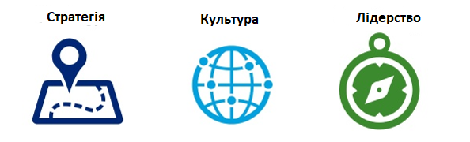
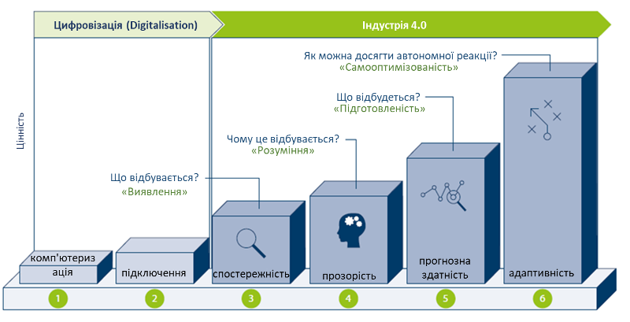
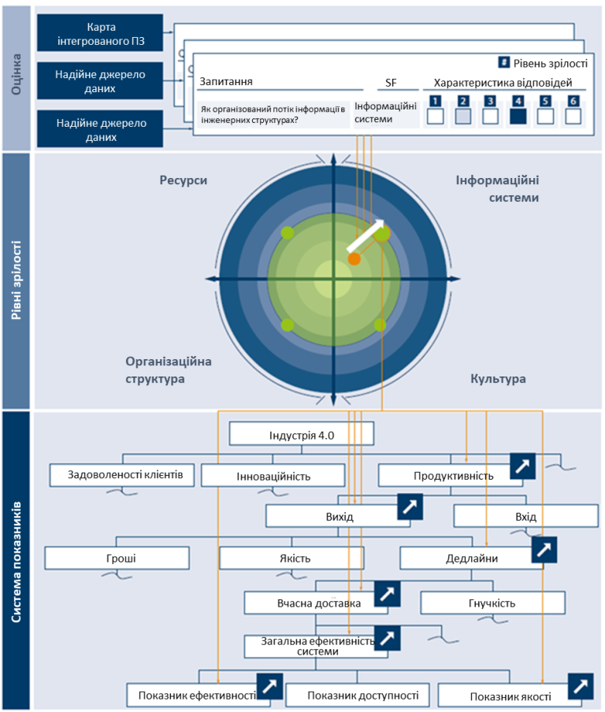
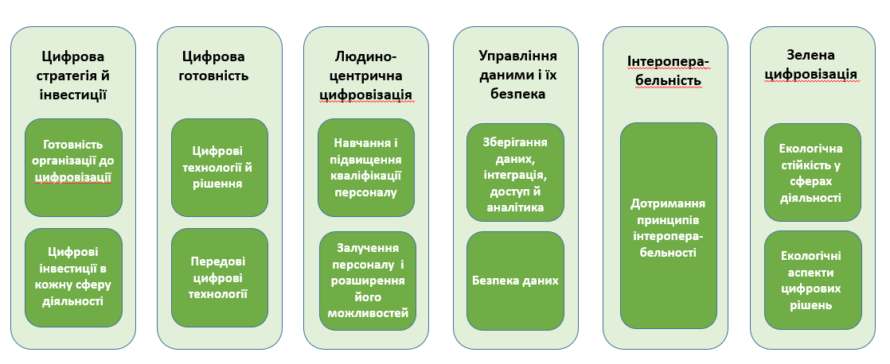
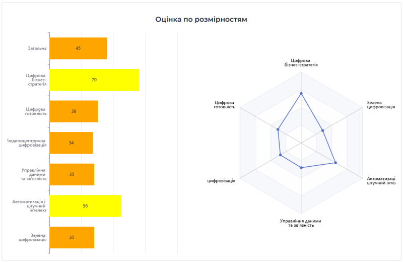

[3 <---](3_2024.md) [Зміст](README.md)  [---> 5](5_2024.md) 

# 4. Шлях цифрової трансформації 

## 4.1. Ключі до успішної цифрової трансформації

Підприємства що хочуть трансформуватися мають мати чітку стратегію в поєднанні з культурою та лідерством. Відповідно є три ключові сфери керування для успішного здійснення цифрової трансформації, опишемо їх детальніше.

Рис.4.1. Три ключові сфери керування для успішної цифрової трансформації 

### Лідерство

Справжня трансформація відбувається лише тоді, коли на підприємстві є **команда лідерів**, яка сприймає і втілює ідею цілісних змін у роботі бізнесу. Ця команда повинна враховувати всі фактори, які створюють цінність для організації, включно з прибутком, капітальними витратами та оборотним капіталом. При цьому звичайні підходи до трансформації зазвичай дають звичайні (і часто неоптимальні) результати. Щоб досягти надзвичайних результатів, необхідна комплексна, високодисциплінована методологія.

Коли справа доходить до цифрової трансформації, найдефіцитнішим ресурсом є не стільки технологічне ноу-хау, скільки **лідерство**. Хоча лідерам не обов’язково бути майстрами в технологіях, вони повинні розуміти, чого можна досягти на стику бізнесу та технологій. Вони також повинні бути готові лідирувати в концептуалізації того, як технології можуть змінити бізнес. Принципово змінюється роль лідерів. Їм потрібно навчитися нової поведінки та відмовитися від старих звичок. Знаходження правильного балансу між вирівняністю (спільне бачення та спільна комунікація) та автономією (певна вільність в прийнятті рішень) є основним випробуванням лідерства під час цифрової трансформації.

Щоб здійснити цифрову трансформацію, потрібна повна злагодженість - від правління до виконавчої команди та всієї організації. Без цієї підтримки з боку правління та акціонерів, які розуміють зміни, через які лідери проводять організацію, дуже важко зробити це успішно.

Під час цифрової трансформації зміни відбуваються на всіх рівнях, особливо коли йдеться про таланти та здібності. Наявність правильних лідерів, які знають цифрові технології, є одним із ключів до успіху трансформації. Так само, як важливо і залучення персоналу з ролями, пов’язаними із трансформацією, а саме лідерів окремих ініціатив і керівників відділу керування програмою або офісу трансформації, які повністю присвячують роботу змінам. 

Ще одним ключем до успіху є відданість лідерів. Коли люди на ключових посадах (як старше керівництво організації, так і ті, хто виконує функції, пов’язані з трансформацією) також залучені до цифрової трансформації, успіх трансформації є більш імовірним.

### Зміна культури та організації 

Як і будь-яка велика трансформація, цифрова трансформація вимагає прищеплення **культури, яка підтримує зміни**, одночасно забезпечуючи основну стратегію компанії. Ігноруючи культуру, організація ризикує провалом трансформації. Ряд досліджень показують, що цифрові трансформації у компаніях, які зосереджувалися на культурі, мали в п’ять разів більше шансів досягти прориву, ніж компанії, які нехтували культурою. Впровадження цифрової культури в організацію дає людям змогу швидше досягати результатів, а також залучає й утримує кращих талантів. Але це вимагає чіткої методології та дисциплінованих зусиль і тут лідерство має вирішальне значення. Цифрова культура зазвичай має п’ять визначальних елементів:

1. Вона сприяє зовнішній, а не внутрішній орієнтації. Цифрова культура заохочує співробітників дивитися назовні та взаємодіяти з клієнтами та партнерами для створення нових рішень. Співробітники формують розроблення продукту та покращують взаємодію з клієнтами, ставлячи себе на місце клієнта.
2. Вона надає перевагу делегуванню прав перед керуванням людьми. Цифрова культура поширює процес прийняття рішень углиб організації. Замість того, щоб отримувати чіткі інструкції щодо того, як виконувати свою роботу, працівники дотримуються керівних принципів, щоб можна було довіряти їхнім судженням.
3. Вона заохочує сміливість замість обережності. У цифровій культурі людей заохочують ризикувати, швидко зазнавати невдач і вчитися, і вони не мають зберігати статус-кво через звичку чи обережність.
4. Вона акцентує увагу на збільшення дій проти довгого планування. У цифровому світі, що швидко змінюється, планування та прийняття рішень повинні перейти від довгострокового фокусу до короткострокового. Цифрова культура підтримує потребу у швидкості та сприяє безперервній ітерації, а не вдосконаленню продукту чи ідеї перед їх запуском.
5. Вона цінує більше співпрацю, ніж індивідуальні зусилля. Успіх у цифровій культурі досягається завдяки колективній роботі та обміну інформацією між підрозділами та функціями. Ітеративний і швидкий темп цифрової роботи вимагає набагато більшого рівня прозорості та взаємодії, ніж ті, які є в традиційній організації.

Одним із ключів до успіху цифрової трансформації є транслювання історії змін до всіх співробітників. Це допомагає їм зрозуміти, куди рухається організація, чому вона змінюється та чому ці зміни важливі. Дослідження показали, що в організаціях, які дотримуються такої практики, ймовірність успішної трансформації збільшується втричі. Керівники повинні розробити бачення цифрової трансформації, змінити вкорінену організаційну поведінку, щоб змінити організаційну культуру та встановити реальні цілі для цифрових ініціатив.

Другий ключ полягає в тому, що в цифровому контексті компанії повинні бути більш креативними в каналах, які вони використовують, щоб забезпечити нові, швидші способи роботи та швидші зміни мислення та поведінки, яких вимагає цифрова трансформація. Комунікація вгору, вниз або по горизонталі має вирішальне значення для довгострокового успіху організації. Одна зміна полягає в тому, щоб відійти від традиційних каналів, які підтримують лише односторонню комунікацію (наприклад, корпоративні електронні листи), і перейти до більш інтерактивних платформ (таких як внутрішні соціальні мережі), які забезпечують відкритий діалог у всій організації. Іншим ключем до кращої комунікації є розробка більш лаконічних і навіть персональних повідомлень для людей в організації, скорочування довгих комунікацій.

Повинні бути розроблені чіткі цілі для ключових показників ефективності організації та чітке повідомлення про графік трансформації. Переваги від відкритої комунікації в організації:

- Спілкування сприяє лідерству. Коли керівництво здатне сформулювати чіткий шлях, мету, бажаний результат і вказівки, уся організація має можливість приєднатися до них і прийняти зміни.

- Спілкування може допомогти у вирішенні проблем. Часто зміни можуть вплинути на життєві цикли продукту, терміни доставки, процеси та процедури. Чіткі лінії комунікації можуть пом’якшити ці проблеми до того, як вони вплинуть на прибутковість організації.

- Менший опір змінам. Коли вся організація знає про нові процеси ще до того, як вони мають відбутися, про те, як ці процеси вплинуть на роботу співробітників тощо, люди схильні підходити до змін з меншим страхом чи побоюванням і з більшим ентузіазмом.

Більш детально на особливостях культури та організації 4.0/5.0 ми зупинимося в наступних лекціях. Це потрібно не тільки для цифрової трансформації а і є одним з показників здійснення такого переходу а саме в культурному та організаційному плані.  

### Визначення цифрової стратегії та дорожньої карти

Цифрова трансформація є складним процесом, який вимагає серйозних інвестицій і пов’язаний з ризиками. Щоб рухатися до цифрового майбутнього, компаніям необхідно мати чітке бачення з детальною стратегією цифрової трансформації, яка може допомогти передбачити можливі ризики, розрахувати бюджет такого вдосконалення та забезпечити бажані результати. Виконана як цілісна стратегія, а не через спеціальні проекти, цифрова трансформація може допомогти компанії підвищити свою конкурентоспроможність у цифровому світі та протистояти викликам, пов’язаним із цією трансформацією.

Як зазначалося раніше, щоб отримати переваги цифрової трансформації, потрібні чітка стратегія та дорожня карта, які зосереджені як на застарілих, так і на цифрових технологіях і процесах, щоб отримати цінність, отримати інформацію та зосередитися на клієнті.

На першому ж кроці варто визначити своє бачення впровадження цифрової трансформації. Але **замість того, щоб розглядати проблеми, які намагається вирішити компанія за допомогою інновацій, необхідно зосередитися на кінцевій меті.** Необхідно поставити перед собою довгострокові цілі та зосередитися більше на досвіді, який компанія хоче створити як для своїх клієнтів, так і для співробітників.

Дуже важливо придумати глобальне бачення, спрямоване на майбутнє. З іншого боку, це бачення має відповідати реальності. Отже, необхідно побудувати своє стратегічне бачення на короткострокових цілях і ресурсах, доступних для бізнесу компанії сьогодні. Зосереджуючись на своїй конкурентній перевазі, можна визначити прогалини в поточній структурі та створити дорожні карти впровадження для її оптимізації.

## 4.2. Технологічні дорожні карти

**Дорожня карта** — це процес стратегічного планування, який допомагає визначити, узгодити та повідомити бізнес-потреби (знати чому), перетворені на реалістичний план дій (знати що) і необхідні базові ресурси (знати як) протягом певного періоду часу (знати коли). Це можна назвати 4-кроковим фреймворком:

1. **ЧОМУ?** Важливо описати поточну ситуацію компанії, зосередившись на параметрах, на які вплине дорожня карта.

   - Проаналізуйте компанію, дайте означення

   - Canvas (інструмент візуалізації), Pestle (аналіз зовнішніх факторів), SWOT (оцінка сильних та слабких сторін, можливості та загрози для організації), технологічний годинник 

2. **ЩО?** Означте бачення та місію компанії та стратегічні цілі, щоб узгодити ініціативи для реалізації з дорожньою картою.

   - Визначення поточної та бажаної позиції

   - Визначення рівня технологічної зрілості

3) **ЯК?** Опишіть дії та ініціативи, які необхідно здійснити. Це можуть бути технологічні проекти, нові бізнес-моделі, організаційні зміни, модифікації операційних процесів, зміни у відносинах із клієнтами та постачальниками або інша діяльність. Також включіть опис технічних вимог, витрат і часу виконання, очікуваних результатів, KPI, заходів контролю, ресурсів, можливості отримання фінансування. Ці заходи будуть кроками на критичному шляху. Також важливо описати, чи ці ініціативи потребують підтвердження концепції чи прототипу, а також наслідки його масштабованості.
   - Означте ініціативи. Створюйте таблиці для опису кожної ініціативи, методологій визначення пріоритетів, визначення KPI, створення робочих груп, моніторингу досягнення цілей

4) **КОЛИ**? Представлення дорожньої карти у формі діаграми або схеми із запланованими та послідовними проектами чи ініціативами з часом. Дорожня карта має включати проміжні цільові стани або етапи процесу, яких компанія досягне, щоб гарантувати, що процес змін йде по курсу.
   - Календаризація

Існує багато типів дорожніх карт, які можна використовувати в організації та вибирати залежно від кінцевої мети. Деякі приклади включають дорожні карти ринку та стратегії, планування активів знань, дорожні карти продукту та планування ІКТ. Дорожні карти можуть бути представлені в широкому діапазоні форматів: зображення (потоки), текст, графіки, таблиці, стовпчики тощо. Їх можна використовувати як основу для ефективного обміну цілями команди, стратегіями та запланованими діями зацікавленим сторонам, постачальникам і клієнтам.

**Технологічна дорожня карта** дозволяє представити технологію, доступну в даний момент для організації протягом певного періоду часу, а також найкращі технологічні варіанти, які можна розробити або придбати в певний проміжок часу. У багатьох відношеннях технологічну дорожню карту можна інтерпретувати як систему GPS для цифрової стратегічної дороги: вона дозволяє компаніям бачити, де вони знаходяться, куди вони хочуть йти і як туди дістатися. Таким чином, це допомагає організаціям планувати, які, коли та чому певні технології будуть застосовані, уникаючи дорогих помилок і навіть плануючи, що технології застаріють.

Деякі з ключових переваг технологічних дорожніх карт:

- Сприяє інтеграції технологій у бізнес.
- Застосовується до процесів, продуктів, відносин з клієнтами та керування активами.
- Сприяє досягненню консенсусу щодо потреб і технологій, необхідних для задоволення цих потреб.
- Забезпечує механізм для прогнозування, планування та координації розвитку технологій.
- Допомагає визначити нові можливості для бізнесу та використовувати технології.

Існує багато способів, за допомогою яких компанія чи галузь можуть створити, означити та реалізувати технологічну дорожню карту. Однак найкращі технологічні дорожні карти мають спільні риси. Основні міркування при створенні технологічної дорожньої карти можна оформити у вигляді наступного чеклиста:

- Визначте та розставте пріоритети для бізнесу та потреб ринку.

- Цінність результатів під час проходження, діліть процес на етапи і забезпечте надання переваг вже на перших етапах. Тому включайте ініціативи, які генерують короткострокові переваги вже на початку плану, щоб заохочувати мотивацію команди під час реалізації інших ініціатив, включених до дорожньої карти.
- Забезпечте підтримку та схвалення з боку вищого керівництва. 
- Надавайте ресурси: підтримка, часові і фінансові ресурси.
- Зверніть особливу увагу на вплив на людей: навички, процес, культура та організаційні зміни.
- Створюйте дорожню карту командою, включіть різноманітні точки зору та знання, щоб збагатити план. Процес включає багато обговорень і може потребувати посередника.
- Будьте простими та лаконічними
- Робіть ітерації і вчіться на досвіді. Розробляючи ініціативи, включені до дорожньої карти, використовуйте критичні знання, отримані з часом, щоб змінити та зробити дорожню карту ще більш стислою.
- Будьте готові скоригувати дорожню карту, якщо це необхідно. Дорожня карта має бути гнучкою і якось адаптованою до середовища, яке постійно змінюється
- Зробіть дорожню карту доступною для всіх підрозділів організації
- Співпрацюйте з відповідними зацікавленими сторонами. Використання зовнішніх ресурсів, таких як консультанти, може бути ефективним способом отримати доступ до цінних знань і досвіду, допомагаючи вам уникнути пасток і вчитися на успіхах інших.

Незважаючи на те, що технологічна дорожня карта є керівним  документом управління, вона повинна регулярно оновлюватися в міру розвитку бізнесу. Це документ, який слід переглядати, оскільки зовнішні та внутрішні структури компанії змінюються з новими можливостями та викликами, які можуть змінити стратегію. Остаточна дорожня карта(и) може приймати різні форми, хоча, як правило, фокусом є графічне представлення, яке забезпечує стратегічне уявлення найвищого рівня. Процес розробки дорожньої карти важливіший, ніж сама дорожня карта. Відправною точкою є майбутнє: те, де ваша компанія прагне бути. З цього моменту ви рухаєтеся назад, визначаючи ініціативи, інвестиції, партнерства та ресурси, які необхідно створити.

## 4.3. Дорожні карти цифрової трансформації                                

**Дорожня карта цифрової трансформації** є ключовою для координації та стимулювання змін у всій організації. Залежно від компанії (розміру, сектору, структури…) обсяг і зусилля, необхідні для досягнення цифрової трансформації, будуть різними, однак без плану та процесу це буде ризиковано та дорого. Дорожня карта впорядковано спрямовує компанію в процес цифрової трансформації, розділяючи проекти, які можна ефективно виконувати, своєчасно створюючи цінність для компанії в узгодженому порядку. Ця дорожня карта надає компанії три ключові елементи для процесу цифрової трансформації:

- **Послідовність.** Цифрова трансформація означає трансформацію компанії на багатьох рівнях, від найпростіших операцій до культури роботи. Це призводить до ініціатив, які включають технології, програмне забезпечення, процеси та організаційні зміни, які часто залежать одне від одного. Важливо чітко розуміти залежність проектів один від одного та порядок виконання, а також дії, які можна виконувати паралельно. Також необхідно враховувати повсякденну роботу підприємства, щоб на нього не вплинули негативно зміни трансформації.
- **Злагоджені робочі команди для співпраці.** Дорожня карта встановлює спільний план для всіх, і багато співробітників навіть беруть участь у розробці дорожньої карти. Визначення проектів, сфери їх діяльності та необхідних ресурсів дозволяють узгодити кожного для координації індивідуальних зусиль для досягнення спільної мети, дозволяючи керувати проблемами або невдачами, які можуть виникнути на цьому шляху.
- **Зосередження на важливому.** Сьогодні існує незліченна кількість технологій, трендів, програмного забезпечення, рекламних роликів, які можна впровадити в компанії для її цифрової трансформації та підвищення конкурентоспроможності. Розробка дорожньої карти, від початкової внутрішньої та зовнішньої діагностики до її концепції та реалізації, дозволяє компанії зосередитися на важливих елементах, не відволікаючись на шум ззовні. Це допомагає вищому керівництву компанії приймати обґрунтовані стратегічні рішення.            

Прикладом загальних підходів щодо розроблення дорожніх карт можна навести "Policy paper №2 Дорожні карти цифрової трансформації – як інструмент стратегічного планування та розвитку" що відображає позицію експертної спільноти Strategist 4.0, та діє в рамках національного руху «Індустрія 4.0 в Україні» .https://mautic.appau.org.ua/asset/60:policy-paper-roadmap-dx-v1docx . Згідно цього документа пропонується розробляти дорожні карти на рівні підприємства та галузей (галузеві). Перший означує в часі головні зміни по категоріям – Продукти, Бізнес-процеси, Технології, Організаційні зміни, Навички, а також за необхідності інші елементи організації, які мають відношення до успішного проведення цифровізації. Найпростіший вигляд подібної карти зводиться до візуального зображення елементів в таблиці 4.1:

Таб.4.1. Приклад дорожної карти у вигляді таблиці

| Категорія                      | Елемент           | Виклик | Цілі 1 року | Цілі n-го року |
| ------------------------------ | ----------------- | ------ | ----------- | -------------- |
| А. Продукти (сервіси, рішення) | Продукт 1         |        |             |                |
|                                | Продукт 2         |        |             |                |
|                                | ...               |        |             |                |
| В. Бізнес-процеси              | Процес 1          |        |             |                |
|                                | Процес 2          |        |             |                |
|                                | ...               |        |             |                |
| С. Виробничі технології        | Техно 1           |        |             |                |
|                                | Техно 2           |        |             |                |
|                                | ...               |        |             |                |
| D. Цифрові технології          | Техно 1           |        |             |                |
|                                | Техно 2           |        |             |                |
|                                | ...               |        |             |                |
| E. Організація                 | Структура         |        |             |                |
|                                | Позиції           |        |             |                |
|                                | ...               |        |             |                |
| F. Люди                        | Навички           |        |             |                |
|                                | Культура взамодії |        |             |                |
|                                | ...               |        |             |                |
| G. Інші елементи               | ххх               |        |             |                |
|                                | ...               |        |             |                |

## 4.4. Оцінювання стану (зрілості)                                

Для визначення стану на початку шляху, в проміжних етапах та в кінці шляху використовують оцінки(індекси, рівня) зрілості (maturity), які дають можливість кількісно оцінити стан компанії відносно вибраних показників за різними напрямками. Оцінювання зрілості допомагає компаніям визначити, на якому етапі вони зараз перебувають у своїй трансформації. Він оцінює ці виробничі компанії з різних точок зору, зокрема технологічної, організаційної, культурної, зосереджуючись при цьому на їх бізнес-процесах в різних категоріях діяльності. 

З часу започаткування програм щодо переходу до Індустрії 4.0, а пізніше 5.0 з'явилося багато різних методик оцінювання цифрової (і сталої) зрілості підприємств, які часто принципово відрізняються як за вибраними критеріями так і за способом оцінювання. Ось кілька з них:    

- ACATECH Maturity Index by Germany Academy for Science and Technology (Germany),  https://en.acatech.de/

- DMAT for SMEs - єдина методика для EDIH розроблена JRC https://european-digital-innovation-hubs.ec.europa.eu/system/files/2023-11/DMA_Framework_Guidelines_for_EDIHs.pdf 
- ADMA TranS4MErs - https://trans4mers.eu
- MDI 4.0 Model for Industry 4.0 by TECHNALIA (Spain),

- DigiMaturity tool, AI DigiMaturity and Manu Maturity by VTT (Finland),
- ACATECH Maturity Index by Germany Academy for Science and Technology (Germany),
- IMP3ROVE Digital Innovation Quotidient (DIQ) (Germany),
- CEF Monitoring by EC,
- THEIA, THRUST, Innovation Scoring by COTEC (Portugal),
- Digital Maturity Assessment tool (DMAT) by Aarhus University (Denmark), 
- DREAMY 4.0 by Politecnico di Milano (Italy),
- HADA ADVANCED DIGITAL SELF-DIAGNOSTIC TOOL by Industria conectada 4.0 (Spain), 
- ATI – Advanced Technologies for Industry by an EC funded project,
- Ipar 4.0 (Hungary).

Ці методики здебільшого розроблені з урахуванням того, що оцінювання будуть проводити за участі експертів і як правило на платній основі. Крім того, вони не є універсальними і стосуються певних типів підприємств (наприклад приватне чи державне) або розміру компаній (мікро, МСП або велике) або навіть області діяльності. Деякі з них є публічними з повною супровідною документацією для можливості імплементації та правильного трактування, однак більшість є у використанні тільки компаній, що їх використовують. 

Для українських підприємств дуже важливо мати можливість самостійно або за допомогою центрів цифрових іновацій (DIH) провести таке оцінювання. Тому нижче зупинимося на перших трьох з наведених методик для розуміння загального контексту а також їх імплементації або використання.

#### Методика від ACATECH 

Дана методика розроблялася групою дослідників з Німецької національної академії науки та інженерії (acatech, https://en.acatech.de/). Загальний опис методики а також опис досліджень які проводилися перед її розробленням викладений в роботі Managing the Digital Transformation of Companies, acatech STUDIE, Update 2020, Günther Schuh, Reiner Anderl, Roman Dumitrescu, Antonio Krüger, Michael ten Hompel (Eds.) який доступний на  https://en.acatech.de/publication/industrie-4-0-maturity-index-update-2020 . Конкретні приклади компаній, які успішно впровадили цей підхід і досягли позитивного впливу на свою ефективність, наведено в іншій супутній публікації від acatech "[Industrie 4.0 Maturity Index in Industry – current challenges, case studies and trends](https://en.acatech.de/publication/using-the-industrie-4-0-maturity-index-in-industry-case-studies/)".

Передумовою дослідження стала велика кількість невдалих проектів по цифровій трансформації підприємств. На думку розробників acatech стратегічною характеристикою сучасної компанії яка впливає на її успішність є гнучкість. Тому значення Індустрії 4.0 полягає в ключовій ролі обробки інформації у забезпеченні швидких організаційних процесів адаптації. Чим швидше організація може адаптуватися до події, яка викликає зміну її обставин, тим більші переваги приносить адаптація. Час реакції на події і є ключовим критерієм, за яким оцінюється зрілість компанії, який у свою чергу проявляється через комплекс інших показників. 

Рис.4.2. Корпоративні процеси адаптації  (джерело https://en.acatech.de/publication/industrie-4-0-maturity-index-update-2020 ) 

Можливості Industrie 4.0 допомагають виробничим компаніям значно скоротити час між виникненням події та впровадженням відповідної реакції. Перш за все автори наголошують що для використання всього потенціалу новітніх технологій недостатньо їх технічного впровадження, необхідна організаційна трансформація та культурна адаптація компаній.  Кінцева мета за думкою дослідників — стати гнучкою компанією, що навчається, яка здатна постійно й динамічно адаптуватися до руйнівного середовища, зокрема, щоб краще долати несподівані події, такі як, наприклад криза, пов’язана з коронавірусом. Методика оцінювання потрібна для визначення плинного стану для створення дорожньої карти цифрової трансформації, методика побудови якої також описана в документі. Для формалізації станів компанії в термінах цифрової трансформації  дослідники acatech розробили показник Індекс зрілості Індустрії 4.0 (Industrie 4.0 Maturity Index). Індекс зрілості базується на моделі, що показує послідовності етапів зрілості, тобто рівнях розвитку, заснованих на цінностях, які допомагають компаніям пройти кожен етап трансформації, від базових вимог для Industrie 4.0 до повного впровадження (рис.4.3). 

Рис.4.3. Етапи шляху розвитку Industry 4.0 від ACATECH (джерело https://en.acatech.de/publication/industrie-4-0-maturity-index-update-2020 ) 

Використання Індексу складається з трьох послідовних етапів (див. рис. 19). Перший етап – це визначення поточної стадії зрілості в різних функціональних сферах. Етап 2 передбачає визначення компанією цільового етапу розвитку, якого вона бажає досягти наприкінці процесу трансформації на основі своєї корпоративної стратегії. Це передбачає аналіз існуючих можливостей Industrie 4.0 за функціональними та структурними областями. Для виявлення відсутніх необхідних можливостей використовується аналіз прогалин, які ще потрібно скорочувати. Вони залежатимуть від поточного етапу розвитку, визначеного на етапі 1, і цільового стану, якого компанія хоче досягти до кінця трансформації. Нарешті, етап 3 передбачає формулювання дій та включення їх у дорожню карту з метою розвитку можливостей, визначених на етапі 2.

Індекс зрілості базується на представленні внутрішніх аспектів керування з концепції "Production and Management Framework". У цьому каркасі кожна компанія характеризується через корпоративну структуру, корпоративні процеси та корпоративний розвиток (рис.4.4). 

Рис.4.4. Індекс зрілості в контексті концепції «Production and Management Framework» від ACATECH (джерело https://en.acatech.de/publication/industrie-4-0-maturity-index-update-2020 ) 

Індекс зрілості оцінює рівень корпоративної структури, який в цій моделі представлений через чотири структурні області: ресурси, інформаційні системи, культура та організаційна структура. Разом ці структурні області складають структуру організації. Вони з’єднані шістьма етапами шляху розвитку Industrie 4.0, які зображені у вигляді шести концентричних кіл. Кожна структурна область має два принципи, що проходять через неї, які служать керівництвом для її подальшого розвитку. Кожен принцип містить ряд можливостей, які необхідно послідовно розвивати для кожного етапу розвитку цінностей. Ступінь реалізації цих можливостей визначає стадію зрілості відповідного принципу. Етапи зрілості обох принципів поєднуються, щоб забезпечити загальну оцінку поточного етапу розвитку структурної області. На рис.4.5  оцінки структурних областей зображені чотирма зеленими крапками.

Рис.4.5. Структурні області компанії від ACATECH (джерело https://en.acatech.de/publication/industrie-4-0-maturity-index-update-2020 ) 

Під ресурсами розуміються матеріальні та фізичні активи, такі як робоча сила (людські ресурси), машини та обладнання, інструменти, матеріали та кінцевий продукт. Робітники повинні володіти певними навичками, щоб максимально використовувати отриману інформацію, а правильно налаштовані технічні ресурси можуть допомогти зменшити затримку даних і дій. На додаток до виконання своїх конкретних функцій, компанії повинні намагатися забезпечити, щоб їхні ресурси мали інтерфейс між фізичним і цифровим світами. Тому при оцінці зрілості даної структурної області враховують два принципи: Цифрові можливості та Структуровані комунікації

Інформаційні системи — це соціально-технічні системи, в яких інформація надається на основі економічних критеріїв як людьми, так і інформаційно-комунікаційними технологіями. У рамках даного дослідження під поняттям "ІТ-система" розуміється інше - це окремі прикладні системи (наприклад, системи ERP), тому це не є синоніми. Конфігурація інформаційних систем компанії є ключовою для того, щоб доступні дані та інформація могли використовуватися для прийняття рішень. Прогрес, досягнутий у цифровізації бізнесу, означає, що компаніям-виробникам стає все простіше й легше приймати ці рішення на основі даних у режимі реального часу. Тому при оцінці зрілості даної структурної області враховують два принципи: Самонавчальна обробка інформації та Інтеграцію інформаційних систем

У той час як трансформація в гнучку компанію, що навчається, можлива завдяки технологіям, описаним вище, для її впровадження потрібна правильна організаційна структура. У наведеній моделі організаційна структура відноситься як до внутрішньої організації компанії (структура та операційні процеси), так і до її позиції в мережі доданої вартості. На відміну від структурної області «культури» (див. нижче), «організаційна структура» встановлює обов’язкові правила, які організовують співпрацю як всередині компанії, так і за її межами. «Культура» охоплює систему цінностей всередині компанії і, таким чином, описує м’які фактори співпраці. Тим не менш, обидві структурні області взаємозалежні і повинні бути узгоджені одна з одною. Структурна область «організаційна структура» охоплена двома принципами: органічної внутрішньої організації та динамічної співпраці в рамках мережі цінностей. 

Гнучкість компанії сильно залежить від поведінки її співробітників. Досвід ощадливого менеджменту в 1990-х і 2000-х роках показав, що ключем до успішного впровадження ощадливого менеджменту в бізнесі є зміна культури компанії, іншими словами, зміна менталітету її співробітників. Те саме стосується цифрової трансформації в гнучку компанію, що навчається. Компанії не зможуть досягти бажаної гнучкості, якщо вони просто запровадять цифрові технології, не звертаючи уваги на свою корпоративну культуру. Натомість вони повинні почати з того, що вирішити, як вони хочуть, щоб їхня компанія працювала в майбутньому, і які навички знадобляться їхнім працівникам. Лише тоді вони повинні визначити та запровадити технології, необхідні для підтримки бажаного способу роботи. Показовим прикладом є цифрові системи допомоги. Саме по собі впровадження таких систем не додає цінності компанії. Перш ніж цифрові системи допомоги почнуть приносити додаткову цінність, компанія повинна створити культуру, за якої співробітники довірятимуть цим системам і будуть готові прийняти їхні пропозиції. Необхідна трансформація корпоративної культури заключається в двох ключових принципах: Готовність до змін та Соціальна співпраця.

У кожній структурній області отримується конкретне число, яке відповідає етапу зрілості 4.0 в цій області. Це робиться окремо для кожної функційної області компанії, де вона проводить певну діяльність (рис.2). Конкретний етап зрілості кожної можливості може бути різним для різних функційних областей і бізнес-процесів, які в них містяться. Таким чином Індекс зрілості не є усередненим показником для компанії, так як оцінюється:

- по кожній функційній області
- в кожній функційній області оцінювання йде по структурним областям, а ті у свою чергу містять оцінки по двом принципам 

Індекс зрілості використовується також для створення дорожньої карти та оцінювання руху компанії в часі через ключові показники ефективності (KPI). Основна ідея полягає в тому, щоб пов'язати встановлені на підприємстві показники з впливами Індустрії 4.0, щоб відображати результати в конкретних числах (рис.4.6). Це дозволяє підприємствам зрозуміти, як покращення рівня зрілості  впливає на конкретні показники.

Рис. 4.6: Зв’язок між схемою класифікації ключових показників та Індексом зрілості від ACATECH (джерело https://en.acatech.de/publication/industrie-4-0-maturity-index-update-2020 ) 

Роботу дослідників від ACATECH важко переоцінити. Сам документ варто поширювати та ставити в приклад усім організаціям як посібник для змін. Зробимо деякі висновки щодо можливості його застосування:

- методика має конкретні шкали вимірювання від 1 до 6;
- методика включає всебічне оцінювання по всім необхідним напрямкам цифрової зрілості але не включає окремого оцінювання по сталості: 
  - технічні аспекти (+)
  - організаційні аспекти (+)
  - вклад в розвиток підприємства та працівників (+)
  - сталість (відсутня)
- є оцінювання по аспектам але немає узагальненої (зведеної) оцінки підприємства та навіть функційної області; це не є недоліком, але ускладнює порівняння загального розвитку, так як покращення в одному напряму однієї області може супроводжуватися погіршенням в іншому.   
- передбачає періодичне оцінювання, та навіть включає підхід щодо інтегруванню з системою KPI підприємства, що дає можливість наочно оцінити покращення

Варто відмітити що дана методика є дуже потужною і варта уваги в розробленні деталізованих методик. Однак окрім наведених недоліків, в загальному доступі немає опитувальників з зазначенням вимірювання за шкалами, тому це необхідно розробляти самим або запитувати індивідуально (можливо на платній основі).

#### Методика DMA for SMEs від JRC 

Дана методика (DMA) та утиліта оцінювання цифрової зрілості (DMAT) була розроблена Joint Research Centre (JRC) у співпраці з DG CNECT у рамках Програми цифрової Європи (DEP, Digital Europe Programme) що сприяло відкриттю та фінансованню близько 200 EDIH по всій Європі та асоційованих країнах. Методика та матеріали для оцінювання (обґрунтування, схему використовуваної методології та практичні вказівки щодо використання основи цифрової зрілості) доступні в звіті https://european-digital-innovation-hubs.ec.europa.eu/system/files/2023-11/DMA_Framework_Guidelines_for_EDIHs.pdf.     

Передумовою виникнення DMAT була необхідність оцінювання розвитку МСП, через залучення EDIH (European Digital Innovation Hubs). Саме EDIH мають допомогти усунути розрив МСП між очікуванням в 2030 році та станом на сьогодні у різних сферах. Для вимірювання ефективності EDIH, які отримають фінансування в рамках програми «Цифрова Європа», вони будуть регулярно перевірятися. Щоб оцінити свою продуктивність, їм буде запропоновано використовувати низку показників результатів і показників впливу. 

- Показники результатів, про які повідомляють EDIH: 
  - Кількість підприємств та державних установ, які скористалися EDIH
  - Сума додатково залучених інвестицій
  - Кількість співробітництв з іншими EDIH та зацікавленими сторонами за межами регіону на рівні ЄС, а також опис спільних інфраструктур/спільних інвестицій з іншими EDIH.

- Показники впливу (KPI) збираються та аналізуються за підтримки EDIHs і Digital Transformation Accelerator:

  - Підвищення цифрової зрілості організацій, що було зроблено за рахунок використання тих послуг мережі EDIH, що базуються на інструменті оцінки цифрової зрілості (DMA), розробленого Спільним Дослідницьким Центром (Joint Research Centre, JRC)

  - Ринкова зрілість і потенціал створення ринку інновацій, як означено в методології Innovation Radar (IR) від JRC.

Таким чином DMA є частиною оцінювання роботи EDIH. Він включає спільний опитувальник, який призначений для вимірювання цифрової зрілості клієнтів EDIH (тобто МСП). Цей опитувальник МСП повинні заповнювати перед тим, як вони отримуватимуть клієнтські послуги від EDIH, а також через певні проміжки часу після надання послуг. Опитувальник вже був опробований на ряді МСП з усієї Європи та спільноти DIH.  

У рамках документа визначена термінологія, частина з якої вже приводилася в першій лекції:

- Цифровізація (Digitalisation): процес використання цифрових технологій для збору даних з організаційних процесів і здійснення діяльності з використанням цифрових технологій з метою підвищення ефективності з точки зору продуктивності, якості, відстеження, швидкості реагування, тощо, а також для того, щоб краще візуалізувати та зрозуміти шлях в якому відбуваються різні процеси в ланцюжку вартості організації. 
- Оцифрування (Digitisation, процес перетворення аналогової інформації в двійковий формат 0 і 1), вона є частиною цифровізації.
- Цифрова зрілість (Digital Maturity): у конкретному контексті вимірювання продуктивності EDIH, цифрова зрілість означується через оцінку категорій цифрової бізнес-стратегії, цифрової готовності, людино-центричної цифровізації, керування даними, автоматизації та інтелекту, екологічної цифровізації.  Категорія зеленої цифровізації зосереджена на використанні цифрових технологій для покращення екологічної стійкості та включення циркулярності в ланцюжки створення вартості.
- Цифрова трансформація (Digital transformation): Цифрова трансформація - це поступовий перехід підприємства до використання цифрових технологій для підвищення ефективності процесів або ефективності бізнесу (цифровізація), а потім до більш глибоких змін, викликаних цифровізацією на стратегічному рівні, що трансформує бізнес-модель підприємства, його ринкові відносини та/або організаційні механізми (повна цифрова трансформація). За допомогою наведеного опитувальника DMA, що включає 11 підвимірів і запитань, списки варіантів і критеріїв оцінки, передбачається відстеження такої трансформації через оцінку зрілості цифровізації та цифрової трансформації. 
- Зрілість інновацій (Maturity of Innovations): За наявності інновацій, спричинених цифровізацією продуктів, послуг або процесів, для вимірювання ринкової зрілості інновацій («Індикатор зрілості ринку») і потенціалу створення ринку для будь-якої конкретної інновації («Індикатор потенціалу створення ринку»), EDIH може використовувати інший інструмент - Інноваційний радар (Innovation Radar). 

Обґрунтування необхідності створення нової структури DMA для використання EDIH полягає у вимірюванні статусу цифрової зрілості об’єкта та його еволюції з часом (наприклад, порівняння його статусу до та після втручання EDIH), що покаже ефективність втручання EDIH і, на загальному рівні ЄС, ефективності політичних ініціатив EDIH. 

Розробники найняли організацію, яка провела вивчення поточної літератури та кількох існуючих інструментів DMA, доступних сьогодні на ринку. На основі деяких з них та враховуючи особливості застосування було розроблено дві методики: для МСП та для державного сектору. В обох випадках оцінка базується на опитувальнику, який має форму онлайн-інструменту, готового до використання клієнтами EDIH для МСП/ОДС. Щоб забезпечити кращу інтерпретацію запитань і точніші відповіді, рекомендується, щоб SME/PSO відповідав з допомогою або настанови експерта EDIH. У майбутньому можна було б розглянути самооцінку МСП/ОПО. 

Опитувальник включає питання загального характеру про клієнта (модуль 1) та питання оцінювання (модуль 2). Перший модуль збирає загальні дані про організацію (МСП або PSO), такі як контактні дані, адреса, тип і розмір організації, сфера діяльності тощо, які слугуватимуть для статистичного аналізу. Ця інформація також слугуватиме для аналізу порівняння рівня цифрової зрілості суб’єкта з рівнем розвитку інших суб’єктів у тому ж секторі, розмірі чи категорії (від мікро до великого), регіоні та/або країні. Це стане можливим лише тоді, коли до бази даних буде заповнено значну кількість анкетних даних. Питання в другому модулі призначені для вимірювання цифрової зрілості організації (рис.4.7). Ця інформація допоможе охарактеризувати відправну точку для здійснення цифрової трансформації організації й визначити сфери, у яких може знадобитися підтримка від EDIH. Вона також допоможе оцінити послуги, які зрештою надасть EDIH, а також допомогти оцінити політики ЄС та фінансові інструменти, які підтримують EDIH. Ці питання стосуються 6 основних вимірів і містять 11 підвимірів (запитань) і кілька варіантів (елементів), які всі разом мають на меті охопити цілісним, але не вичерпним способом цифрову зрілість сучасного бізнес-організації. 

рис.4.7. Модуль 2 для МСП

Для модулю 2 наведений повний опис оцінювання у визначених шкалах. 

рис.4.8. Приклад візуалізації оцінки цифрової зрілості

Опитувальники доступні на загальній сторінці для EDIH https://european-digital-innovation-hubs.ec.europa.eu/uk/open-dma . Також опитувальник було адаптовано DIH KPI і доступний за посиланням https://dih.kpi.ua/digital-maturity/

Зробимо деякі висновки щодо його застосування.

- методика має конкретні шкали вимірювання від 0 до 100;
- методика включає всебічне оцінювання по всім необхідним напрямкам цифрової зрілості: 
- є оцінювання окремо по аспектам і є усереднене оцінювання що спрощує порівняння;
- передбачає періодичне оцінювання та показує прогрес 
- передбачає можливість порівняльного аналізу за секторами, та за розміром компанії  

Є також додаткові переваги:

- окрім для МСП є окрема методика, що розроблена для підприємств державного сектору;
- методика є загальноприйнятою для всіх EDIH, передбачає можливість імпорту/експорту даних опитування; це дає можливість перехресного порівняння даних отриманих від різних EDIH;
- методика є обов'язковою для EDIH, які фінансуються за кошти DEP, і є індикатором ефективності роботи EDIH; її впровадження дає основу для можливості залучення грантових коштів від DEP а також привабливість для інших донорів;

Щодо можливості імплементації:  

- вже є імплементація для усіх EDIH  https://european-digital-innovation-hubs.ec.europa.eu/uk/open-dma  та для DIH KPI  https://dih.kpi.ua/digital-maturity/;
- оцінювання з використанням застосунку може проводитися як самостійно так і за підтримки експерта з EDIH;
- методика розрахунку є в загальному доступі, чітка і зрозуміла;
- методика включає рекомендації щодо візуалізації результатів та текстів рекомендацій за результатами оцінювання  

Порівняно з ACATECH методика проста, однак вона досить загальна, що не дає можливості сконцентруватися на деяких деталях. 

#### Методика ADMA

ADvanced MAnufacturing (ADMA) — це спосіб оцінки цифрової зрілості  підприємств та підтримки їх у переході до використання новітніх  технологій. Розроблена під егідою Європейської Комісії, ADMA створена  для допомоги виробничим підприємствам у їхньому переході до Індустрії  4.0-5.0. 

Опитування призначене для оцінювання стану по 7 напрямкам (зон) цифрової трансформації за ADMA: 

1. Передові виробничі технології (Advanced Manufacturing) — передбачає  оснащення виробничих машин сучасним обладнанням, часто розробленим  спеціально під потреби компанії.
2. Цифрова фабрика (Digital Factory) — акцентує на інтеграції цифрових технологій, зборі точних даних та системній інтеграції.
3. Екологічна фабрика (ECO Factory) — спрямована на зменшення  негативного впливу виробництва на довкілля, акцентуючи увагу на  сталості, циркулярній економіці та відновлюваних джерелах енергії.
4. Клієнтоорієнтована розробка і виробництво (End-to-End Customer  Focused Engineering) — орієнтація на потреби клієнтів як основний  драйвер процесів та організаційного розвитку.
5. Організація, орієнтована на працівників (Human-Centered  Organization) — підтримка розвитку співробітників, їхньої залученості у  діяльність компанії.
6. Інтелектуальне виробництво (Smart Manufacturing) — використання  можливостей машин, людей і систем для підвищення ефективності та  гнучкості виробничих процесів.
7. Відкрита фабрика, орієнтована на інтеграцію в ланцюги доданої  вартості (Value Chain Oriented Open Factory) — сприяння обміну знаннями  та навичками з іншими підприємствами та науковими установами, що сприяє  створенню інноваційних рішень разом із клієнтами та постачальниками.

Опитувальники пропонуються в 2-х версіях:

- коротка, що містить 22 запитання https://de.surveymonkey.com/r/YSYDV9Y

- довга, що містить 51 запитання https://de.surveymonkey.com/r/D7NTQRZ

Коротка версія доступна для українських підприємств https://appau.org.ua/maturity-test/

Кожне питання оцінюється в 5-бальній шкалі, відповіді формують середню оцінку в зоні.  

Зробимо деякі висновки щодо його застосування.

- методика має конкретні шкали вимірювання від 0 до 5 для кожного питання в кожній зоні - дуже проста і зрозуміла система оцінювання 
- методика включає всебічне оцінювання по всім необхідним напрямкам цифрової та сталої зрілості: 
- є оцінювання окремо по аспектам і є усереднене оцінювання що спрощує порівняння;
- передбачає періодичне оцінювання та показує прогрес 
- передбачає можливість порівняльного аналізу за секторами, та за розміром компанії
- має дві версії опитувальника, що дозволяє за необхідності зробити поверхневий та детальний аналіз  

Так само як DMAT, ADMA є стандартною методикою для Європейських МСП. Однак DMAT радше розроблений для оцінювання ефективності роботи EDIH через прогрес їх клієнтів. В Україні яя методика опробувана в проєкті[ GDT Textile](https://appau.org.ua/a/news/digital-maturity-project-gdt-textile-start-ua/) , в ній взяло участь 133 респонденти,  промислових підприємств з різних галузей, переважно — легкої  промисловості. З них 75% – це малі та середні підприємства, 15% –  великі й 10% – мікро. Результати опитування на сайті АППАУ  https://appau.org.ua/gdt-textile/adma-results/ 

 

https://www.undp.org/sites/g/files/zskgke326/files/2023-10/mapa_puta_eng.pdf

https://navvia.com/digital-transformation-roadmap/    

MacKinsey&Company. https://www.mckinsey.com/industries/financial-services/our-insights/a-roadmap-for-a-digital-transformation

