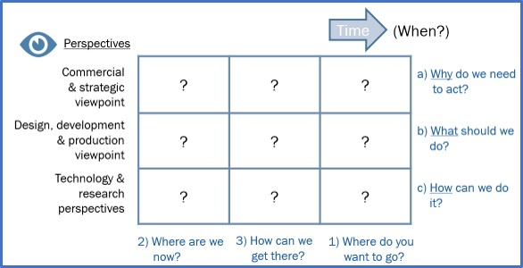
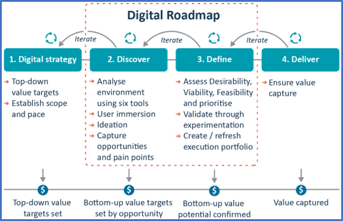
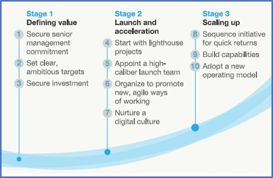
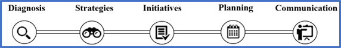

[6 <---](6.md) [Зміст](README.md)  [---> 8](8.md) 

# 7. Розроблення дорожніх карт для цифрової трансформації підприємства

## 7.1. Про дорожні карти

Термін «дорожня карта технології» набув широкого використання в промисловості, наукових колах та уряді. Технологічна дорожня карта — це візуальний документ високого рівня, який означує та передає план технологічних ініціатив в організації. Дорожня карта технологій загалом означує, чому, коли та які технологічні рішення можна впровадити, узгоджуючи технологічні ініціативи з короткостроковими та довгостроковими бізнес-цілями. Іншими словами, дорожня карта представляє досягнутий консенсус щодо потреб і потенційних технологій, необхідних для задоволення цих потреб.

Існують різні категорії та підходи до створення технологічної дорожньої карти. На початку необхідно зрозуміти причини, що лежать в основі створення технологічних дорожніх карт, представити найважливіші категорії дорожньої карти та представити загальну основу для розробки технологічної дорожньої карти.

Малим і середнім підприємствам слід розглядати подвійний перехід як можливість, оскільки вони мають величезну перевагу з точки зору гнучкості – для них набагато легше та швидше змінити підходи та ресурси, ніж для великих компаній, які борються з масовими інфраструктура, великі команди та тривалі контракти на обслуговування з постачальниками. 

Навіть якщо малий і середній бізнес уже прийняв найважливіше рішення з усіх – прийняти цифрову трансформацію – велика кількість доступних варіантів інвестування, технологій, на які варто покластися, і рішень, які необхідно прийняти, можуть бути надзвичайно важкими. Визначення як і з чого почати може бути складним. Щоб керувати корпоративними зусиллями, технологічні дорожні карти можуть бути важливим інструментом для уточнення технологічної готовності організації та допомоги у визначенні пріоритетів правильних областей, на яких слід зосередитися під час побудови технологічної стратегії. Крім того, його також можна використовувати для ефективного виявлення, планування та визначення цифрових можливостей у різних сферах бізнесу.

Фактично, з роками діловий світ все більше схиляється до технологій, що робить майже неможливим для багатьох компаній відокремити бізнес-стратегію від технологічної стратегії. Технологія надає нові способи створення та отримання цінності, а також прибутку. Правильне поєднання інформації, цифрових технологій, бізнес-ноу-хау та фізичних активів може становити конкурентну перевагу в ключових стовпах бізнес-моделі (поліпшити відносини з клієнтами, покращити пропоновані продукти та послуги, створити нові джерела доходу, підвищити ефективність операцій тощо) . Через різкий вплив, який технологія може мати на успіх компанії, її слід розглядати як один із поперечних стовпів, які визначають унікальну бізнес-модель організації.

Дорожня карта — це процес стратегічного планування, який допомагає визначити, узгодити та повідомити бізнес-потреби (знати чому), перетворені на реалістичний план дій (знати що) і необхідні базові ресурси (знати як) протягом певного періоду часу (знати коли). 

Стратегічне складання дорожньої карти та технологічне планування як процес спочатку було розроблено в 1970-х роках. Motorola стала однією з перших компаній у світі, яка розробила формальний підхід до картографування технологій. Приблизно в 1990-х роках вона поширилася на електроніку та напівпровідникову промисловість і з того часу експоненціально поширилася на багато інших галузей.

Існує багато типів дорожніх карт, які можна використовувати в організації та вибирати залежно від кінцевої мети. Деякі приклади включають дорожні карти ринку та стратегії, планування активів знань, дорожні карти продукту та планування ІКТ. Дорожні карти можуть бути представлені в широкому діапазоні форматів: зображення (потоки), текст, графіки, таблиці, стовпчики тощо. Дорожні карти можна використовувати як основу для ефективного обміну цілями команди, стратегіями та запланованими діями зацікавленим сторонам, постачальникам і клієнтам.

Технологічна дорожня карта дозволяє представити технологію, доступну в даний момент для організації протягом певного періоду часу, а також найкращі технологічні варіанти, які можна розробити або придбати в певний проміжок часу. У багатьох відношеннях технологічну дорожню карту можна інтерпретувати як систему GPS для цифрової стратегічної дороги: вона дозволяє компаніям бачити, де вони знаходяться, куди вони хочуть йти і як туди дістатися. Таким чином, це допомагає організаціям планувати, які, коли та чому певні технології будуть застосовані, уникаючи дорогих помилок і навіть плануючи, що технології застаріють.

Деякі з ключових переваг технологічних дорожніх карт:

- Сприяє інтеграції технологій у бізнес.
- Застосовується до процесів, продуктів, відносин з клієнтами та управління активами.
- Сприяє досягненню консенсусу щодо потреб і технологій, необхідних для задоволення цих потреб.
- Забезпечує механізм для прогнозування, планування та координації розвитку технологій.
- Допомагає визначити нові можливості для бізнесу та використовувати технології.

Існує багато способів, за допомогою яких компанія чи галузь можуть створити, означити та реалізувати технологічну дорожню карту. Однак найкращі технологічні дорожні карти мають спільні риси. Основні міркування при створенні технологічної дорожньої карти можна оформити у вигляді наступного чеклиста:

- Визначте та розставте пріоритети для бізнесу та потреб ринку.

- Цінність урожаю під час проходження, діліть процес на етапи і забезпечте надання переваг вже на перших етапах. Тому включайте ініціативи, які генерують короткострокові переваги вже на початку плану, щоб заохочувати мотивацію команди під час реалізації інших ініціатив, включених до дорожньої карти.
- Забезпечте підтримку та схвалення з боку вищого керівництва. 
- Надавайте ресурси: підтримка, часові і фінансові ресурси.
- Зверніть особливу увагу на вплив на людей: навички, процес, культура та організаційні зміни.
- Створюйте дорожню карту командою, включіть різноманітні точки зору та знання, щоб збагатити план. Процес включає багато обговорень і може потребувати посередника.
- Будьте простими та лаконічними
- Робіть ітерації і вчіться на досвіді. Розробляючи ініціативи, включені до дорожньої карти, використовуйте критичні знання, отримані з часом, щоб змінити та зробити дорожню карту ще більш стислою.
- Будьте готові скоригувати дорожню карту, якщо це необхідно. Дорожня карта має бути гнучкою і якось адаптованою до середовища, яке постійно змінюється
- Зробіть дорожню карту доступною для всіх підрозділів організації
- Співпрацюйте з відповідними зацікавленими сторонами. Використання зовнішніх ресурсів, таких як консультанти, може бути ефективним способом отримати доступ до цінних знань і досвіду, допомагаючи вам уникнути пасток і вчитися на успіхах інших.

Як обговорювалося раніше, технологічна дорожня карта забезпечує механізм для прогнозування технологічного розвитку та структуру для планування, координації та включення їх у дане підприємство. Іншими словами, технологічна дорожня карта відповідає на набір питань чому, що, як і коли для розробки плану дій для досягнення визначених бізнес-цілей. Запропоновані ключові фактори та допоміжні методології для створення дорожньої карти можна назвати 4-кроковим фремворком:

1. ЧОМУ? Важливо описати поточну ситуацію компанії, зосередившись на параметрах, на які вплине дорожня карта.

 - Проаналізуйте компанію, дайте означення
 - Canvas, Pestle, SWOT, технологічний годинник

2. ЩО? Означте бачення та місію компанії та стратегічні цілі, щоб узгодити ініціативи для реалізації з дорожньою картою.

 - Визначення поточної та бажаної позиції
 - Рівень технологічної

3. ЯК? Опишіть дії та ініціативи, які необхідно здійснити. Це можуть бути технологічні проекти, нові бізнес-моделі, організаційні зміни, модифікації операційних процесів, зміни у відносинах із клієнтами та постачальниками або інша діяльність. Також включіть опис технічних вимог, витрат і часу виконання, очікуваних результатів, KPI, заходів контролю, ресурсів, можливості отримання фінансування. Ці заходи будуть кроками на критичному шляху. Також важливо описати, чи ці ініціативи потребують підтвердження концепції чи прототипу, а також наслідки його масштабованості.

 - Означте ініціативи. Створюйте таблиці для опису кожної ініціативи, методологій визначення пріоритетів, визначення KPI, створення робочих груп, моніторингу досягнення цілей

4. КОЛИ? Представлення дорожньої карти у формі діаграми або схеми із запланованими та послідовними проектами чи ініціативами з часом. Дорожня карта має включати проміжні цільові стани або етапи процесу, яких компанія досягне, щоб гарантувати, що процес змін йде по курсу.

 - Календаризація

Процес створення дорожньої карти може допомогти клієнтам зрозуміти, які цифрові загрози та можливості можуть створити для бізнесу та в якому ступені. Це також може допомогти організаціям отримати краще уявлення про те, звідки виникають їхні можливості та загрози, а також про те, які стратегії та дії потрібні в їхній організації, щоб створити конкурентну перевагу в цифровому бізнес-середовищі, що швидко розвивається.

Як і в будь-якій стратегії, нам потрібно визначити «що?». Це наша відправна точка. Яка наша поточна ситуація і куди ми хочемо рухатися, коли мова йде про технології? А потім «як?». Які наші стратегічні пріоритети та процеси (організаційна структура, прийняття рішень, системи заохочення, норми та цінності)?

Незважаючи на те, що технологічна дорожня карта є документом управління, вона повинна регулярно оновлюватися в міру розвитку бізнесу. Це документ, який слід переглядати, оскільки зовнішні та внутрішні структури компанії змінюються з новими можливостями та викликами, які можуть змінити стратегію.

Остаточна дорожня карта(и) може приймати різні форми, хоча, як правило, фокусом є графічне представлення, яке забезпечує стратегічне уявлення найвищого рівня. Процес розробки дорожньої карти важливіший, ніж сама дорожня карта. Відправною точкою є майбутнє: те, де ваша компанія прагне бути. З цього моменту ви рухаєтеся назад, визначаючи ініціативи, інвестиції, партнерства та ресурси, які необхідно створити.

Стандартної формули для структури дорожньої карти немає. Спрощену візуальну дорожню карту технології можна зобразити, як показано на рис. 6 нижче:

***Fig. 6** Simplistic roadmap framework [[1\]](https://mooc.restartsmes.eu/mod/page/view.php?id=723&forceview=1#_ftn1).*

## Дорожня карта цифрової трансформації.                                

Цифрова трансформація – це подорож, і не обов’язково легка.

Цифрова дорожня карта є ключовою для координації та стимулювання змін у всій організації. Залежно від компанії (розміру, сектору, структури…) обсяг і зусилля, необхідні для досягнення цифрової трансформації, будуть різними, однак без плану та процесу це буде ризиковано та дорого. Дорожня карта впорядковано спрямовує компанію в процес цифрової трансформації, розділяючи проекти, які можна ефективно виконувати, своєчасно створюючи цінність для компанії в узгодженому порядку. Ця дорожня карта надає компанії три ключові елементи для процесу цифрової трансформації:

- **Послідовність.** Цифрова трансформація означає трансформацію компанії на багатьох рівнях, від найпростіших операцій до культури роботи. Це призводить до ініціатив, які включають технології, програмне забезпечення, процеси та організаційні зміни, які часто залежать одне від одного. Важливо чітко розуміти залежність проектів один від одного та порядок виконання, а також дії, які можна виконувати паралельно. Також необхідно враховувати повсякденну роботу підприємства, щоб на нього не вплинули негативно зміни трансформації.
- **Злагоджені робочі команди для співпраці.** Дорожня карта встановлює спільний план для всіх, і багато співробітників навіть беруть участь у розробці дорожньої карти. Визначення проектів, сфери їх діяльності та необхідних ресурсів дозволяють узгодити кожного для координації індивідуальних зусиль для досягнення спільної мети, дозволяючи керувати проблемами або невдачами, які можуть виникнути на цьому шляху.
- **Зосередьтеся на важливому.** Сьогодні існує незліченна кількість технологій, трендів, програмного забезпечення, рекламних роликів, які можна впровадити в компанії для її цифрової трансформації та підвищення конкурентоспроможності. Розробка дорожньої карти, від початкової внутрішньої та зовнішньої діагностики до її концепції та реалізації, дозволяє компанії зосередитися на важливих елементах, не відволікаючись на шум ззовні. Це допомагає вищому керівництву компанії приймати обґрунтовані стратегічні рішення.            

Компанії необхідно узгодити свою стратегію з цільовим станом, куди компанія намагається йти. Це слід популяризувати та повідомляти всім працівникам, щоб спрямувати зусилля кожного на правильний шлях. Іншими словами, дорожня карта має бути стислим робочим документом, який буде легко доступним для будь-кого в організації.

#### Приклади

Щоб мати можливість конкурувати, компанії повинні адаптуватися до змін у бізнес-середовищі. Ті компанії, які досягнуть успішної цифрової трансформації, отримають значну конкурентну перевагу. Таким чином, розробка та впровадження цифрової дорожньої карти може значно збільшити ймовірність успіху та знизити ризик.

Нижче наведено **4 приклади різних підходів, які використовуються для розробки дорожньої карти цифрової трансформації.**

**1. Partners in Performance**, глобальна консалтингова фірма з менеджменту, пропонує підхід, який швидко розробляє орієнтовану на цінності, пріоритетну та дієву цифрову дорожню карту, що дозволяє компанії:    

- Означити, що клієнти (та інші користувачі, наприклад співробітники) дійсно цінують
- Розуміти ринок і конкуренцію, включаючи потенційні замінники ззовні в галузі
- Застосовувати правильні технології в правильному контексті
- Створити організаційного узгодження та налаштування для успішного виконання

**2. Navvia**,  компанія, що спеціалізується на інструментах моделювання бізнес-процесів, пропонує 5 кращих практик для створення дорожньої карти цифрової трансформації:

1. Визначте, як виглядає успіх вашої компанії
2. Розділіть зміну на керовані частини
3. Отримайте цінність урожаю по ходу, замість того, щоб чекати до кінця
4. Зосередьтеся на впливах на людей (культура, процес, навички та організаційні зміни)
5. При необхідності відкоригуйте курс (середовище постійно змінюється)

**3. Mckinsey&Company**, міжнародна консалтингова фірма з менеджменту, пропонує 10 керівних принципів цифрової трансформації, розділених на 3 основні етапи:

- **Визначення цінності:** компанія повинна поставити цифрову трансформацію в центр своєї програми та розуміти масштаб цього починання. Керівництво має здійснити значні інвестиції та поставити чіткі амбітні цілі.
- **Запуск і прискорення:** щоб гарантувати процвітання та нарощування імпульсу на ранніх етапах, компаніям слід ретельно обдумати, з яких проектів почати, і підтримати їх необхідними ресурсами. Передумови включають висококваліфіковану команду запуску, яку часто очолює головний цифровий директор (CDO), розгляд організаційної структури та виховання цифрової культури.
- **Збільшення масштабів:** коли компанія має кілька запущених ініціатив і починає отримувати цінність, це також час, щоб посилити трансформацію та зробити все в більших масштабах. Продумана послідовність наступних ініціатив є ключем до цього. Крім того, пильну увагу потрібно буде приділити розширенню можливостей, і врешті-решт знадобиться повністю нова операційна модель.

- https://www.mckinsey.com/industries/financial-services/our-insights/a-roadmap-for-a-digital-transformation

**4. Eurecat,** the Technology Centre of Catalonia has an  approach to improve the competitiveness of companies through the  development of a transformation plan that allows them to incorporate  digitization into their DNA. Defining a new strategy        based on the incorporation of new digital technologies that  allows the optimization of costs and generation of new business models.  Fig. 10 below, shows the 5 steps:    

***Fig.10** Key steps of a technology roadmap.*

- **Diagnosis:** external analysis of technologies and  trends in the sector. Internal analysis through face-to-face interviews  with the relevant people in the company.
- **Strategy:** define the digital vision of the company. Set strategic objectives.
- **Initiatives:** generate opportunities and initiatives  to boost digitalization for each of the dimensions: products, processes, technology and infrastructure, ecosystem, culture and organization, and information and data. 
- **Planning:** establish a digital transformation plan minimizing risks and maximizing the impact for the company.
- **Communication:** communicate the company's digitization strategy. Sensitize and inspire about digital transformation.

- To obtain further information regarding Eurecat’s proposed roadmap please visit: https://www.eurecat.org

​                **References**        

https://www.undp.org/sites/g/files/zskgke326/files/2023-10/mapa_puta_eng.pdf

https://navvia.com/digital-transformation-roadmap/    

MacKinsey&Company. https://www.mckinsey.com/industries/financial-services/our-insights/a-roadmap-for-a-digital-transformation

