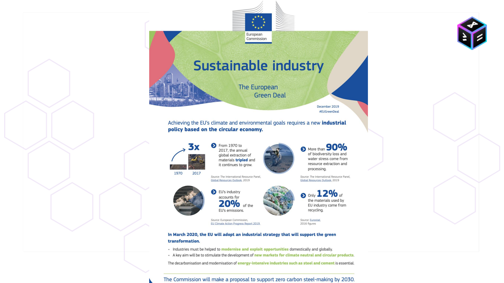
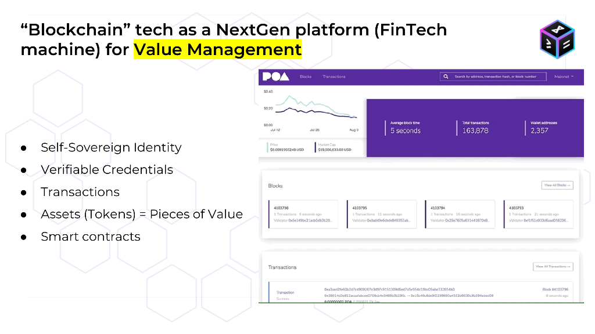
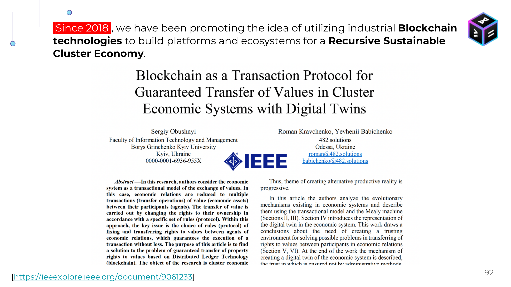

# Принципи та технології сталої індустрії. 

Субтитри з відкритої лекції Романа Кравченка Принципи та технології сталої індустрії

Запис. Ч1. https://youtu.be/NhZTisEwVlQ?si=dwlN5gge8HF7zByt

Запис Ч2. https://youtu.be/rv5xB4fL8Ik?si=bKPfa68AKz984I73

# Вступ 1

https://youtu.be/NhZTisEwVlQ?si=M2mPvp1zC7Qd9-W4

Добрий день всім хто приєднався. Сьогодні у нас е гостьова лекція на яку Я запросив Романа Кравченка і він про себе більше розкаже і про тему про яку він буде говорити. Отже пане Романе Дякую що знайшли час для того щоби прийти і розповісти нам про нові концепції що стосується подвійного переходу. Так зараз прийнято казати про цифровий та зелений перехід і все що стосується сталого розвитку.

О добре дякую Олександр за запрошення. Доброго ранку колеги хто приєднався. Мене звати Роман Кравченко та сьогодні я виступлю з лекцією щодо принципів та технологій, які використовуються в так званій сталій індустрії.

## 2 1:44

Тобто сьогодні ми поговоримо про те які існують поточні зміни в першу чергу на рівні економічних систем. Бо без цього неможливо пояснити чому відбувається ці зміни, чому з'явилася концепція подвійного переходу, чому це буде впливати на кожну країну і кожне підприємство незалежно від індустрії, незалежно від регіону та як будувати оцю стратегію подвійного переходу, і що більш важливо які технологічне рішення ми можемо сьогодні використовувати і ви, як майбутні фахівці, що будуть впроваджувати ці рішення моделювати ці системи, тому дуже важливо розуміти чому відбуваються ці зміни.

## 3 2:39

Дуже коротко про себе. Я більше 15 років займаюся темою там цифрової економіки. Більше семи років я працював в університеті в академічній сфері,  потім перейшов до приватного сектору і останні майже 10 років я працюю у приватній сфері. Тобто я останні більше ніж пть років керую компанією і ми займаємося розробкою блокчейн рішень саме у тих напрямках, з яким пов'язана сьогоднішня лекція. Тобто в мене кілька таких галузей професійних інтересів, тобто це веб3 та блокчейн платформи. Це дуже комплексна та цікава тема. Буду намагатися дуже коротко транслювати ті знання і досвід, який накопичився, також це побудови інститутів та екосистем це більш така загальна тема і тема транзактивної економіки яка є там парадигмою за якою буде будуватися економіка майбутнього.

## 4 4:14

Почну з дисклеймеру. Коли ми говоримо про тему екологічної повістки, є кілька позицій, які ми можемо як фахівці займати. Це умовний екоромантизм,  коли ми говоримо що потрібно врятувати природу, екологічні системи. Є позиція еконігілізму,  коли ми говоримо що все, що відбувається в екологічній повістці, та оці більш широкі концепції сталого розвитку, це все там якийсь заговор корпорацій, або масонів і таке інше. Тобто ми з упередженням ставимося до цієї теми, а я пропоную займати зайняти позицію екопрагматизму. 

Тобто ми як інженери, кожну повинні розглядати як систему систему, яка складається з елементів цієї системи та зв'язків. Тобто такий дуже прагматичний підхід, ніяких емоцій, тобто і ми як інженери і наша мета зрозуміти що відбувається, як ми можемо відреагувати, використовуючи технологічні рішення для вирішення тих чи інших індустріальних проблем та викликів, це наша така мета. 

## 5 6:04

Тобто сьогодні ми будемо намагатися зібрати з таких пазлів та окремих елементів цілісну систему щоб зрозуміти що таке сталий розвиток, стала індустрія.

## 6 6:19

Та чому там ми будемо говорити про такі технології як finнtech та блокчейн. 

Моя презентація поділена на три розділи. Перший розділ - це про концепції: що таке сталий розвиток та стала індустрія. У другому розділі мова іде про методологію, яку можна використовувати на рівні підприємства для того щоб побудувати оцю стратегію сталого розвитку та які технології технологічні рішення доцільно використовувати для реалізації цієї стратегії.

## 7 6:59

Кілька слів про нашу компанію. Тобто чому ця лекція відбувається і який досвід Ви отримаєте. Ми більше 10 років займаємося розробкою цифрових рішень, тобто ми інженірингова компанія і в останні майже сім років спеціалізуємося на саме індустріальних web3 та блокchain рішеннях у сфері зеленої енергетики, зелених фінансів та сталих ланцюгів постачання. Ми з України. Також два роки три роки тому відкрили компанію у сингапурі де розвиваємо також свій продукт та рішення. 

## 8 7:44

Ми також є учасником кількох таких ключових інноваційних екосистем щодо використання блокчейн технологій, зокрема такі як Global blockchain buziness council, європейська асоціація блокчейн,  українська асоціація блокчейна. Ми співпрацюємо також з організаціями в Сінгапурі і Європі щодо розробки цифрових рішень для різних галузей, в першу чергу це галузь умовно Зелена енергетика. Також ми є генеральним партнером ДТЕК з імплементації блокчейн рішень, та останні кілька років ми дуже активно приймаємо участь в розвитку українського кластерного Альянсу і асоціації підприємства промислової автоматизації.

# Частина 1 Концепт

## 9 8:39

Перейдемо до а основних ключових елементів.

## 10 8:44

Перш за все це виклики, які виникають зараз. І ці виклики, такі кризові явища і стали таким стимулом для розвитку цих нових моделей побудови економіки промисловості та це впливає на кожне окреме підприємство. 

Перш перш за все це економічна криза, тобто глобальна криза капіталу. Капітал в своєму розвитку досяг межі, і географічно практично вже нікуди розвиватися. Є такий закон капіталізму, який ще був сформульований Адамом Смітом, в якому є вертикальна та горизонтальна спеціалізація, яка й обумовлює закон розвитку капіталу. І практично вже у кінці 60х років людство досягло оцієї межі розвитку розширення. І те що ми зараз бачимо як кризові явища в економіці, які впливають на інші системи, це є такою системною кризою. Це не є якийсь там тимчасовий момент, який ми переживемо, це така точка неповерненні, яку ми вже пройшли. 

Інша історія - це кліматичні зміни. Ця історія пов'язана з кількома також позиціями щодо того, чи є кліматичні зміни, чи вони не відбуваються. Кліматичні зміни - це таке постійне явище, яке ми усі бачимо. Статистичні показники та аналітичні висновки показують що кліматичні системи вийшли за межі стабільностію. А більш цікаво аналізувати що є причиною, ми як інженери відштовхуємося від тієї реальністі, яка є. Тобто є консенсус, так званий науковий консенсус, який сформулював те, що ключовим або основним фактором зміни клімату є промислове виробництво. Можна на цю тему багато дискутувати, але це не тема нашої презентації і лекції. 

Третя криза - це криза вичерпування енергетичних ресурсів. Тут є альтернативні думки. Одним крайнім радикальним напрямком є думка, що енергетичні ресурси повністю відновлюються, такі як природні ресурси типу вугілля, нафта або газ. Але це також це не є темою сьогоднішньої лекції.  Ми будемо констатувати, що є енергетична криза в плані того, що об'єм енергетичних ресурсів, які потрібні людству на кожному кроці зростають. І тому це вичерпує належні запаси які можливо добувати в економічно розумних моделях. 

## 11 12:49

Констатація цих трьох криз була зафіксована ще в кінці 60-х. У 1972-му році вийшов звіт від Римського Клубу The limits to Growth, про межі росту розвитку, в якому було промодельовано кілька сценаріїв, як можна будувати в наступних роках розвиток таких систем як економіка, промисловість та суспільство.

## 12 13:24 

Тобто з'явилася така дорожня карта щодо зеленого переходу. Є кілька ключових дат. Це 2030-й рік, якому присвячені ключові національні так звані зелені плани. Green plan це плани стратегії переходу держави до нового вкладу економіки. У тому числі там приділяється велика увага питанню щодо саме розвитку промисловості. Є такий глобальний деadлайн це 2050 рік - це дата повного переходу до так званої зеленої або сталої економіки. 

Точкою наповернення був 2008 рік, коли відбулася велика криза капіталу. Це показало, що потрібно змінювати щось, бо надалі все буде тільки погіршуватися. Сам капітал є не тільки складовою фінансової системи, бо потоки капталу перш за все фінансують вирішення глобальних проблем. Тобто це голод, освіта, в тому числі розвиток промисловості. Ці кризи на ринку капіталу зрештою впливають на кожне підприємство, та на кожну людину. Якщо у нас на самому початку є фундаментальна криза, ми не можемо вирішувати проблеми боротьби а навіть пом'якшення наслідків кліматичних змін, типу засухи або підвищення рівня океану, та інших деструктивних процесів. 

## 13 15:59 

З цього моменту почалася системна робота над тим, щоб перейти до інших принципів побудови звичних нам індустрій. У 2015 році це було сформульовано як глобальна така повістка від Організації Об'єднаних Націй, яка включає в себе 17 цілей, які поділяється на три компоненти:  environmental, Social і governance (ESG), про які ми також поговоримо пізніше. 

## 14 16:29

Дуже важливо розуміти термінологію, бо багато нових слів і багато інформації щодо цих термінів. Намагайтеся знаходити першоджерело щодо тих термінів, бо тоді більш зрозумілим стає що буде відбуватися, як з цим працювати. Сталий розвиток визначається як такий розвиток, що задовольняє поточні потреби людства без компромісів щодо можливості задоволення тих же потреб наступними поколіннями. Таке не дуже просте формулювання,  але якщо розібратися, то те що ми робимо сьогодні не повинно якось входити в конфлікт інтересів та компроміси для наступних поколінь. Тобто ключовий момент це потреби, а потреби ми задовольняємо завдяки створенню вартості або цінностей в різних формах, таких як товари та послуги, які є результатом виробничих процесів підприємств. 

Також ми можемо говорити що ключовою метою сталого розвитку є довгострокова стабільність і тут важливо розуміти, що мова не йде про зріст. Тобто  мабуть більше 400 років економіка розвивалася за принципами постійного зростання. Нова концепція в противагу попередній іноді має назву економіка нульового зростання. Тобто це побудова промисловості та економічних систем, які будуть стабільно працювати та задовольняти потреби, і саме ті потреби, які є необхідними. Тобто ми можемо говорити про термін стала індустрія та стала економіка як про створення сталої та довгострокової вартості,  тобто такої вартості, яка буде задовольняти оці потреби наші поточного покоління та також враховувати ті потреби які можуть виникати у майбутніх поколінь.

Також ми можемо вести критерії стало індустрії. Як нет-зеро так званої економіки або вуглецево-нейтральної економіки або індустрії, тобто такої індустрії яка має нульові викиди парникових газів, з урахуванням викидів та систем які які мінімізують ці викиди.

## 15 19:59

На наступних слайдах ми більш детально поговоримо щодо того як це обговорюється на World economic Forum.

## 16 20:19

World economic Forum - це така найбільш поважна комунікаційна платформа, на якій відбувається в тому числі формування таких стратегій та політик розвитку. Наприкінці 2019-го року там була сформульована, тобто було випущений опублікований маніфест, так званий Давоський маніфест, в якому сформульовані цілі та мета існування компанії у новій четвертій індустріальної революції. Ця концепція звучить так: мета компанії і сутність компанії - це збирати усіх стейкхолдерів (тобто усіх тих учасників процесу на яких прямим або непрямим чином впливає діяльність компаній) та працювати з ними задля створення так званої суспільної та сталої вартості. Тому це також там закріплено в визначеннях цієї сталості вже по суті для компанії. Під стейкхолдерами тут розуміють працівників компанії клієнтів, компанії постачальників, та так званих локальні спільноти, або частина суспільства на які впливає компанія. 

## 17 22:19

І тут варто поговорити про те, що таке value. З одного боку, це економічна категорія. Value більш коректно перекладати як вартість, а не цінність. Ми можемо розуміти під вартістю продукти, сервіси або активи, які там є результатом роботи наприклад промисловості, або окремої компанії. Наприклад компанія випускає продукцію, припустимо це напої, і це є продуктом компанії. Інша компанія може надавати якісь інжинірингові сервіси, це також є результатом та вартістю яка створюється компанією. А більш точно термін вартості можна сформулювати як поєднання продукту та так званих екстерналів.  Тут продукт - це товари та послуги, а екстерналі - це такий зовнішній ефект, який виникає в процесі виробництва або постачання продукції  на всіх етапах створення оцієї вартості. 

Отже екстерналі - це такий ефект, що може бути як позитивний так і негативний, який впливає на наприклад інші економічні агенти, тобто на компанії, які знаходяться поряд з цим підприємством, або на частину суспільства. Наприклад, якщо компанія побудувала завод і вона там робить викиди шкідливих речовин - це негативна екстерналі, тобто це негативний ефект. У цьому прикладі компанія заробляє гроші, негативно впливаючи на людей, які живуть поруч з підприємством. Інший приклад екстерналій, коли компанія може побудувати наприклад дитячий садок поруч з підприємством для стимулювання того, щоб працівники могли розвивати там сім'ї. І це вже приклад позитивної екстерналії.

Тут важливо також розуміти що вартість не є аналогом ціни. Ціна (price) та вартість(value) це різні категорії. Тобто ціна є виміром для вартості яка створюється. 

Щодо вартості говорять про так звані ланцюги створення вартості - це всі процеси (транзакції) зі створення продуктів, сервісів або активів. Тобто це така модель, яка описує всі процеси створення та впливу оцієї вартості.

Тут будуть посилання за якими ви можете більш детально ознайомитися.

## 18 25:44

Наведемо кілька прикладів вартості. Тобто це дуже зрозумілі для нас речі, наприклад кава, автомобіль, акції підприємства. Також в Новій економіці ключову роль будуть відігравати так звані нематеріальні активи тобто intangible, нематеріальна вартість. Це як приклади різні там елементи інтелектуальної власності, типу знання, досвід тобто те, що не можна матеріально побачити, але це є ключовим елементом оцієї нової економіки. Іноді цю економіку нову економіку сталого розвитку також називають економікою знань.

## 19 26:54 

Тому дуже важливо вам, як майбутнім фахівцям отримувати якомога більше релевантних знань та компетенцій в процесі навчання. На цій інтерактивній карті можна подивитися і більш детально зануритися у елементи, з яких складається сталий розвиток.

## 20 27:24

Тут показана глобальна повістка, яка для України більш близька не стільки як глобальна повістка а як європейська, бо Українська промисловість все більше зближується з європейською промисловою екосистемою. У Європі також є стратегія так званий Gгeen Deal, яка також стосується зміни параметрів та ландшафту економіки та промисловості. Мета Європи - до 2050 року стати першим вуглецево-нейтральним континентом, а до 40го року є проміжна мета щодо зниження цих парникових газів. 

## 21 28:24

Окремий розділ грінділа - це так звана стала індустрія а також там є кілька параметрів. Ця концепція визначається як перехід до нової індустріальної політики, що базується на циркулярній економіці. Попередня лекція від Андрія гнапа вона стосувалася саме циркулярної економіки і це ключовий принцип за яким буде будуватися ця стала індустрія.

## 22 28:59

Таким чином ми можемо констатувати, що е багаторічна або навіть багатосторічна концепція цього масового виробництва Mass Production, і вона завершилася. Тобто неможливо досягти отих цілей які поставлені як глобально, так і на рівні там європейського континенту та окремих країн не змінюючи при цьому ландшафт. Крім того, як ми вже говорили, ця криза на ринку капіталів по суті не дає можливості надалі розвивати масове виробництво, бо масове виробництво - це такий механізм, який стимулювався з двох боків: це умовно дешеві гроші у вигляді кредитів, які надавалися виробникам з одного боку і вони виробляли продукцію 24х7 з іншого боку. Такими ж кредитами стимулювалися споживачі, тобто така система вона працювала довгі роки, але як кожне системне явище, яке має певні протиріччя всередині, ця система перестала працювати вже мабуть там в 70-х роках. Тобто це не сьогодення, це констатація того факту і це пов'язано з тими публікаціями, про які йшла мова попередньо. І це буде дуже змінювати ландшафт і принципи побудови виробництва. І взагалі ті знання які ми маємо сьогодні в багатьох випадках неадекватні тим проблемам і завданням, які стають.

## 23 31:29

 Тому є така проблема, що багато років ми вивчали одним принципам, за яким буде будуватися промисловість і готувалися до роботи за цими принципами, а в дуже короткій період часу змінюються ці принципи.  Якщо раніше підприємство фокусувалося на по суті одному параметрі - це отримання прибутку та підвищення ефективності виробництва, то сьогодні підприємство повинно дбати вже про людей а також про планету. Тобто це корелює з тією концепцією від маніфесту, який визначив що компанії вже недостатньо задовольняти потреби акціонерів а потрібно вже дбати про великі екосистеми. 

Це була перша частина лекції - про концепцію. Це намагання відповісти на питання, чому ці зміни відбуваються,  і це не те що там щось випадкове чи якийсь там тренд, це по суті незмінна концепція. У цьому є багато підтверджень, аргументів як наукових так і на рівні полісімейкерів. Тобто це такий шлях цього зеленого переходу з якого ми нікуди не подінемось.  

# Частина 2 Методологія

## 24 32:09

- В мене такі короткі два питання. Перше, можливо це ще буде розглядатися, як цей value вимірюється, якщо туди входять не тільки фінансова складова? А друге питання: протиставляється зараз як було написано з масовим виробництвом, але ж в деяких все-таки речах масове виробництво має сенс, ну навіть зараз сьогодні під час війни. Де там скажімо є потреби в цьому масовому виробництві, чи це не протистояння а просто якби якась концепція більше економічного характеру, зв'язана з кредитуванням?

- Щодо першого, так буду от якраз в другій частині щодо методології, ми поговоримо про те, як можна на рівні підприємства підійти до вимірювання цієї вартості, яку саме методологію можливо використовувати та стандарт. Їх зараз багато, але ми розглянемо один, як приклад, але воно не дуже буде відрізнятися. Щодо масового виробництва. Під масовим виробництвом розуміється саме як принцип, за яким відбувається виробництво продукції з орієнтацією на постійне зростання попиту. Тобто і в якомусь сенсі це явище було штучно стимульованим завдяки кредитуванню з обох боків і зараз вже немає можливості підтримувати це. Не тільки зараз а останні 30 років вже констатували економісти, що концепція цього масового виробництва, орієнтованого на постійне безперервно зростання попиту, воно вже неможливо, тому ми говоримо про переформатування принципів виробництва. Ми також там кілька моментів деталізуємо щодо принципів кастомізованого виробництва, але дуже просто говорячи це попит, який вже не стимулюється. Тобто виробляти ми повинні тільки стільки, скільки потрібно буде для того щоб задовольнити потреби. Причому зараз йде дискусія щодо того, а де та планка потреб, що для кожної людини може бути. Тобто в якомусь сенсі ми переходимо до такої реальності, де не буде такої кількості варіації продукції та в такій кількості. Тобто це буде якась обмежена дуже кастомізована серія окремих продуктів, причому ця продукція може вироблятися наприклад не на весь ринок, але для кожної окремої ринкової аудиторії, можливо навіть для кожної людини. Так може бути вироблена продукція і тільки у тій кількості, яка необхідна для задоволення потреб, ці мінімальні потреби, ну це так якщо дуже коротко 

Ми підійшли до другої частини - про методології. Будемо вважати що на питання що відбувається та що буде відбуватися та чому це відбувається, тобто які причини оцих змін ми відповіли. 

Сьогоднішня лекція не може надати повний спектр знань. Тобто це такий екскурс щодо оцієї нової системи та ми дуже швидко пройдемося по основним поняттям. У подальшому необхідно самотужки розбиратися з іншими поняттями (також буде кілька посилань). 

## 25 38:44

Ми поговоримо про перший такий аспект це методологія управління так званими кліматичними ризиками на підприємстві, в компанії. Поговоримо чому це так і чому це важливо. Тобто в першій частині ми зрозуміли що відбувається та чому відбувається. Тут питання стає: а чи потрібно кожному підприємству рухатися за цим напрямком, можливо можна вибрати якусь там свою стратегію та оминути вплив цих факторів? І тут є аргументи чому це неможливо жодному підприємству чи компанії якось рухатися іншим шляхом. Тобто ми поговорили про такі глобальні аспекти, але для нас, як практиків, більш цікаво як на кожному підприємстві будувати оцю стратегію.

І тут ми переходимо до цих принципів ESG. Тобто це абревіатура яка включає три компоненти: environmental, Social, governance. Сьогодні ми поговоримо більш про першу компоненту, бо вона є ключовою і найбільш важливою, і вона по суті в якомусь сенсі формує дві інші компоненти. Тобто якщо у підприємства все добре з цим першим фактором, тобто environmental то і Social і goverance там теж буде вирівнюватися. Також є посилання, де можна познайомитися з загальною концепцією. Тобто це абревіатура, яка включає так звані фактори або параметри діяльності підприємства, в якому підприємство аналізує, як виробничі процеси, тобто як процеси по виробленню продукції або товарів або послуг впливають на оцю компоненту. Тобто як ми впливаємо на екологічні екосистеми, на суспільство і за якими принципами ми будуємо взагалі роботу компанії і підприємства. 

## 26 41:14

Тут більш детально щодо підкомпонентів. Про перший параметр ми говорили на попередній лекції, мабуть також говорили про парниковий газ (GHG). Тобто це ключовий елемент, але не єдиний. І там зауваження, що ми не можемо зосереджуватися виключно на ньому, але він був вибраний як такий ключовий KPI, тобто метрика, яка вимірює практично все інше. Тобто це такий універсальний показник, який був обраний за різними критеріями, принципами і він є основним для сьогоднішнього виробничого підприємства. Це такий параметр, з якого все починається.  Потім там також, як приклад управління цим впливом імпакту. Тобто цей Імпакт це є створення виникнення цих екстерналів, тобто як ми наприклад впливаємо на якість повітря, при виробництві. Також там приклад енергоменеджмент, тобто які енергоресурси ми використовуємо, говорять по про так званий енергетичний портфель підприємства. Далі як ми використовуємо водні ресурси у виробничих процесах.

Як приклад з соціальних підкомпонтентів тобто, S Social впливу на суспільство, це те як компанія або підприємство дотримується прав людини та вибудовує взагалі принципи роботи з працівниками. Це також політика підприємства щодо охорони здоров'я. Тобто оці функції багато років які були функціями держави перекладаються в якомусь сенсі на плечі підприємств та компаній. Це відбувається тому, що оця глобалізована економічна та фінансова система вже не спроможна вирішувати оці питання. І тому за кожним підприємством буде закріплена така функція.

Ну і governance - це те яким чином та за якими етичними принципами будується діяльність підприємства та як воно керує ризиками та інші аспекти. 

## 27 44:14

Тут ми можемо говорити про два таких підходи. Це такий термін Business as usual тобто бізнес як ми звикли вести справи або виробничі процеси і в противагу умовно сталі принципи до побудови бізнесу.  Тут під терміном "бізнес" розуміється окреме підприємство, компанія, фірма а тому є більш загальним поняттям. Принципи, за якими будувалися компанії раніше - це тільки досягнення прибутку. Це вже неможливо. Багато років тому вже почали говорити про те, що компанія не тільки повинна виробляти продукцію, але також задовольняти якісь потреби. Це вже була така м'яка форма нової концепції. 

Поточну концепцію можна сформулювати так, що це компанія, або фірма яка виробляє оцю сталу вартість і вона складається з двох компонентів: 

- процеси в якому виробляється продукт та одночасно досягаються оці цілі за трьома показниками ESG. Це означає, що виробничі процеси постачання та процеси, що пов'язані вже з тим, як буде споживатися продукція, повинні враховувати оці параметри ESG. 
- і оцей більш зрозумілий традиційний параметр - генерація прибутку для акціонерів 

Тобто ці дві складові - прибуток та позитивний вплив (Social environal impct). Тут вже є перша відповідь на питання, як вимірювати вартість. Це та сама вартість, як і була раніше, тільки нам необхідно зануритися трохи глибше, відповівши на питання що таке виробництво продукції наприклад вартістю наприклад 1 млн гривень, та як ця продукція вартістю в 1 млн гривень впливає на ESG, тобто як досягаються оці параметри і три компоненти

## 28 47:24

Після цього невеликого вступу ми перейдемо до кліматичних змін, і надамо відповідь чому кожне підприємство повинне якось реагувати на кліматичні зміни. Бо мало що там відбувається, але ми ж не екологи, то чому говоримо про це.  Під кліматичними змінами, тобто окремим елементом кліматичних змін є так звані сценарії. Перше про що всі домовилися, що є консенсус, ми використовуємо цей сформульований консенсус щодо того, що зараз відбуваються системні та непередбачувані кліматичні зміни. Тобто поводження кліматичних екосистем зараз неможливо прогнозувати, так як це було наприклад 100 років. Тому дуже важко прогнозувати яка буде погода, або який буде сезон наприклад, а а це дуже впливає в тому числі на врожайність, що дуже актуально наприклад для сільського господарства, бо це перша галузь, яка вже зазнає фундаментальних змін. І було сформульовані три сценарії підвищення так званої середньої температури. Це такі аналітичні моделі, які надають можливі шляхи розвитку. Тобто більш бажаний сценарій - це сценарій, при якому середня температура до середини поточного сторіччя підвищиться не більше ніж на 1,5 градуси в порівнянні з так званим доіндустріальним періодом. Таким умовно кризовим, але більш-менш можливим сценарієм є 2° і таким катастрофічним є підвищення більше 2° і чотири - це коли за показами прогнозних моделей екосистема перейде в режим турбулентності, тобто взагалі неможливо буде нічого враховувати в виробничих процесах. Тобто це буде якийсь глобальний колапс.

## 29 50:44

Ці прогнози базуються на наукових дослідженнях, які висвітлені в аналітичних матеріалах, з якими можна ознайомитися і посперечатися щодо цих змін. Але раціональний підхід показує що там дійсно відбуваються такі глобальні зміни, на які ми не не очікували. Тобто дуже важко на рівні окремого підприємства пояснити що потрібно робити.  Тому був вироблений такий універсальний показник, як викиди парникових газів і був вироблений так званий каbon CO2 еквівалент. Тобто це двуокис вуглецю, який був взятий як елемент, який ми повинні вимірювати в процесі виробництва продукції, товарів та послуг. 

## 30 51:59

Під це все є міжнародний Індустріальний стандарт Greenhouse Gas Protocol. Тобто це найбільш універсальний та прийнятий стандарт щодо вимірювання оцих викидів парникових газів на індустріальних підприємствах. І тут дуже важливо акцентувати на те, що є так звані три сфери охоплення (Scope) які ви тут бачите на на екрані. Цей протокол розділяє на три категорії викиди:  Scope 1 - це прямі викиди, Scope2 - це непрямі викиди, які відбуваються в процесі споживання енергетичних ресурсів, перш за все це електроенергії.  І треті - це так звані непрямі викиди, вплив яких відбувається  як в процесі виробництва продукції так і споживання. Наприклад це вплив, який який був сформований нашими постачальниками матеріалів, з яких ми виробляємо продукцію. Усі викиди при процесах, коли вони виробляли для нас певну кількість матеріалу яку ми використовуємо є оцим непрямим викидом. У той же час після того як ми реалізуємо нашу продукцію, ці непрямі викиди продовжують свій рух по життєвому циклу. І наприклад нам необхідно транспортувати нашу продукцію до споживача, це може бути інша країна або навіть інший континент, і оці викиди, які ми робимо коли транспортуємо продукцію, наприклад, коли використовуємо послуги логістичної компанії це також відносяться до scope 3. І що дуже важливо розуміти, що сьогодні от в рамках цієї концепції усі підприємства вже пов'язані от в цей ланцюг, тобто не може вирішити цю проблему обліку окреме підприємство, бо є оцей sсope 3, який потрібно вимірювати. І по суті необхідно по всьому ланцюгу створення вартості отримати оці дані тобто провести вимірювання цих виробників продукції та процесів, які прямими або непрямим чином пов'язані з цим.

## 31 55:04

За цим посиланням можна ознайомитися з цим стандартом. Це такий методологічний аспект. Більш важливо те, що як ми і казали, сьогодні підприємству необхідно враховувати викиди CO2, чому так, бо викиди CO2 стали так званим ринковим активом. Тобто викиди, об'єм дозволів на викиди умовно торгується зараз на організованих ринках. Ще 21го року за прогнозами щодо ціни за ці викиди була визначена планка в 100 $ за еквівалент тони CO2, і ця планка вже була подолана на Європейському ринку. Максимальний прогноз reuters прогнозує рівень 250 доларів за тону.  Тобто це означає, що якщо при виробництві одиниці продукції або партії продукції був викид 100 тн наприклад СО2 це означає, що підприємству необхідно по суті в якомусь сенсі оплатити цей негативний вплив в розмірі цього еквіваленту в залежності від ціни на тону. Якщо не враховувати цей параметр то це одна економічна модель. Якщо ми починаємо на виробництві враховувати і закладати ціну цього викиду і оплату цього негативного впливу в собівартість продукції, це дуже змінює параметри цієї економічної моделі. І навіть там деяка продукція може бути нерентабельною ось за цими новими принципами.

## 32 57:39

Чому ж говорять, що потрібно змінювати самі принципи виробництва? Бо в старій моделі ми не можемо бути економічно рентабельні саме через оцю криву. Тобто якщо це графік зміни вартості викидів CO2 на Європейському ринку вона там коливається, але ми бачимо загальний тренд, те що буде зростання. Тобто є якісь там не дуже великі коливання, але ми рухаємося до цих прогнозів. Тобто максимальна ціна в 100 доларів та вище, вже була досягнута ціна більше 105 євро за за викиди CO2. 

## 33 58:39 

Якщо ми подивимося що взагалі відбувається в розрізі окремих секторів промисловості за викидами, то загальний так званий carbon footprint, тобто вуглецевий слід промисловості на рівні 50 млрд тон. Тобто ми можемо порахувати що це приблизно 5 трлн доларів ось такого еквіваленту, який є негативним з точки зору впливу на навколишні екосистеми. У розрізі окремих індустрій першою є енергетика, де більше 30-35 гтон викидів, та сільське господарство, далі йдуть індустріальні процеси -  оці три ключові показники. 

## 34 59:44

 Ну а енергетика - це те що споживає промисловість. І тут зрозумілим стає те, чому оцей зелений перехід називають енергетичним переходом, і чому він неможливий без тотальної електрифікації сфери промисловості, транспорту та будівництва. Тобто максимальна електрифікація за аналітичними моделями може знизити на 60% викиди CO2 до 2050го року. Тобто транспорт електрифікується саме тому, що потрібно також перейти до нових параметрів виробництва та економіки. 

Ще одна ремарка: електрифікація сама по собі йде ще в розрізі того, які джерела енергії ми використовуємо при споживанні. І тут також оцей параметр вартості викидів CO2 він буде впливати таким чином що буде змінюватися і вже змінюється дуже сильно структура енергетичного портфелю виробництв. Тобто це поява більш чистих відновлюваних джерел. Були дискусії щодо там чистоти та впливу але атомна енергія вважається зараз вже чистою тобто придатною для досягнення цих цілей.

## 35 1:01:34 

Щодо споживання є резонним питання що буде відбуватися з нафтою та газом до 35-го року. Очікується постійне збільшення попиту на нафту та газ. Це пов'язано з тим що є такий перехідний період який ну необхідній для перебудови промисловості. І ось за кількома аналітичними моделями  пік буде досягнутий у 2035 році. З того періоду буде поступово зниження попиту за секторами та регіонами на споживання нафтогазових продуктів. Тут можна говорити про нафту газ ще довго бо вони вважаються достатньо чистим джерелом. 

## 36 1:02:29 

І чому ми говоримо про якісь ринки парникових газів, і чому окреме підприємство повинно піклуватися про всю цю історію, яке наприклад не знаходиться у Європі? Наприклад в Україні немає ринку вуглецю. Тому чому українське підприємство взагалі повинно цим перейматися? Тут є дуже простий аргумент -  це той самий інвестиційний фонд, або рух того самого капіталу. Тобто підприємство залежить в тому числі від зовнішніх потоків капіталу. Це різні механізми фінансування, це також ті ж самі кредити, страхові послуги страхових компаній, це інвестори, які будуть відігравати все більшу роль, або кредитний механізм, який практично вже неможливий в тій формі, до якої всі звикли.  І сьогодні, коми ми говоримо про рух оцих інвестиційних коштів на фінансування розвитку виробництва, інвестори теж розуміють що є оці кліматичні зміни і вони дуже впливають на результати роботи підприємства.

## 37 1:04:09 

https://youtu.be/NhZTisEwVlQ?si=y-nRwv2lAjPFmTDL&t=3849

Чому саме так? Є три таких гарних коротких відео від комісії цінних паперів, в яких розповідається чому промисловим підприємствам необхідно почати цю історію зі створення датасетів, які описують управління кліматичними ризиками. Тобто як ви побачили ми дуже багато говоримо про фінансові та економічні аспекти. Тобто ми не можемо пояснити ці зміни якщо ми будемо тільки фокусуватися на рівні виробничих процесів або технологій, бо немає пояснення у цьому випадку чому підприємство повинне будувати оцю стратегію

## 38 1:05:14

Відповідь на цьому слайді. Бо якщо сьогодні індустріальне підприємство не будує цю стратегію управління оцими кліматичними ризиками у більш широкому понятті управління трьома параметрами ESG (environmental Social governance) і якщо у ще більш широкому понятті воно не рухається до принципів сталого розвитку, то такому підприємству вже сьогодні із кожним роком все більше буде закриватися споживчі ринки. Тобто продукція, така яка не має відповідності оцим стандартам, просто не може бути реалізована вже на окремих ринках перш за все для українського виробника це європейські ринки. В Азії та ж сама історія. там з'являються вимоги щодо параметрів стандартів екологічності продукції, це перша компонента. 

Друга компонента - це фінансування, тобто ніякі фінансування неможливі, якщо сьогодні підприємство вже не показує яким чином всередині виробничих процесів враховуються оці параметри. Тобто системний інвестор, так званій інституційний інвестор, не інвестує, якщо компанія не показує як будується оця стратегія управління кліматичними ризиками.

## 39 1:06:44

І тут ми, як підприємство, переходимо до прикладного аспекту. Тобто що ми можемо використовувати, яку методологію щоб побудувати оцю стратегію, з чого почати? Тобто ми вже прояснили, що зміни відбуваються, вони впливають на окреме підприємство, ми пояснили і подивилися чому це впливає, бо є оця ринкова складова, є оця фінансова та інвестиційна складова, яка впливає на кожне підприємство сьогодні в Україні. Навіть маленьке підприємство крок за кроком буде і вже відчуває вплив цих параметрів. 

Зараз з'явився фреймворк який називається task Force climat Related Financial. Тобто це Індустріальний frameworк, який описує як компаніям будувати оцю стратегію.

## 40 1:08:04

І це по суті така мова спілкування між компанією бізнесом та підприємством та інвестором, коли інвестору надається інформація щодо управління кліматичними ризиками в процесі виробництва. По суті мова йде про розкриття інформації або публікація специфічних звітів не тільки для інвестора. Тобто ця звітність також спрямована на споживачів, для яких це також сигнал для прийняття рішень щодо, наприклад закупівлі продукції у того чи іншого постачальника. Або якщо ми говоримо про кінцевого споживача це сигнал щодо того, чи буду я споживати таку продукцію. Ну і ви бачите там такі тенденції щодо екологічності продукції різних компаній.

## 41 1:09:14

Тобто tcfd frameworк практично узагальнив вже існуючі стандарти, яких там більше мабуть 20 основних. Ми сьогодні не будемо розбирати їх, а розглянемо цей один фреймворк, так як він є універсальним, і  по суті з ним синхронізуються усі інші стандарти. Тобто зараз, незважаючи на таку дефрагментацію в стандартах tcfd став таким узагальненням 

## 42 1:10:04

Європейська комісія на основі tcfd рекомендації розробляє відповідні європейські директиви. Також така ж історія у Північній Америці та Азії.

## 43 1:10:34

Тобто tcfd став такою собі основною мовою, тому що як було сказано на попередньому слайді розробником цього фреймворку стали Міністерства фінансів від ключових 20 економік, такі як центрабанки та фінансові регулятори. Вже сьогодні після цього стандарту (tcfd) з'явилася ще низка стандартів.  Тобто в якомусь сенсі TFCD передає місію наступній організації - це International sustenability Standard Board, яка розроблювала і продовжує розроблювати індустріальні стандарти. Є два ключових стандарти щодо того як компанії повинні збирати дані та звітувати щодо управління кліматичними ризиками.

## 44 1:11:39

Чому чому це важливо для підприємства? Бо кліматичні ризики відносяться до категорії фінансових ризиків, вони напряму впливають на отримання потоків доходу від діяльності підприємства, на витрати підприємства а також, що головне, впливає на оцінку активів підприємства. І це говорить про те, що якщо не враховуються ці ризики, то загальна вартість підприємства, як інвестиційного активу, як економічного активу, є невідомою. Тобто для інвестора рішення щодо інвестування в таку компанію не може бути прийнято. Саме тому необхідно почати збирати ці дані та розкривати ці дані в тому чи іншому форматі. Також кліматичний ризик є недиверсифікованим. Тобто ми не можемо застрахуватися, тобто піти в страхову компанію та застрахувати ці ризики. Тобто підприємство повинно вибудовувати цю стратегію самотужки, змінюючи мабуть навіть організаційну структуру.

## 45 1:12:59

У деяких випадках щодо розміру оцього впливу на глобальну економіку, кліматичні ризики вимірюються більше 50 триліонів доларів. Це величезна сума,  яка вказує на те, скільки складуть наші витрати, якщо нічого не робити і ми будемо рухатися так, як рухалися раніше. 

## 46 1:13:49

Це одна із категорії ризиків. Як приклад нещодавно в Турції був землетрус, який зупинив фінансові ринки. Знову ж таки, коли ми говоримо про фінансові ринки, ми зараз не говоримо як фінансисти, а як інженери, які будуть працювати на підприємстві, або хтось з вас буде керувати підприємством, та повинні розуміти що діяльність підприємства залежить від цих фінансових ринків. Фондовий ринок був зупинений на кілька днів. Навіть неможливо врахувати які були економічні, фінансові та непрямі наслідки. Тобто ми говоримо, що була зруйнована інфраструктура, це одні наслідки, а інше - як це вплинуло на економічні параметри окремих підприємств, галузей та в цілому країни. Це такий свіжий приклад, як оці кліматичні зміни або землетруси, засухи та інші категорії ризиків впливають на діяльність окремих підприємств.

## 47 1:15:19

Цей фреймворк систематизує роботу як з ризиками так і з позитивним впливом. Є негативний вплив, ми умовно називаємо його ризиками, але є ще так званий позитивний вплив. Тобто не все так погано а да в цій історії. Перш за все нам необхідно на підприємстві побудувати стратегію управління кліматичними ризиками, а вони поділяються на дві ка категорії: 

- так звані перехідні ризики transition risks 
- так звані фізичні ризики 

На наступних слайдах більш детально ми познайомимося з прикладами фізичних ризиків. Прикладами перехідних ризиків є зміна основних параметрів бізнес-моделей та моделей собівартості продукції, зміни в регуляції, поява нового податку на викид CO2 та ін. Що вже є реальністю, то це поява якихось нових технологій, які будуть впливати на нашу продукцію, це зміна на ринках, наприклад, це зміна вартості викиду вуглецю, як один з параметрів, а також зміна в моделях споживачів. Споживачі будуть бажати споживати більш екологічну продукцію. 

З іншого боку це можливості (opportunities). Тобто підприємство може, як виявляється навіть виграти від цих змін, від таких фундаментальних проблем, які є сьогодні, які відбуваються в цих екосистемах. Можна підвищувати енергоефективність завдяки впровадженню цих практик та нових технологічних процесів, почати використовувати більш дешеві енергетичні ресурси, почати виробляти нову продукцію з новими параметрами. Це відкриває підприємству доступ до нових ринків, до нових сегментів ринку, до нових регіонів. По суті на підприємстві, балансуючи між стратегією управління ризиками та можливостями ми будуємо оцю стратегію сталого розвитку, і це як результат впливає позитивним чином на дохід та прибуток підприємства, на витрати підприємства та приваблює підприємства з точки зору інвестицій. Це є можливість перейти до таких більш більш привабливих фінансових інвестиційних можливостей для підприємств.

## 48 1:18:29

Кліматичний ризик - це збільшення частоти виникнення екстремальних погодних умов. Тобто засухи, або велика кількість опадів це все сильно впливає наприклад на сільське господарство. Якщо засуха, то ми не отримали врожай, тому підприємство може навіть збанкротіти. Якщо проблеми з коштами то це підвищення рівня води в океані.  Це реальна проблема, зараз деякі регіони вже потерпають від цього підвищення рівня. Якщо виробничі потужності підприємства знаходяться в таких зонах ризику, це буде впливати на оцінку вартості підприємства, на оцінку вартості активів. Тому зрозуміло, що наприклад страхова компанія може не застрахувати якийсь проект, або виробництва продукції в даному випадку без управління цими ризиками. 

## 49 1:20:09

Підприємство залишається без доступу до фінансування а також доступу до споживачів. З іншого боку можливості, тобто це, наприклад, перехід до енергоефективних будівель. Це потенційно підвищує вартість активів, спонукає перехід до низьковуглецевих джерел енергії, зменшує вплив зростання ціни на викопне паливо, яка буде рухатися вгору. Тому зараз вже використання відновлюваних джерел є економічно доцільним в цих умовах. 

## 50 1:21:09

Тепер більш детально, що всередині цього фреймворку. Фреймворк, як ми звикли у програмуванні, це як набір інструментів, які дозволяють вирішувати якісь завдання. Цей фреймворк, який називається TCFD рекомендації, призначений для спрощення ідентифікації інформації. Ми можемо говорити про дані та контекст, які необхідні для інвесторів, страхових компаній, для того щоб вимірювати ціну ризику. Далі це стає вже в основі прийняття інвестиційних рішень. Як я вже казав ми зараз говоримо про це не як фінансисти, не як інвестори, а з точки зору підприємства. Бо підприємство не може зараз працювати не взаємодіючи зі страховими компаніями, з інвесторами, з фінансовими потоками. Всередині цей фреймворк складається з чотирьох так званих елементів, це governance тобто керівництво, Strategy - стратегія, керування ризиком, метрики та цілі.

## 51 1:22:49 

Тобто рекомендації включають ці чотири розділи, які описують як підприємство вибудовує оцю стратегію управління кліматичними ризиками. Рекомендовані розкриття - це специфічна інформація, дані які необхідно розкрити у звіті. Цей фреймворк є частиною, яка загальна не залежно від сектору, також є специфічні вимоги щодо рекомендації з урахуванням конкретних секторів.

## 52 1:23:34

Сільське господарство або енергетика, там різні історії, це впливає як правило на четверту компоненту - метрики та цілі.

## 53 1:23:44

Розберемо чотири оці компоненти, так звані 11 розкриттів. Наприклад у першому розділі необхідно описати та розкрити інформацію яким чином керівництво керує ризиками та можливостями, тобто описати організаційну структуру наприклад того комітету, або робочої групи з розвитку, який буде формувати оцю стратегію, потім описати яку роль менеджмент виконує. Тут є різниця між governance та меджмент. Перше - це більш широке поняття, більш стратегічний рівень, менеджмент - це вже реалізація стратегії на рівні окремих підрозділів підприємства. 

Стратегія - це як підприємство бачить свою стратегію в короткостроковому, середньостроковому та довгостроковому горизонті. Як впливають ці ризики на організацію, на її стратегію та фінансове планування. Тобто необхідно підприємству провести аналіз, побудувати мапу кліматичних ризиків та включити цю компоненту в загальну стратегію управління ризиком. 

Третій розділ - це ризик менеджмент, там вже описуються конкретні підходи, як підприємство буде зменшувати або знижувати вплив оцих потенційних кліматичних ризиків, також як підприємство буде використовувати ті можливості які відкриваються, завдяки тим напрямкам, які ми розглянули. 

Четверте - це більш прикладний аспект. Там вже є окремі показники щодо наприклад категорій - це якраз описання структури викидів CO2 за трьома сферами охоплення sсope 1 - scope 3. У цьому розділі підприємство також формулює цілі щодо управління кліматичними змінами, ризиками та як правило звітується кожен рік перед стейкхолдерами.

## 54 1:26:59

Як підприємство реалізує цю стратегію, чи успішно чи ні. Від цього залежить цей перший параметр. Тобто на питання навіщо підприємство повинно будувати займатися цією всією історією - це підвищення ефективності. Тобто це відкриває доступ до нових інвестиційних можливостей. Це не сьогодні а через деякий час буде означати, що це закриє можливість для фінансування для тих підприємств, які не будуть здатні побудувати цю стратегію і її реалізовувати. Це така сьогоднішня реальність. На жаль зміни відбувається дуже швидко та необхідно вже сьогодні підприємству дбати про це.

## 55 1:27:54

Більш конкретно коли ми говоримо що настав час, тут ми звертаємося да нормативних актів Європейської комісії. Ну тобто це Green Deal який буде рухати промисловість у напрямку зниження викиді вуглецю. 

Це так званий Carbon border adjustment mechanism, тобто це виплати, які виробники будуть виплачувати з кожної тонни викидів CO2, коли будуть перетинати кордон з країнами Європейського Союзу. Тобто це така форма податку, і такі податки вони вже з'явилися майже в кожній країні. Ось у Європі така ось історія. І якраз з жовтня цього року цей механізм вступив в так звану перехідну стадію. Тобто він почав працювати. 

Інший аспект це директива щодо корпоративної звітності пов'язаної з сталістю. Там є дорожня карта щодо реалізації цієї директиви. Вже сьогодні більше 50 000 компаній повинні звітувати щодо того, як вони керують оцією сталістю і ця директива розроблювалася також з урахуванням рекомендацій оцього фреймворку TCFD. Сьогодні ця директива розповсюджується на так звані великі компанії, а також на listed smes. Тобто сьогодні починається ця історія з великих підприємств та окремих малих та середніх підприємств. Але як ми пам'ятаємо підприємствам необхідно звітувати про sсope 3. Тобто ми говоримо що усі підприємства незалежно від розміру та входять вони чи не входять в цю регуляцію підпадають чи не підпадають вони по суті знаходяться в єдиній системі і для того щоб корпорація змогла звітувати про свої викиди вона повинна отримати дані у наприклад фермера, який там постачає какаобоби. Тобто ми знаходимося в такій ситуації, що кожний учасник виробничих процесів ланцюжка постачання або ланцюжка створення вартості повинен почати збирати ці дані. 

Ну і четвертий компонент - це ринковий механізм, який буде стимулювати перехід на низьковуглицеві моделі виробництва. Тобто є адміністративний механізм - це податок, є ринковий механізм, який необхідно закладати в виробничі процеси. Є рекомендована вартість викиду двуокису вуглецю 100 $ за тонну. Тобто вже сьогодні підприємство в собівартість повинно вкладати оцей параметр. Як рекомендація, як гіпотетичну виплату нараховувати на так званий sustinability Fund. Підприємство із цього фонду інвестує в нові технології переходу до більш наприклад енергоефективного виробництва.

## 56 1:32:24

Крім того, ще одна ремарка щодо цих компонент sustainable finance. По суті Green deal складається з двох компонентів: це так звана концепція індустрії 4.0 а сьогодні це вже 5.0 і так звані сталі фінанси. Це і є умовний Green Deal.

## 58 1:32:59

Ще раз нагадаю що ми розглядаємо ці фінансово-економічні питання з точки зору впливу на підприємства. Тобто які висновки за другою частиною. У нас змінюється структура капіталу. У нас змінюються принципи управління цим капіталом, це впливає також на рух капіталу до промислового сектору, бо ми бачили що промисловість є одним з ключових факторів щодо викидів CO2. Це буде означати переорієнтацію капітальних потоків до більш сталих моделей виробництва. 

# Частина 3 Технології

https://youtu.be/rv5xB4fL8Ik?si=cYcQPHopl_syZlSC

## 59 

Завершимо третьою частиною. Друга була щодо методології, тобто як приклад фреймворк, або інші стандарти. З чого ж починати? Підприємство може почати як мінімум з того, що почати враховувати оцю внутрішню ціну вуглецю у виробництві. І це вже є першим параметром. А як ми можемо виміряти оцю вартість з урахуванням трьох показників? Найбільш простий і зрозумілий шлях це вшити оцей параметр в собівартість продукції, а потім вже починаються всі інші елементи щодо енергоефективності, щодо того як ми споживаємо водні ресурси, які джерела електроенергії ми використовуємо. І це все з урахуванням того, як будуть змінюватися наприклад ціна на ті чи інші енергоресурси. Тому тут дуже важливим постає вже питання для компанії наприклад не тільки отримати стабільне енергопостачання в українських реаліях війни, яке є першим завданням, а і як в повоєнному стані необхідно вже будувати оцю стратегію енергоспоживання з точки зору вартості окремих видів енергоресурсів. Це накладає, як ви розумієте, навантаження на підприємство, і це вимагає почати використовувати та будувати нові системи обліку по суті в додаток до існуючих систем управління виробничими процесами. І тому ми поговоримо про технології, які тільки почали з'являтися, для того щоб вирішувати оці питання перш за все обліку, а потім ще передачі оцієї вартості між учасниками. 

## 60 

## 61 3:01 

Почнемо з першого питання - це технологічна еволюція. Умовно ми можемо розділити еволюційний процес на так звані індустріальні технології. Тобто це питання того а як ми оброблюємо по суті різні форми енергії, як ми управляємо енергією в наших виробничих процесах. Energy менеджмент ми можемо також розуміти і управління ресурсом, тобто як там компанія видобуває ресурси, як з них виробляє кінцеву продукцію, наскільки ефективно компанія управляє енергією, від цього залежить наскільки підприємство ефективне і успішне. 20 сторіччя - це було сторіччя початку обробки інформації завдяки інформаційним технологіям, інформаційно-комунікаційним технологіям, тобто ICT і той напрямок Compute Science, тобто це все про оброблення інформації та управління даними, по суті. І сьогодні ми бачимо нові виклики, які стоїть перед підприємством, а по суті ми говоримо що підприємству потрібно почати управляти ресурсами, як фінансовими активом. Саме тому сьогодні вже говорять що наступним кроком є так звані фінансові технології. Тобто недостатньо вже будувати тільки шар по збиранню, обробки та управління даними, використання систем штучного інтелекту для того щоб на основі цих даних приймати управлінські виробничі рішення на рівні наприклад там окремого підрозділу підприємства. А сьогодні цими ресурсами, елементами виробництва необхідно управляти як фінансовими активами.

## 62 5:41

Бо ми бачимо що в кожному моменті є оцей показник ринкової вартості, наприклад, яку необхідно вкладати в собівартість продукції. Тому ми повертаємося до цього графіку, коли там співпадіння а скоріш не співпадіння - це готовність була до того ця криза 2008 року дуже велика фінансово, була ні з чим незрівнянна. І наслідки цієї кризи продовжують зростати, тобто нікуди ця криза 2008 року не поділась. Вона з нами живе і це була фундаментальна зміна всього ринку капіталу.

## 63 6:36

І саме в 2009 році з'являється так званий вайтпейпер bітcoin. Тобто ви знаєте біткоін як криптовалюту, але біткоін це перш за все протокол. Тобто нас, як інженерів цікавить технологічна складова, а не те що там відбувається на ринку зі спекуляціями якимось з біткоіном. Подивіться на це, як на технологію. Це технологія, яка описала яким чином можна створювати та передавати вартість по суті у цифровій формі. Тобто це перший приклад, де ми можемо сказати в якомусь сенсі про дуже примітивний приклад першої технології з обліку та передачі вартості без участі так званої третьої сторони. Тобто це можливість робити так звані пір-ту пір транзакції. І це приклад. Тобто біткоін не був першим блокчейном, він тільки агрегував там кілька важливих технологічних рішень. Дуже цікаво почитати вайтпейпер.  Він там з точки зору технології описує як цей протокол працює, як він з'явився.

## 64 8:41

Я повернуся на цей слайд. Як колись людство навчилося працювати з інформацією, тобто зберігати інформацію, оброблювати інформацію та передавати інформацію, так сьогодні ми можемо говорити про те, що завдяки технології блокчейн ми можемо почати збирати вартість, обробляти вартість та передавати вартість через мережі.  Це як шар, який йде наступним після шару обробки та передачі даних. І коли ми говоримо про так звані економічні цифрові технології, саме такий термін ми сьогодні можемо коректно використовувати для того, щоб визначити оцей новий шар, або новий клас технологій. І це складається з двох елементів: це економічні і цифрові. Ці технології передусім економічні. Ще раз а зроблю акцент що тут ми говоримо як інженери, які будуть працювати на промислових підприємствах. І як недивно, сьогодні промислове підприємство повинно почати використовувати ці економічні цифрові технології. Тобто просто цифрових технологій недостатньо, бо вони не виконують цієї важливої функції обліку та вартості та активів, з яких складається вартість.

## 65 11:11

Зрозуміло що ці технології за природою цифрові. І коли ми говоримо що передусім це економічні технології, нам необхідно зрозуміти а з якою економічною теорію ми можемо описати принципи роботи цих технологій, якщо це економічні технології. І тут є цілий підрозділ економічної науки. Так звана нова інституційна економіка. Тут є три таких нобелівських лауреати. Ключовий з них - це Рональд Коус, який ще в 37-му році заклав принципи, а в 91-му він отримав за цю роботу Нобелівську премію, за те що він описав механізм управління фірмою (він використовував саме цей термін), як з множиною транзакції. Тобто він описав по суті принципи роботи оцих економічних платформ та економічних технологій які сьогодні необхідні. 

## 66 12:31

Тут кілька кілька визначень, щоб розуміти з чого складається цей апарат нової інституційної економіки. Це інститути (institution) - це правила за якими відбувається взаємодія так званих  економічних агентів або акторів. Тобто це можуть бути регуляції, або якісь норми, або законодавство, яке описує як ті чи інші економічні Агенти працюють в рамках єдиного економічного простору. Друге - це інституції (institute), тобто є інститути - це правила, є інституції - це організація, а організація як правило може гарантувати виконання тих правил. Тут важливо розуміти ці два ключових поняття. І по суті нова економіка - це цифрова економіка, це економіка створення цифрових платформ які будуть замінювати інститути, правила взаємодії на ринках.

## 67 14:01

А ринок в даному випадку - це також одне з ключових понять нової інституційної економіки. Тобто як ми побачили на прикладі виникнення по суті нового ринку вуглецю, раніше такого взагалі не було, і уявити це було важко, як це викиди можуть бути ринковим активом на які є вартість, які торгуються, які ви можете продати або купити. Тобто це по суті новий ринок дозволів на викиди, це є такий специфічний приклад. Рональд Коус в 60-х роках описав також роботу цього ринку. Тобто сьогодні те, що ми бачимо вже у вигляді європейського ринку торговлі вуглецю базується на викладках побудови оцих нових інститутів точніше платформ, які будуть замінювати інститути. 

Фірма це основний економічний суб'єкт. Під фірмою ми можемо розуміти в нашому випадку компанію, підприємство. Тобто Рональд Коус використовував для всього цього більш загальний термін "фірма", він більш загальний. Фірма розглядається в даному випадку як система економічних взаємовідносин між усіма учасниками процесу. Сьогодні ми можемо використовувати оцей сучасний термін "стейкхолдери". Тобто фірма це множина транзакцій між усіма стейкхолдерами підприємства. Раніше під цим кутом підприємство не розглядалося. Воно могло розглядатися як множина ресурсів, які оброблюються, множина виробничих процесів, множина логістичних процесів. А сьогодні ми говоримо що фірма - це є множиною економічних транзакцій, якщо більш коректно використовувати транс-акцій. 

Контракти - це форма комунікації між учасниками в даному випадку ринку. 

## 68 16:21

Що таке транс-акція - це ключове поняття в оцій новій парадигмі. Це по суті передача, або обмін вартістю, тобто товарами, або послугам, чи активами, як також однією з форм вартості, використовуючи так звані технологічні інтерфейси. У даному випадку ми можемо вважати, що ринок може бути таким інтерфейсом, в якому відбувається передача вартості. Також це відображає саму суть транзакції - це встановлення та підтримання прав власності на вартість. Тобто це процес, який показує, як можна змінити права власності на той чи інший товар, або послугу, або актив, і як ці права підтримуються. Тобто коли людина купляє автомобіль, по суті, до автомобілю, як фізичного тобто як до матеріального об'єкту, людина отримує права власності на використання цього автомобіля, бо він стає його власником. До цього моменту власником автомобіля був виробник, потім наприклад ділери, вони виступають як правило просто як брокер. Тобто коли оця вартість, яка має форма автомобіля з'явилася власником цього автомобіля був виробник. Він потім передав права на використання цієї вартості на подальші етапи ланцюга створення цієї вартості. Зрештою хтось купив цей автомобіль і він по суті отримав ці права як власник цього автомобіля. Але цього недостатньо. Тобто якщо у вас немає прав на керування автомобілем, тобто ви не можете здійснювати рух автомобіля, хоч ви володієте цим автомобілем, але максимум що ви можете зробити, не порушуючи закон, це використовувати його для того, щоб отримати якесь естетичне задоволення. Але рухатися на ньому ви не можете, тому до автомобіля додається ще наприклад оце право на управління автомобілем. Якщо ми будемо розбирати від чого залежить по суті ваша можливість рухатися вашим автомобілем ми зрозуміємо що ви пов'язані великою кількістю оцих транзакцій з іншими суб'єктами з іншими агентами ринку - це страхові компанії, постачальники палива, постачальники запчастин і той же виробник, з яким ви продовжуєте відносини, тому що вам необхідно обслуговувати автомобіль певним чином в авторизованих центрах. І це вся історія вона по суті тягнеться як такий набір транзакцій або зв'язків між всіма учасниками процесу.

## 69 20:26

Ще додайте сюди те що кожен зв'язок генерує оцей Імпакт, тобто вплив. І коли виробник виробив автомобіль, він по суті зробив викид певної кількості CO2. Це дуже простий приклад. Крім цього, він міг ще впливати на мешканців того міста, де була вироблена оця вартість. Для того щоб здійснювати оці транзакції, тобто передавати права власності, економічні агенти несуть транзакційні витрати. Тобто це витрати на передачу, по суті, оцих товарів, послуг та прав власності на них, а також право власності на використання цих товарів та послуг. Ми можемо говорити що транзакційні витрати - це витрати на здійснення економічних транзакцій, або плата інститутам за те, що вони обслуговують оці транзакції. Тобто, наприклад, ринок є одним з прикладів інституту. Або там ціновий механізм, так званий, також є прикладом інституту. Коли ми говоримо про те, що підприємство сьогодні повинно обліковувати викиди CO2, і вартість CO2 - 100 євро наприклад за тонну, то ми говоримо, що це плата цьому ринку, за те щоб здійснити певну кількість певний об'єм транзакцій.

## 70 22:21

Транзакційні витрати діляться на чотири категорії:

- це витрати на пошук і отримання інформації, коли там необхідно здійснити якусь економічну взаємодію 
- це витрати на те, щоб сформувати так званий контракт на здійснення чи взаємодії 
- це так звані моніторингові затрати на те щоб контракт продовжував працювати для обох сторін
- і підтримка по суті цього контракту, який був між двома сторонами, і це можливо зміни в контракті якщо це необхідно нашій транзакції

## 71 23:16

Що зробив Рональд Коуз, тобто за що він отримав Нобелівську премію. Він аналітично довів, що є, так звані, зовнішні транзакційні витрати, тобто витрати які є в ринку, коли там хтось щось хоче купити на ринку, а є фірми, які існують тільки завдяки тому. Ну, тобто або компанії, або підприємство існують тільки завдяки тому, що вони беруть оці економічні зовнішні транзакції та перетворюють їх у внутрішні транзакції. І він довів, що внутрішні транзакційні витрати набагато менші ніж зовнішні. Це фундаментальний момент, який повністю описав, чому фірма відіграє ключову роль в економіці.

## 72 24:27

Є також так звана теорема Коуза, яка складається з чотирьох компонентів, яка по суті описує, як може стабільно працювати в нашому випадку  економічно стійка економіка. 

- Перша умова -  необхідно щоб наш ринок, на якому здійснюються ці транзакції, був відкритий та конкурентний
- Друге - всі учасники ринку повинні мати вільний доступ до ринкової інформації 
- Третє - ринкові права власності повинні бути чітко визначені 
- Четверте - це близькі до нуля транзакційні витрати, 

Тобто по суті, якщо ми розбираємо оцю теорему, вона є аргументацією створення цифрових платформ. Вже є ринкові цифрові платформи, наприклад європейська ринкова платформа для торгівлі вуглецем. На цій платформі ви можете отримати інформацію за транзакціями. Тобто учасники цієї платформи можуть побачити в прозорому вигляді, як відбувається торгівля цими викидами. Тому, по суті, якщо ми задовольняємо чотири ці вимоги, ми можемо говорити, що ми наближуємося до побудови економічно оптимальної системи.

## 73 26:28

Тобто якщо ми говоримо про те, як будувати сталу економіку, або стале виробництва, по суті це є економіка, яка складається з окремих ринків, які поступово трансформується у вигляд цифрових платформ, тобто на базі використання цих економічних або фінансових технологій.

## 74 27:08

І по суті інженер сторіччя - це інженер, який моделює, будує ці економічні платформи, які є в основі виробничих процесів. 

Як підсумок. Ми звикли до підприємств, які використовують MES системи, тобто систем, які супроводжують процес виробництва, ERP систем - клас систем, який дозволяє підвищувати ефективність управління ресурсами. З'явилися системи управління бізнес-процесом, тобто моделювання окремих бізнес-процесів в середині підприємства, які вже формують наприклад те, як окремий підрозділ виробляє продукцію. 

## 75 27:53
окремих бізнес-процесів середені

А сьогодні ми можемо говорити, що цих систем вже недостатньо, вони не можуть почати враховувати оці транзакції, бо вони відбуваються між підприємствами по всьому ланцюгу. Тобто, це означає, що нам по суті необхідно зшити в одну платформу ERP системи всіх виробників і постачальників, які є в ланцюгу. Але проблема в тому, що в цьому випадку жоден з учасників не буде мати довіри до іншого, бо це якісь закриті системи, а ми до них не маємо доступу. Тому є необхідність певної надбудови над цими системами у додаток до цих систем. Тобто ми не говоримо, що ERP системи сьогодні, чи завтра будуть відмінені, або замінені на щось інше. Це доповнення до існуючого парку інформаційних систем підприємства, доповнення над цими системами, які ми можемо називати Enterprise Value Planning Platform. Тобто це системи для управління саме вартістю, які будуть обліковувати оці всі параметри щодо впливу за трьома напрямками Environmental, Social,  Governnance. Існують методології, як це робити. Ми як приклад привели - для того, щоб враховувати environmental складову вартості достатньо там почати враховувати викиди CO2.

## 76 29:58 

Це перший такий маленький крок, але як приклад. Тому ми можемо говорити, що коли була концепція що усі компанії переходять до технологічних компаній, тобто з'явився термін AgrTech (та інші xTech) . По суті сьогодні сучасне підприємство вже має на борту цифрові технології, без цього сьогодні неможлива робота підприємства. Коли ми говоримо про наступні 5-7 років компанії трансформуватимуться з технологічних до FinTexh компаній, і це реальність. Чому? Тому що промислове підприємство повинно сьогодні дивитися на свої процеси, як на процеси з управління фінансовими активами.

## 77 31:08

Підводячи підсумок по цьому Twin transition. Що таке подвійний перехід? 

- Перше - це та декарбонізація. Ми зрозуміли що це також електрифікація виробничих процесів. Тобто це перехід до net-zero виробництва, тобто виробничі процеси з нульовими викидами вуглецю.
- Друге - це цифровізація, та ми можемо використовувати термін комодитизація, тобто перетворення всіх активів і врахування всіх активів підприємємства, як ринкових активів. Які там технологічні елементи - це цифрові технології, звичні нам програмні рішення, та платформи які будуються на базі цих цифрових технологій. Це платформи для управління саме оцими активами, або вартістю, для того щоб ми могли перетворювати ресурси в активи, та управляти активами як commodities. Тобто торгуй такими активами, які мають ринкову вартість, а тому основні компоненти для таких платформ - це блокчейн, Індустріальний інтернет речей та штучний інтелект

## 78 32:48

Як вони поєднуються? 

- Блокчейн необхідний для такої платформі для обліку транзакцій, для обліку цих активів та передачі активів по всьому ланцюгу створення вартості.
- Інтернет речей необхідний для того, щоб з фізичного виробничого шару отримувати дані в тому числі для побудови цифрових двійників. Тобто це там телеметрія, яка дозволяє зрештою створити як результат цифровий двійник.
- Та це штучний інтелект. Це узагальнені терміни, який використовується тут для прийняття управлінських рішень

## 79 33:43

## 80 

Кілька слів також про блокчейн. Блокчейн багато хто пов'язує з криптовалютами, або дуже популярним NFT, з якими пов'язані дуже неоднозначні історії. Багато чого відбувається, спекуляції. Блокчейн від цього дуже далекий як технологія. Тобто це як приклад того, як людина може використовувати технології не за прямим призначенням. 

## 81 34:23

Тобто блокчейн - це технологія, яка дозволяє по суті перетворити, як ми говорили, оці інститути до цифрових форм, цифрових платформ. Зробити їх дуже ефективними, дуже дешевими у використанні і на базі цих нових цифрових платформ побудувати цю нову епоху індустріального розвитку.

## 82 34:48

Тобто по суті блокчейн ми можемо назвати як технологію, фінансову машину для управління вартістю та активами. Тобто ці транзакції, які обліковуються у блокчейн системах, це саме ті транзакції зі створення та передачі прав власності на активи.

## 83 35:23

Одним з прикладних елементів блокчейн-технологій є смартконтракт. Тобто - це такі інструкції для розподіленого комп'ютера, обчислювані машини, які є  аналогом і заміною, трансформацією, наприклад якогось правила взаємодії. Смартконтракт може описувати контракт між економічними суб'єктами, або агентами в виробничих процесах, та по суті в автоматичному режимі гарантувати те, що ці ці контракти будуть виконані.

## 84 36:23

Смартконтракти є тим механізмом передачі вартості, який з'явився для того, щоб можна було реалізовувати так звані повні за тюрінгом алгоритмічні інструкції. І зараз вже є приклади використання смарт-контрактів, в окремих випадках, коли можливо знизити оці транзакційні витрати практично до нуля, тобто підтримання та здійснення контракту близького до нуля витрат.

## 85 37:13

Кілька кілька слів про архітектуру. Якщо ми говоримо, що в нас є платформа, яка ж архітектура цієї платформи? Ця виробнича платформа складається з трьох шарів. 

- Перший шар - це хардвершар, там де є, наприклад, виробничі потужності. Тобто це лінія зборки, або якісь станки з інтелектуальним управлінням, це фізичний шар.
- Другий шар, який будується над цим шаром, це шар програмного забезпечення. Тобто тут ми можемо виділити цифрові двійники, як шар, який керує процесами на фізичному рівні.
- Третій шар нам необхідний для того, щоб управляти цією вартістю. Тут якраз з'являються сигнали, які пов'язані в тому числі з ринковими механізмами, які передають контрольний сигнал до рівня програмного забезпечення Digital Twins, а потім вже це впливає на те, що у нас наприклад, вмикається якась виробнича лінія в нашому цеху. 

Тобто, тут ми можемо побачити, як приклад, таку концепцію промислового підприємства, коли ми не просто виробляємо продукцію 24х7, як це ми говорили відбувалися в режимі масового так званого виробництва. Ми, по суті, чекаємо сигналу від ринку, наприклад від споживача, що необхідна така продукція, потім ми збираємо по суті оці заявки в пакет і відправляємо інформацію до другого шару, тобто до шару програмного забезпечення. Це може бути там цифровий двійник, який об'єднує різні інформаційні системи та слої телеметрії, і він вже відправляє керуючий сигнал до виробничої лінії, яка вмикається,  виробляє певну кількість продукції, наприклад 1000 одиниць продукції, і потім ця продукція отримується споживачем. 

У даному випадку ми переходимо до зовсім інших за ефективністю виробничих процесів. Крім того, завдяки оцьому третьому рівню ми можемо враховувати як впливає, тобто закладати в наші виробничі процеси параметри того, як наша продукція буде впливати на всьому ланцюгу створення цієї вартості. Тобто ми передаємо з цього слою до слою наступного нашого контрагенту (наприклад якщо ми постачальник, то це наш споживач) інформацію щодо вуглецевого викиду нашої продукції. Це, я нагадаю - Scope 3. Для того, щоб ми могли порахувати цей Scope 3. Дуже важке завдання саме зараз враховувати наприклад викиди за всім ланцюгом створення вартості. І поступово з'являються та імплементується рішення, оці платформи, які дозволяють зшивати по суті розрізнені виробничі процеси у єдину систему. 

## 86 41:38

Тобто ця конструкція дозволяє з одного боку оперувати даними і захищати дані підприємств, які необхідні для прийняття управлінських рішень, які є конфіденційними даними, а з іншого боку у цьому шарі розподілених систем та реєстрів відбувається обмін транзакційними даними, які необхідні для здійснення цих операцій. І ці дані необхідні в відкритому доступі для всіх учасників виробничих і економічних процесів. Тут показана вже архітектура саме третього слою, саме от цієї так званого itangableangable шару цієї машини для управління вартістю. Тобто це звичні підсистеми idenity Access менеджменту, які розповсюджуються на користавачів, а також на роботизовані сутності. Це системи управління активами і контрактами. Ну і там є інтерфейс доступу до них і звичний API для того щоб зшивати ці платформи.

## 87 43:08

Як приклад туди подивитися, щодо реалізації кінцевої технології - це Framework hyperer faбрик. З самого початку він був розроблений компанію IBM, потім він був відправлений в Open Source і він зараз існує як один в рамках однієї з ініціатив Linux foundation .

## 88 43:43

Можете побачити і більш детально ознайомитися як будувати системи, використовуючи hyperledger faбрик. Тут слово Fabric - значить якусь тканина, яка зшиває. А зшиває вона саме оці транзакції, які до цього часу були розрізнені. І спеціалізація цього фреймворку - це побудова так званих індустріальних рішень, він дозволяє будувати приватні мережі та додатки які існують у приватних мережах підприємств.

## 89 44:28

Блокчейн як технологія з'явилася умовно там 2000. До 2010 року він використовувався як елемент Інтернету інформації. Тобто в нас є еволюція інтернету з одного боку, з іншого боку те, як блокчейн інтегрується в цей звичний нам Інтернет, в якому ми оперуємо даними. Тобто там перехід від інтернету інформації до інтернету контента, в кінцевому випадку до так званого Internet of Value. Тобто як ми говорили, це історія про те, що використовуючи інтернет можна буде вже передавати вартість.

## 90 

## 91 45:23

Кілька індустріальних юзкейсів. Це теорія про те, що ми там робимо. Дуже коротко як це імплементується на практиці. Перший момент - це те що окремі фірми, як великі фірми корпорації, так і маленькі МСП (малі та середні підприємства)  сьогодні не можуть бути автономним агентом, через низку причин. Тому економіка сталого розвитку - це індустріальна кластерна економіка. 

## 92 46:13

Ми займаємося питаннями індустріальної кластерної економіки з 2018 року. Є публікація а IEEE щодо того, як ми бачимо побудову так званих рекурсивних сталих кластерних економік. 

## 93 46:28

Тобто по суті ця модель, вона описує те, як можна будувати промислові системи, використовуючи цю тришарову архітектуру.

## 94 47:03

Саме завдяки цьому одним з параметрів цієї кластерної економіки є параметр сталості, бо ми можемо почати враховувати елементи, враховувати вплив виробничих процесів на оці три компоненти. Ми можемо почати враховувати транзакції, які пов'язані з нашим підприємством, які пов'язують наше підприємство з іншими стейкхолдерами по всьому ланцюгу створення вартості. По суті ми говоримо, що ми переходимо від таких ієрархічних організаційних структур в виробничих процесах до мережевих структур. Саме Індустріальний кластер є таким прикладом. 

## 95 47:43

У Європейському Союзі економіка сьогодні будується на основі кластерної спеціалізації, так званої смарт спеціалізації. Сьогодні в Європі більше 3 000 індустріальних кластерів, у світі більше 7 000. Кілька прикладів. Продуктивність кластеру в Середньому на 25% вище ніж середня продуктивність. Якщо взяти 200 (трошки менше 10%) найбільш ефективних кластерів, то їх продуктивність на 140% вище ніж середня по індустрії. І ці дані є відображенням тих принципів, які дозволяють знижувати оці так звані транзакційні витрати. Тобто ми можемо перейти до зовсім іншої економіки, з зовсім іншим рівнем ефективності, щодо використання усіх ресурсів. Крім того, ми можемо враховувати вплив наших виробничих процесів на великі екосистеми.

## 96 49:08

Тобто, коли ми говоримо про сталу економіку, вона складається з цифрових платформ, які по суті управляють промисловим кластером, всередині якого є вже конкретні виробники, постачальники. І вони, по суті, формують оцей ланцюг всередині окремого кластеру. Наприклад, це агріфуд класстер, в якому можна будувати дуже швидко ці дуже кастомізовані ланцюги створення вартості.

## 97 49:48

У Європейському Союзі почалася робота над побудовою такої глобальної цифрової екосистеми, одним із елементів якої є глобальний проект, так званий Connecting European facilities. Тобто це створення єдиної цифрової економіки з використанням саме оцих технологій. Одним з елементів цієї інфраструктури є European Blockchain Services один з компонентів якої дозволить по суті побудувати і вже дозволяє будувати окремі сегменти цифрової економіки та промисловості. 

## 98 50:33

## 99 

Зараз ця стратегія сфокусована на трьох елементах: це транспорт, енергетика та телеком. Під телекомом тут більш розуміється Digital. 

## 100 51:13

Тобто на ідея в тому, щоб створити єдину екосистему транспортну, енергетичну та цифрову, яка використовувала конкретні цифрові рішення. У тому числі тут є блокчейн, бо без нього ми не можемо, бо нам потрібна система обліку цих транзакцій.

## 101 51:33 

А більш конкретно більш на прикладному рівні, у додаток до hyperledger faбрик фреймворку, в якому можна будувати взагалі будь-яку промислову систему обліку, є компоненти технологічної екосистеми i4trust. 

## 102 52:03

i4trust - надає технологічні блоки, які дозволяють будувати так звані dataSpace. 

## 103 52:18

DataSpace - це один з компонентів оцієї європейської єдиної інфраструктури. По суті dataaspace включає в себе такі окремі ноди, кожна з яких є по суті нодою hyperledger faбрик, що цікаво. Наприклад в Нідерландах є dataspace, який використовує більше 100000 компаній. Вони будують таку логістичну систему з обміну даними, таку прозорою і зрозумілою.  

## 104 52:58

І всі учасники процесу знаходяться в єдиній а цифровій мережі, тобто у всіх є довіра одне до іншого, зрозумілі правила гри.

## 105 53:18

Тобто це як приклад того як ідеї, сформульовані Роном Коузом вже будуються сьогодні, імплементується в конкретних індустріях. 

Два проекти, як приклади того, як використовуються ці системи. Перший проект - це наш пілотний проект ДТЕК, коли ми будували платформу для управління енергетичними активами підприємства з використанням елементів механізмів розподіленого реєстру. Правда був не hyperleder faбрик а приватний блокчейн, який побудований на протоколі етіріум. Ця платформа продемонструвала, як по суті можна збудувати новий сегмент енергетичного ринку, який був би прозорий, зрозумілий для всіх учасників процесу. Тобто для виробника електроенергії, для споживача електроенергії, яким є як промислові підприємства, так і окремі фізичні особи, і інші учасники ринку - тобто це трейдингові компанії та інвестори які інвестують в цю історію.

## 106 54:48

 Другий приклад це там же, де ми побудували перший dataaspace. 

## 107 54:58

Тобто ми використовував ці технологічні блоки і i4trust для того, щоб побудувати dataSpace для управління транзакціями і даними, які би враховували оці параметри ESG для сфери агріфуд. Тут приймали участь шість організацій з України та Іспанії - це виробники промислової продукції, виробники сільськогосподарської продукції. По суті в рамках єдиної цієї системи використовуючи технології i4trust та hyperlfaбriк ми побудували систему обліку даних ESG та розкриття таких даних по всьому ланцюгу створення вартості .

## 108 55:43

## 109 55:48

Тобто тут ви бачите архітектуру цієї системи: це поєднання елементів, які працюють з шаром індустріального інтернету речей. Тобто це з'єднання з системами енергоменеджменту, з окремими конкретними системами обліку та елементами виробничих процесів. І по суті в рамках цієї системи йде збір таких даних в тому числі щодо впливу на ESG параметри, та передачі даних між всіма учасниками .

## 110 56:33 

Тобто блокчейн - це така ключова технологія. Це не якась срібна куля, яка дозволяє вирішувати усі питання. Але це шар, який нам необхідний для побудови цих систем обліку. 

## 111 56:58

За дослідженням LinkedIn learning Platform а в 20-му році перший hard skill, який необхідний компаніям - це знання блокчейн-технології. Тобто  блокчейн у зв'язці з інтернетом речей та штучним інтелектом є тими трьома складовими для побудови цих нових економічних платформ.

## 112 57:28 

 Тут є кілька там посилань щоб можна було більш детально познайомитися.

## 113 57:38

Контакт якщо будуть питання. 

# Запитання

Якщо є час можемо там 5-10 хвилин пройтися.
