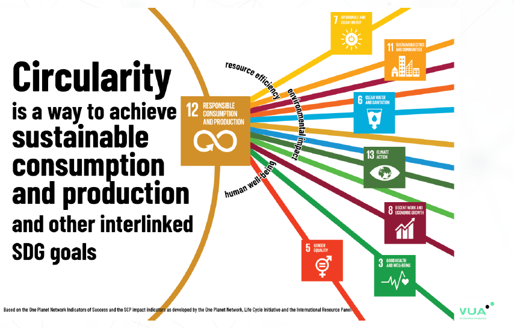
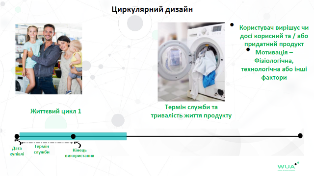
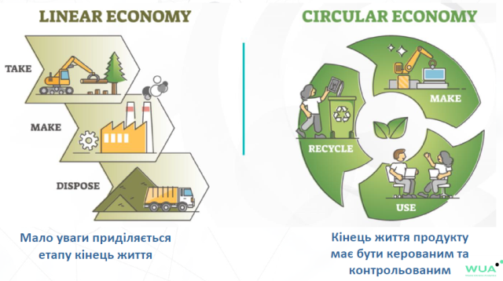
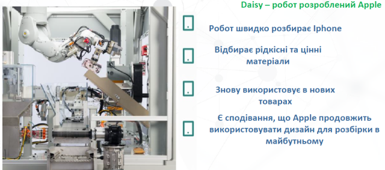

# Вебінар «Економіка кругового циклу та порядок денний на період до 2030 року»

Андрій Гнап

https://youtu.be/TnaTLjGeW80?si=TFhmkW9V23PRL6es

Це нотатки по вебінару.

# Блок 1. Цілі сталого розвитку

Без даних ми ще одна людина з точкою зору (W. Edwards Deming). Без доказової бази важко приймати рішення. Для переходу в циркулярну економіку факти грають важливу роль.

## Про сталий розвиток.

Що таке сталий розвиток? «...розвиток, який задовольняє потреби нинішніх поколінь без шкоди для здатності майбутніх поколінь задовольняти власні потреби».
Доповідь Комісії Брундтланда 1987 року під назвою «Наше спільне майбутнє »

### Які мегатренди впливають на наше майбутнє?

Ці ідеї увійшли до збірнику Мережа економістів ООН доповідь до 75 ї річниці ООН «Shaping the Trends of Our Time» .

- Бідність і нерівність
- Демографічні та соціальні зміни
- Технології та четверта промислова революція
- Зміна клімату
- Екологічний слід світового виробництва та споживання
- Зростання невизначеності, шоків і криз

### Розробка Порядку денного зі сталого розвитку на період до 2030 року

Реакція привела до серії зустрічей, що наш світ треба трансформувати.

25 вересня 2015 року 193 держави члени Організації Об’єднаних Націй одноголосно прийняли глобальний порядок денний.

- Універсальний - Цей порядок денний має бути універсальний для будь якої країни.
- Інтегрований - у законодавчу базу країн та між країнами
- Трансформаційний - є потреба в змінах
- Національна власність - кожна нація конвертує цей документ до своїх потреб та реалій але в певних рамках
- Заснований на правах з фокусом на людей - людські цінності
- Нове глобальне партнерство - важливе рівноправне партнерство, а не диктатура і тиранія

Порядок денний до 2030 року ставить серйозний виклик домінуючим економічним моделям. По суті, він вимагає поетапної зміни основ економічного виробництва та споживання, закликаючи до прогресу, який:

- є інклюзивним і для всіх людей - ми повинні об'єднатися навколо цих цілей
- може бути сталим крізь покоління
- захищає нашу планету

Порядок денний на 2030 рік розділений на чотири розділи

- Візія та принципи Відображені в деклараціях
- Структура результатів 17 цілей
- Реалізація Глобальне партнерство та засоби
- Контроль та перегляд

П’ять «P» сталого розвитку, на яких зав'язані принципи сталого розвитку

Цілі сталого розвитку (17)

У другій половині вебінару розглянемо цілі які більше звязані саме з циркулярною економікою, однак варто зауважити що вони всі взаємопов'язані, їх не можна розділяти а потрібно сприймати як цілісні задачі.

## Економічні моделі

Існуюча економічна модель: лінійна система виробництва і споживання

Ця модель найбільш прибуткова.

**Трансформаційний потенціал циркулярної економіки**: Циркулярна структура надає основу для того, щоб кинути виклик і направляти нас, коли ми переосмислюємо та перепроектуємо наше майбутнє.

## Визначення циркулярної економіки 

«Визнає, що в більшій мірі циркулярна економіка , одна з нинішніх стійких економічних моделей, в якій продукти та матеріали розроблені таким чином, щоб їх можна було повторно використовувати, повторно виготовляти, переробляти або відновлювати і таким чином підтримувати в економіці якомога довше поряд із ресурсами, з яких вони створені, а також уникнення або мінімізація утворення відходів , особливо небезпечних, а також запобігання або скорочення викидів парникових газів , і може сприяти сталому споживанню та виробництву ». **United Nations Environment Programme** (2018). Дуже масивне визначення.

«Економіка , яка є відновлюючою та регенеруючою за дизайном і спрямована на те, щоб продукти, компоненти та матеріали завжди мали найвищу корисність та цінність , розрізняючи технічний та біологічний цикли ». **Ellen MacArthur Foundation** (2015). Це визначення сфокусоване на систему, тобто як трансформувати економічну модель як систему.

«Цю концепцію, в принципі, можна застосувати до всіх видів природних ресурсів, включаючи біотичні та абіотичні матеріали, воду та землю. Еко дизайн , ремонт , повторне використання , реконструкція , переробка , обмін продуктами, запобігання утворенню відходів і переробка відходів це важливі частини економіки кругового циклу». **European Environment Agency (2016)**. Сфокусована на специфічну дію або процес: ремонт, рециклінг і т.п.

«У циркулярній економіці цінність продуктів, матеріалів і ресурсів зберігається в економіці якомога довше , а утворення відходів зводиться до мінімуму». **European Commission (2015)**. Сфокусована на специфічну дію або процес. Найбільш лаконічне визначення, запобіганню відходів і цінність, щоб матеріали максимально довго залишалися в обігу. Це визначення ЄС використовує у всіх документах.

«Циркулярна економіка це загальний термін, що охоплює всі види діяльності , які зменшують , повторно використовують і переробляють матеріали в процесах виробництва , розподілу та споживання ». **Blomsa & Brennan (2017)**. Якщо ми переосмислюємо і змінюємося то вже в циркулярній економіці.

## Ключові принципи циркулярної економіки

Концептуально базується на 3-х фундаментальних блоках:

### Особливості циркулярної економіки

- Системне мислення в основі - вона системна в своєму дизайні, вона комплексна. На противагу до складних речей (наприклад автомобіль, протилежність проста), комплексні (противага незалежні) - все зв'язано. Приклад екосистеми лісів Амазонки, коли вплив на якийсь вид може змінити всю екосистему. У циркулярній - треба змінювати всю систему.   
- Видалення токсичних речовин
- Ідея петлі зворотного зв’язку - від клієнтів, партнерів і користувачів як можна покращити 
- Стійкість через різноманітність - залучення різних аспектів та елементів для досягнення цінностей
- Збереження цінності - має бути максимальною
- Використання відновлюваної енергії - циркулярна економіка і сталий розвиток нерозривні від відновлювальних джерел енергії
- Перехід від споживача до користувача - ми маємо більше бути користувачами а не власниками
- Замкнуті цикли та «Відходи як їжа»

Зараз Україна намагається перейти від лінійної економіки до економіки переробки (Rcycling), на протязі останніх років йде обговорення про поводження з відходами і зараз мають прийняти законопроект про відходи. Але наша задача перейти до циркулярної економіки, щоб відходів було якомога мало.

У циркулярній економіці ключове місце буде займати 12 ціль - "Відповідальне споживання і виробництво", але вона пов'язана з усіма іншими цілями і ці речі є нерозривні.

## Що потрібно, щоб зробити наш світ більш «циркулярним»?

Циркулярна економіка - це важіль, який дозволяє трансформувати зміни і направляє нас на шлях досягнення Порядку денного до 2030 року.

- Узгоджена комбінація політики для просування практики ЦЕ
- Інноваційні платформи для глобальної співпраці для об’єднання всіх секторів і зацікавлених сторін. 
- Підприємства з циркулярними бізнес моделями. Їх кількість має зростати і підтримка уряду.
- Місцеві органи влади та міста повинні запровадити, сприяти та поінформувати про практику ЦЕ на місцевому рівні.
- Споживачам необхідно змінити звички та переосмислити відносини з продуктами та послугами.

### Циркулярний дизайн

Європейський Союз відзначає (Sustainable Product policy, EU Sciene Hub(12 грудня 2018)): 80 % впливу на навколишнє середовище продуктом у його життєвому циклі, визначаються на фазі дизайну.   

Тому кожне підприємство яке націлиться на зміну в напрямку ЦЕ перш за все націлить свої зусилля на зміну дизайну продукції. Це одна з найважливіших фаз.

Всі активності та процеси, які намагаються закрити потік матеріалів в ідеальну петлю, можуть розглядатись, як підхід циркулярного дизайну.

Циркулярний дизайн та сталий дизайн хоч і пов'язані але мають дещо різні цілі. 

Якщо на підприємстві використовуються енергоефективні технології, або інші речі пов'язані з оптимізацією виробництва  то це більше про сталість. Якщо ви думаєте як ваша продукція може більше слугувати, більше використана та повернутися назад в систему - то це більше про циркулярний дизайн, і це те про що буде говоритися далі. 

- Приклад Оптимізація виробництва продукту через стратегії збереження енергії - це скоріше про сталий дизайн 
- Приклад Процес реінтеграції продукту в систему - це про циркулярний дизайн

### Процеси та термінологія в циркулярній економіці

Розуміння циркулярного дизайну продукту через схему багатьох життєвих циклів

- є кілька життєвих циклів продукту, який є часом володіння продуктом
- тільки після n-го циклу йде на переробку

- Технічні цикли можуть мати життя після першого циклу 
- Біологічні цикли можуть мати життя після першого циклу або можуть бути викинуті

- Обгортка цукерки корисна декілька хвилин 

- Інші речі можуть бути корисні роками 
- Інша цінність використання 
- Використання, ремонт підтримка продукту

- Користувач вирішує чи досі корисний та / або придатний продукт 
- Мотивація – Фізіологічна, технологічна або інші фактори

- Усі можливі життєві цикли 
- Повторне використання (секонд хенд), відремонтоване або відновлене на заводі

- Максимальна цінність обох, як енергії так і матеріалів 
- Відома локація, якість та кількість відновлених матеріалів

Далі будемо розглядати що треба зробити щоб протримати максимально товар на життєвому циклі, або як його можна відновлювати і за допомогою кого.

### Системне бачення

- Кожен життєвий цикл - потрібно розуміти і відштовхуватися від цього, і кожен цикл а не тільки пеший
- Виробництво, обслуговування, використання, відновлення - активності дизайну
- Інший життєвий цикл може розпочатись із відновлених матеріалів, тобто відновлення може привести до наступного життєвого циклу

У лінійній моделі економіки виробник не переймається питаннями кінця життя. На противагу цьому в циркулярній економіці кінець життя має бути керованим і контрольованим, бізнес бере на себе роль того учасника процесу що перемйається тим як буде продукт перероблятися, відновлюватися і т.д. І тим самим ініціювати усі дії в екосистемі. якщо десь гравців не вистачає.     

Зазвичай біологічні та технологічні цикли розділяють.

#### Біологічний цикл

- це біологічні або біорозкладні первинні матеріали, наприклад деревина

- Перероблені або використані в інших цілях

- Обміркуйте біологічний ресурс, його процес росту, сегмент ринку, та тривалість життєвого циклу продукту

Щоб бути по справжньомусталим, виріб з деревини для масового ринку має мати термін служби такою ж як час зростання 3-х дерев

#### Технологічний цикл

- це Технічні матеріали не можуть бути повернуті в природу
- Тільки реінтеграція технічних матеріалів у матеріальний потік дозволить багаторазове використання матеріалів
- Використання небезпечних матеріалів, хімічних продуктів або рідкісних матеріалів має уникатись
- Скорочення втрат матеріалів через покращення можливості розбирання є критичним для циркулярної економіки

Бізнес має робити кроки щоб спростити користувачам можливість самостійного ремонту та продовження циклу використання. Ремонт не має бути дуже дорогим але і техніка не може бути дуже дешевою.

У технологічному циклі обов'язково треба враховувати: контекст, ринок ..., як відноситься до цього замовник, зміни у виробничому процесі, зручність обслуговування, на скільки дорого розробити інфраструктуру для відновлення.

Продовження циклу корисності та повторне використання:

- Продукти, компоненти та матеріали
- Реінтеграція в систему (як реінтегрувати)
- Пропонувати скоріше послугу користування, аніж продукт
- Продуктовий дизайн та використання інших бізнес моделей впливає на потік матеріалів

Стратегії:

- Сповільнення матеріального потоку - використання матеріалів довше в часі
- Звуження матеріально го потоку - зменшення кількості матеріалу
- Зациклення матеріального потоку - повторне використання матеріалу

Системи можуть бути 2-х типів:

- Системи закритого циклу
- Системи відкритого циклу

Циркулярні бізнес моделі (буде обговорюватися пізніше детальніше):

- Нові моделі власності
- Пропозиції цінності
- Доступ перед прибутком (для бізнесу)
- Особи можуть мати доступ до товарів поза їх фінансовими можливостями

Чи потрібна вам дірка в стіні, чи потрібна дрель. 

## Дизайн стратегії 

### Дизайн для обслуговування

- Заохочуйте активності з обслуговування
- Повертайте до стану придатного до використання
- враховуйте час ремонту

Акценти:

- Дизайн для ремонтнопридатності
- Дизайн для апгрейду 
- Дизайн для надійності

Дизайн для ремонтнопридатності

- Використання стандартний компонентів
- Спрощення та модульність продукції
- Широка доступність запчастин
- Лейби компонентів та відповідні мануали обслуговування

Дизайн для апгрейду (оновлення) 

- Адаптація до майбутнього вдосконалення. Наприклад автомобіль тесла оновлюється через ПЗ
  - Продукт оновлений через заміну продукту
  - До продукту додані нові або модифіковані існуючі частині

Дизайн для надійності

- Прогноз можливих причин поламок через предикативні моделі та запобігання їм відповідними засобами
- Дизайн для стійкості (тяжко поламати)

### Дизайн для повторного використання

- Власник продукту змінюється
- Користувач змінюється із закінченням життєвого циклу
- Обслуговування критично для повторного використання
- Здатність до ремонту, оновлення та надійність також критичні для повторного використання

В цій стратегій варто враховувати:

- Дизайн для простоти
- Дизайн для зручності та доступності

Дизайн для автентичності поза часом

- Автентичність немає рушійною силою продукту (стильною з часом, автентичність поза часом, нейтральний)
- Продукт із збалансованим та «нейтральним» дизайном буде слугувати довше

Дизайн для граційного старіння

врахування що буде старішати

- Продукт не збереже свого оригінального автентичного вигляду
- Врахувати емоційну та фізичну реакцію користувача на товар
- Використання матеріалів та застосунок мають братись до уваги

Дизайн для взяття назад

- Дизайн для винагороди користувача
- Дизайн для викуповування назад компанією
- Використання матеріалів та застосунок мають братись до уваги

### Дизайн для ремонту

Для фахівців але не заводське

- Інспектування та відновлення продукції
- Не має гарантії від виробника
- Тестовано та верифіковано щоб функціонувати правильно

Дизайн для розбірки та збірки

- Спрощення продукту
- Зменшена кількості запчастин
- Нижчі процесні витрати
- Нижчі накладні витрати
- Вище ефективність
- Коротший час виходу на ринок

### Дизайн для заводського перероблення

тому що деякі речі можна відновити тільки на заводському обладнання

- Відновлення використаних продуктів для нових цілей
- Відновлення цінності від продуктів на етапі «кінець циклу»

Стандартизований промисловий процес, що відбувається в промислових або заводських умовах, у якому товар відновлюються до початкового стану, як новий, і продуктивності або краще. Процес відновлення відповідає конкретним технічним специфікаціям , включаючи стандарти інженерії, якості та випробувань, і зазвичай дає продукти з повною гарантією. Виробниками відновлених товарів вважаються фірми, які надають послуги з відновлення вживаних товарів до початкового робочого стану. UNEP, REDEFINING VALUE, THE MANUFACTURING REVOLUTION, 2018

Кроки до заводського перероблення:

- Товари відправляються до виробника повністю
- Виробник розбирає та очищує товар
- Дефективні, пошкодження чи зламані компоненти замінюються
- Компоненти збираються та перевіряються на якість
- Товар знову продається на ринок з гарантією

### Апскейлінг:

метал з банок для банок

«… матеріал або продукт, який спроектований таким чином, щоб повернутись назад в технологічний цикл, в індустріальний метаболізм з якого він вийшов» Cradle to Cradle, Braungart and McDonough

«… «Сила повного циклу» … лежить у факті, що незабруднені матеріальні потоки, збільшують збір та розподільчу ефективність, при цьому зберігаючи якість, особливо у технологічному циклі, який, в свою чергу, збільшує довговічність продукту і таким чином збільшує ефективність матеріалу.» Ellen MacArthur Foundation

даунскейлінг відноситься до перобки (рециклінг)

### Дизайн для рециклінгу

Дизайн для полегшення сортування
Проектування з врахування цінності пластика

Дизайн для чистоти матеріалу
Desso Take Back програма.
Матеріалі використані у виробництві відібрані таким чином, щоб повернутись в індустріальний потік

- Найбільш відома та широковживана стратегія дизайну
- Знижує потребу в нових матеріалах, скорочує кількість відходів пов’язаних з видобуванням первинних матеріалів
- Різні матеріали мають різну ступінь переробки
- Враховує те, де продукт буде використаний та вміст з яким буде перероблений

- Мінімізує використання матеріалів
- Мінімізує використання запчастин
- Мінімізує використання матеріалів в кожній запчастині
- Мінімізує кількість використаних матеріалів

### Звуження матеріального потоку

- На пряму не пов’язано з концепцією циркулярності продукту
- Не промотує повернення продуктів у систему
- Циркулярність продукту не пом’якшує вплив на довкілля
- Необхідність у визначення на початковому етапі проектування

Дизайн для оптимізації

- Використовувати мінімальну кількість матеріалів, проте міцний та компактний дизайн 

- • Напряму впливає на навколишнє середовище 
- • Менше відходів та впливу, обох матеріалів та продукції під час транспортування до пунктів зберігання 
- • Якість продукції залежить від кількості матеріалів

Дизайн для матеріалів з малим впливом

- Використовувати менше небезпечних матеріалів 
- Використовуйте екологічні, а не синтетичні процеси 
- Використовуйте матеріали та техніки виробництва, які споживають менше енергії та води

Дизайн для мініатюризації

- Мініатюризація заохочує використовувати менше матеріалів 
- Враховувати розбірку продукту 
- Враховувати доступність компонентів

Дизайн для дематеріалізації

- Діджіталізація товару 
- Не завжди призводить до скорочення матеріалів

Дизайн для використання місцевих ресурсів

- Застосовується, як до продукту так і до упаковки 
- Зменшує потребу в ресурсах з різних частин світу 
- Повітряний транспорт найменш дружній до довкілля 
- Ефективне планування логістики та дистрибуції

### Дизайн для ефективності ресурсів (енергія)

Дизайн для зменшення інтенсивності
використання матеріалів

- Вибір матеріалів, які можуть каскадно впливати на всю систему
- Використання аналізу життєвого циклу Life cycle analyze

Дизайн для енергоефективності процесів

- Холодильник використає за час терміну служби більше енергії, ніж витрачено на його виробництво
- Кількісний аналіз потенційної спожитої енергії протягом терміну служби

### Дизайн для каскадного використання

Під каскадним використання матеріалів розуміють використання в послідовних циклах з різною метою

Загальні методи в біологічних циклах також можуть бути використані в технологічних циклах.

При першому використанні найвища цінні. При останньому найнижча. Важливо розуміти пріоритетність використання ресурсів

### Дизайн для біодеградації

Не має альтернативи використання після застосування

Продукти з короткою або дуже короткою тривалістю служби

Потребує дослідження, як продукт може бути розібраний

Створює додаткову вартість при компостуванні та заохочує процес розкладання

### Дизайн для сталої поведінки користувачів

як стимулювати користувачів

- Дизайн для екологічного зворотного зв’язку, коли користувач може зв'язатися з виробником для покращення
- Дизайн на заохочення управління - керування користувачем енергоефективністю та контроль
- Дизайн для переконливих технологій (обмеження використання) - по замовченню багато речей обмежується 

### Дизайн для циркулярної поведінки користувачів

- Дизайн для спільного використання (шерінгу)

- Дизайн для емоційної довговічності
- Дизайн для естетики поза часом

# Блок 2.  Рухаючи циркулярність: роль політики та законодавства.

2015

- Прийняття ЦСР 2030
- Парижська кліматична угода COP 21
- Європейський план дій із циркулярної економіки

2017

- Запуск Європейського альянсу батарейок
- Декларація намірів, зробити Європу лідером виробництва та споживання батарейок

2019

- Представлення Зеленої угоди Green Deal

2020

- Адаптація нового плану дій по циркулярній економіці, як частини індустріальної стратегії
- Пропозиція нового кліматичного закону, який має забезпечити кліматичну нейтральність Європи до 2050
- Презентація нової стратегії Біорізноманіття до 2030
- Презентація нової стратегії від Ферми до виделки для агросектору
- Хвиля реновації
- Європейський кліматичний пакт
- Пропозиція щодо вдосконалення законодавства ЄС по батарейках

2021

- Повернення США до кліматичної угоди
- Реалізація Європейської Зеленої угоди
- Глазго COP26

### Кліматичні зміни

Кліматичні зміни це варіація температури та погоди, яка виникає з часом. Це трапляється природньо, але глобальне потепління спричинено в основному діяльністю людей

- Випаровування води, діоксид вуглецю (СО2), метан (СН4), оксид азоту (N2O), тропосферний озон (O3) – парникові гази 
- Фторований газ також вважають парниковим газом
- Парникові гази прозорі і їх присутність спричиняє потепління 
- Довготривале потепління спричиняє кліматичні зміни

Світ очікує більша кількість екстремальних погодних подій

Ці події вплинуть на всі 7,5 мільярдів людей на планеті

Цілі 2030 EU Climate and Energy політик (в порівнянні з 1990)

- Скоротити емісію парникових газів до 40%
- Частка електроенергії з відновлюваних джерел 32%
- Покращення енергоефективності 32,5 %

- Інтеграційна стратегія енергетичної системи Європейської комісії базується на відновлювальній енергії
- Використання енергії зросло з 2014 року
- ЄС досі має складності з надійними партнерами щодо постачання доступних, надійних та сталих енергетичних ресурсів
- Європейська Зелена угода включає заходи щодо масштабування відновлюваної енергії
- Європейська Зелена угода закликає розділяти економічне зростання та використання енергії

### Стала енергія

- Сталу енергію можна визначити, як форму енергії, яку можна використовувати знову і знову не
  наражаючи джерело виснаження, вичерпання або зникнення
- Стала енергія практично невичерпна або може відновитись за людського життя
- Стала енергія допомагає зберегти природній капітал
- Стала енергія основа для декарбонізації енергетичної системи
- Стала механізм щоб відреагувати на зростання температури, кліматичні зміни та екологічні виклики
- Ключовий контрибутор в глобальний енергетичний мікс, значно дешевша та конкурентніша

#### Eco-design framework Directive

- Європейська комісія включила циркулярні критерії в Eco-design framework Directive
- Виробники товарів споживачів енергії, мають зменшити споживання енергії та негативний вплив на довкілля в під час терміну служби
- Споживання під час терміну служби дуже залежить від фази дизайну

#### Energy Labelling Directive

- Функціональність продукту посилена. Можливість користувачі обирати
- Мінімальні стандарти. Довговічність та здатність до ремонту

#### Sustainable product initiative

- Перегляд Eco-design framework Directive
- Пропозиції до сталості товарів та інноваційних аспектів товарів на ринку ЄС
- Розробка інструментів на перетині циркулярності та діджіталізації, як цифровий продуктовий паспорт

#### Парижська кліматична угода

- Адаптована кліматичним самітом ООН на Парижській кліматичній конференції COP21 в грудні 2015
- Спрямована на подолання кліматичної кризи та зменшення викидів парникових газів, використання пом’якшуючих та адаптивних заходів, враховуючи права людини в усіх кліматичних діях та підтримку країн, що розвиваються
- Зусилля направлені на досягнення рівня потепління не більше 1,5 градуси
- Стимулювання глобальних ініціатив

#### Зелена Угода ЄС

- Регуляція та стандартизація
- Інвестиції та інновації
- Національні реформи
- Діалог з соціальними партнерами
- Міжнародна співпраця

#### Кліматичний закон ЄС

- Ключові елементи Зеленої угоди
- Частина ширшої угоди майбутніх амбітних дій
- Цілі та напрямки до усіх політик до 2050
- Система моніторингу прогресу та подальших дій
- Надає передбачуваність для громадськості, бізнесу, інвесторів та громадян

#### Fit for 55 Legislative Package

- Ревізія кліматичного та енергетичного законодавства до відповідності цілі скорочення викидів, принаймні до 55%
- Посилити торгівлю емісією
- Надати поштовх відновлюваній енергетиці
- Покращити енергоефективність
- Реформувати систему податків в енергетиці

#### Європейський план дій із циркулярної економіки

- Надати поштовх, конкуренцію та глобальне лідерство ЄС
- Модернізувати економіку ЄС та взяти під контроль весь життєвий цикл продукції
- Представити законодавчі та незаконодавчі дії для планомірного регуляторного процесу
- Реформувати шлях, як думаємо про сталу продукцію, виробництво, утворення відходів, споживання та первинні матеріали
- Надати план для досягнення чистішої Європи у майбутньому
- Розробити план з іншими економічними акторами, споживачами, громадянами та іншими організаціями громадянського суспільства

Ключові продуктові ланцюжки цінності

#### Глобальні зусилля

- Кліматичні зміни та втрата біорізноманіття – глобальний виклик
- Людство потребує нової історії та спільні амбіції
- Провідні економіки від США до Японії поставили за мету кліматичну нейтральність до 2050 або одразу після
- Кліматичні амбіції мають бути підкріплені конкретним планом для досягнення мети в стримані глобального потепління до 1,5 градуси
- Кліматичні амбіції ЄС в Зеленій угоді неможливі, якщо Європа буде діяти сама 
- ЄС буде продовжувати показувати шлях до циркулярної економіки на світовому рівні

## Циркулярні бізнес-моделі (ЦБМ)

Інноватор (Виконавчі директори, інженери, голови департаментів інновацій):

- Хочу зрозуміти, як циркулярні бізнес (ЦБМ) моделі можуть бути джерелом вищої ефективності
- Хочу спроектувати ЦБМ для моєї компанії або галузі
- Хочу зрозуміти суть різних ЦБМ для моєї компанії зараз і у майбутньому
- Хочу зрозуміти, як ЦБМ можуть стати джерелом сталої конкурентної переваги

Оператор (Продуктовий менеджер, операційний чи фінансовий директор, відповідальний за ланцюжки постачання):

- Хочу зрозуміти принципи ЦБМ
- Хочу спроектувати ЦБМ для моєї компанії або галузі
- Хочу зрозуміти суть різних ЦБМ для моєї компанії зараз і у майбутньому
- Хочу зрозуміти, як ЦБМ можуть стати джерелом цінової переваги або більшого прибутку

Консультант (Консультант, фріланс консультант, радник):

- Хочу пояснити своїм клієнтам, як ЦБМ можуть бути джерелом вищої ефективності
- Хочу спроектувати інноваційні ЦБМ для моїх клієнтів
- Хочу зрозуміти суть різних ЦБМ та зрозуміти, які підходять найкраще для моїх клієнтів
- Хочу зрозуміти, як ЦБМ можуть стати джерелом сталої конкурентної переваги для моїх клієнтів

Інвестор (Венчурний капіталіст, бізнес янгол, менеджер фонду, інвестор EGS):

- Хочу мати змогу проаналізувати доцільність специфічної ЦБМ та чи може вона стати дохідності або непересічним поверненням інвестицій
- Хочу зрозуміти принципи ЦБМ
- Хочу зрозуміти суть різних ЦБМ
- Хочу зрозуміти, як ЦБМ можуть стати джерелом сталої конкурентної переваги для компаній у які я інвестую або є радником

Законотворець (Держслужбовець, виборні посадові особи, політики, політичні радники):

- Хочу зрозуміти мікро та макро вплив ЦБМ на економіку та довкілля
- Хочу зрозуміти принципи різних ЦБМ
- Хочу зрозуміти суть різних ЦБМ
- Хочу зрозуміти, як урядова політика може допомогти або перешкоджати адаптації ЦБМ

### 7 Доступна та чиста енергія

- Нові бізнес моделі сталі в екологічному та економічному сенсі
- Допомагає виправдати довгострокові інвестиції в ринок, що швидко змінюється
- Полегшення через інноваційні енергетичні ЦБМ
- Надавачі енергетичних послуг можуть створювати довготривалі зв’язки з клієнтами
- Створення дохідних потоків необхідних для виправдання та зменшення ризику багатьох інвестицій

### 8 Пристойна робота та економічне зростання

- Джерело нових робочих місць
- Оптимізація ресурсів
- Більше економічної активності використовуючи менше ресурсів
- Переробка на заводі, ремонт та апскейлінг стануть причиною нових робочих місць

### 9 Індустрія, інфраструктуру інновації та інфраструктура

- ЦБМ напряму впливають на індустрії та інфраструктуру
- ЦБМ з інтернетом речей (IoT) та штучним інтелектом (AI) є ключем до поштовху виникаючого ринку фізичних та цифрових систем
- Акселерація нових підходів, що зроблять революцію в Індустрії 4.0

### 11 Сталі міста та громади

- Більш сталі та стійкі міста 
- Зв’язок бізнесів у більш тісні локальні мережі
- Переконатись, що бізнес не переслідує активностей, які шкодять громаді, в якій він оперує
- Натхнені природою рішення, допоможуть зробити міста більш стійкими, самодостатніми та зеленими

### 12 Відповідальне споживання та виробництво

- Зменшити споживання через виробництво товарів, які служать довше чи потребують менше ресурсів
- Створення більш здорових та тривалих стосунків між виробником і клієнтом
- Дозволяє виробнику виснажувати менше первинних ресурсів та пролонгує життєвий цикл товарів, продукції чи послуг

- Бізнес моделі (БМ)

Базуючись на загальноприйнятому визначенні, бізнес модель пояснює як організація створює, доставляє та захоплює цінність

- Циркулярні бізнес моделі (ЦБМ)

Циркулярні бізнес моделі це інноваційні бізнес моделі у яких створення, доставка та захоплення цінності зберігаючи економічну цінність продукту і його складових, якомога довше, через скорочення його залежності від первинних матеріалів, використовуючи відновлювальні енергетичні системи, адаптуючи практики сталого виробництва, і більш загально, «озелененням» усього ланцюжку цінності.

Лінійна бізнес-модель

- Різні форми підходу «взяти-зробити-викинути»
- Створення цінності з метою максимізації прибутку
- Враховує наслідки капіталізму для стейхолдерів
- Без поваги до довкілля, планети, або інших зовнішніх ефектів
- Загалом виснажує природні ресурси

Циркулярні бізнес моделі:

- Регенеративна
- Допомагає поповнювати планету
- Модель та термінологія Стахеля (1984, 2010)
- Забезпечує створення, доставку та захоплення цінності без шкоди для планети і у спосіб, який допомагає відновлювати планету

Лінійні БМ створюють відходи

- Усунення недоліків дизайну
- Усунення недоліків бізнес моделей

ЦБМ налаштовані на

- Дизайн без відходів
- Регенерацію систем

Два типи ЦБМ

- Існуючі БМ адаптуються до більш сталих
- БМ проектують для дизайні

### Класифікація ЦБМ

Свіжі спроби класифікувати ЦБМ робляться через різні фокус

- Вплив на сталість
- Принципи продуктового дизайну
- Ціннісна пропозиція та потоки
- Життєві цикли продукту

### Перепони для ЦБМ

- Фінанси
- Структурні обмеження
- Операційні обмеження
- Ставлення до циркулярної економіки
- Технології

### Сповільнення ресурсного циклу Шерінг

- Машини
- Будинки
- Офіси
- Одяг
- Обладнання
- Велосипеди

### Звуження ресурсного циклу

- Ремонт
- Продукт як послуга

### Закриття ресурсного циклу

- Повторне використання
- Повторне виробництво
- Індустріальний симбіоз
- Рециклінг

### Повторне виробництво

- 80% менше енергії
- 88% менше води
- 92% менше хімічних продуктів
- 70% менше відходів виробництва 
- повернення інвестицій в завод для повторного виробництва 5Х швидше

### Ключові висновки

- Циркулярні бізнес моделі мають бути направлені на ті самі ключові принципи, що і циркулярна економіка загалом 
- Зменшення, повторне використання, рециклінг, вторинні, а не первинні матеріали, екодизайн, біомімікрія, висока ефективність, користування замість власності, достатність, від колиски до колиски, заміна викопного палива 
- Жодна ЦБМ не обов’язково має втілити усі принципи одразу 
- Багато світових лідерів вже успішно втілюють ЦБМ та принципи циркулярної економіки

## Циркулярна Індустрія 4.0

- Дослідницький проект, який вело Німецьке федеральне Міністерство освіт та науки
- Для підвищення конкурентоспроможності німецької виробничої індустрії
- Ключові заходи високотехнологічної політики німецького федерального уряду

### Індустрії 4.0 та циркулярка економіка

- Роз’єднання використання ресурсів та економічного зростання
- Доступність даних отриманих від відслідковування цінності за допомогою RFID, NFC чи QR Code
- Активатор переходу до циркулярної економіки
- Розуміння та управління потоками цінності продукції, компонентів та матеріалів

### Індустрії 4.0 та циркулярка економіка

- Моніторинг, оптимізація та покращення виробничих процесів
- Машини можуть покращувати прогноз виходу з ладу та ініціювати ремонт
- Самоорганізація та відповідь на непередбачувані обставини у виробництві
- Нові типи даних та посилення управління цінністю

### Ключові драйвери цінності

- Розуміння розташування активів
- Розуміння стану активів
- Розуміння доступності активів

### Використання та сервіс у цифрову еру

- Цифрові платформи глибоко інтегровані у корпоративні процеси та ІТ системи
- Для бізнесу, цифрові платформи стимулюють рішення на основі даних
- Цифрові платформи покращують користувацький досвід клієнта, працівника та стейхолдера
- Стимулюють розвиток peer-topeer та В2В мереж

### Відновлення цінності від користувача

Матеріальний паспорт

- Цифрові набори даних описуючі визначені
  характеристики матеріалів та компонентів
  продукції
- Пов’язане з будівельними матеріалами
- Мета видобування, переробки та/або
  повторного використання матеріалів
- Інструмент активного моніторингу цінності
- Промоція інновацій
- Детальна інформація про матеріал, продукт або систему

### Висновки

- Вторинні матеріали замінять первинні в індустрії, проте тотальна незалежність від первинних матеріалів неможлива 

- Багато технологій мають бути застосовані для зменшення витрат енергії у ланцюжку цінності
- Видобування в межах міст може бути альтернативою видобування первинних матеріалів 
- Цифрові двійники можуть бути ключовою технологією для видобувних галузей

- Циркулярна економіка покладається на дизайн 
- Щоб побудувати більш поєднані товари, які можуть надсилати та отримувати дані, вони мають бути
  спроектовані відповідно від самого початку
- Використовувати матеріали, які можуть реагувати на майбутні стимули (механічний стрес, температурні коливання)
- Застарілі або рідкісні запчастини можуть бути скановані та перероблені за допомогою 3 D друку

- Організація виробництва таким чином, щоб уникати проблем та відходів
- Імплементувати швидкі модифікації дизайну
- А дитивне виробництво дозволяє кастомізацію та локальне виробництво
- 3 D друк дозволяє використовувати більш дружні до довкілля та вуглицевонегативні матеріали

- Щоб бути більш ефективними, з точки зору вартості, товари можуть використовуватись в шерінгових
  бізнес моделях
- Платформи даних можуть поєднувати користувачів, бізнеси та навіть уряди
- Платформи обміну даними дозволяють зробити ланцюжки цінності більш обізнаними та
  інтелектуальними
- Циркулярні бізнес моделі зменшують споживанню енергії, а також запобігають поламці продукції та
  систем

- Після того, як користувач викинув товар, він має бути відновлений, щоб ним знову користувались 
- Матеріальний паспорт, матеріальні сканери та лейби, важливі технології, які використовуються
  сьогодні для закриття ланцюжків постачання
- Це критичні технології для отримання знань про систему, активи та матеріали
- Усі стейхолдери мають ділитись даними для створення поєднаної системи, що базується на обміні
  інформацією

- Різні технології застосовують для ефективності витрат та безпеки
- Автоматизація може прискорити та здешевити розбірку
- Адитивне виробництво може бути використано для швидкого ремонту або оновлення
- Після відновлення товару аналіз даних може бути використаний для виправлення просторових
  неточностей або проблем з повторною збіркою

- Розуміння технологій переробки дуже важливе 
- Роботизовані руки та штучний інтелект широко використовуються в переробці
- Системи штучного інтелекту можуть класифікувати та субкатегорізувати об’єкти базуючись на візуальних ознаках
- Переробні компанії мають фокусуватись на якості та цінності матеріалів, аніж на кількості